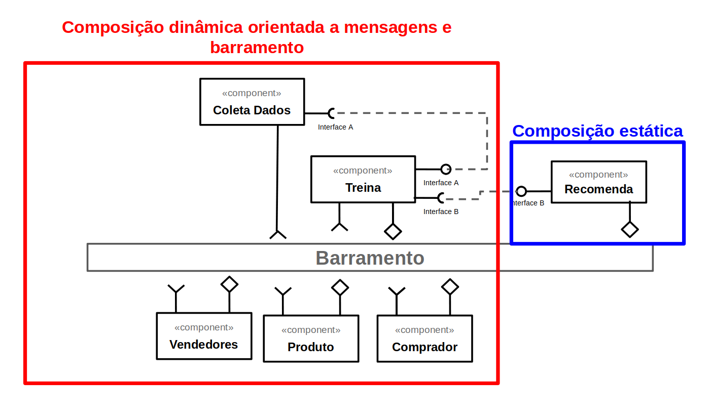

# Apresentação do Lab02

Estrutura de pastas:

~~~
├── README.md  <- arquivo apresentando a tarefa
│
└── images     <- arquivos de imagens usadas no documento
~~~

# Aluno
* `Fabiano Louzada Cesario`

## Tarefa 1 - Dados para Treinamento e Recomendação

### Treinamento
* Vendedor
  * categorias
  * ranking
  * total de vendas
  
* Produto
  * nome
  * valor
  * categoria
  * pontuacao
  * quantidade comprada

* Comprador
  * favoritos
  * gênero 
  * historico de busca
  * historico de compra

### Recomendação
* Vendedor
  * categorias
  * ranking
  * total de vendas
  
* Produto
  * nome
  * valor
  * categoria
  * pontuacao
  * quantidade comprada

* Comprador
  * favoritos
  * gênero 
  * historico de busca
  * historico de compra

## Tarefa 2 - Breve descrição de Composições Dinâmica e Estática

### Composição Dinâmica

> A composição dinâmica se da de forma assincrona, como por exemplo em enventos gerados de forma indefinida entre usuários. 

### Composição Estática

> Na composição estática, pode-se combinar diversos componentes, em tempo de compilação, e gerar uma aplicação ou uma atualização do sistema.

## Tarefa 3 - Composição para Treinamento e Recomendação

