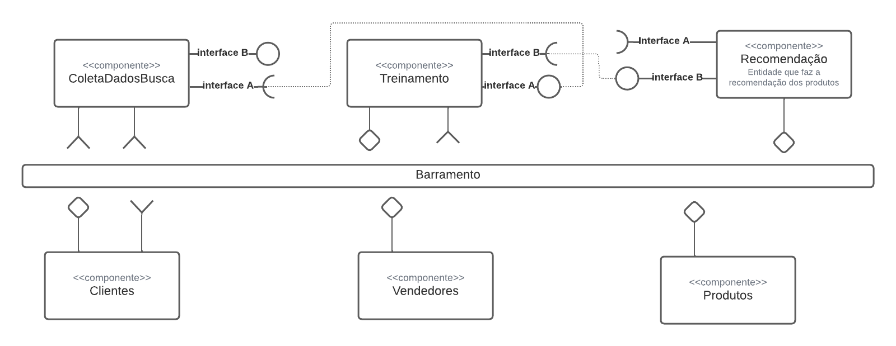

# Lab02 - Estilos Arquiteturais

Estrutura de pastas:

# Aluno
* `Mayara Ferreira Fernandes`

## Tarefa 1 - Dados para Treinamento e Recomendação

### Treinamento

* Produto
  * nome
  * valor
  * avaliação
  * categoria
  * quantidade comprada

* Cliente
  * favoritos
  * gênero 
  * categorias buscadas
  * itens acessados
  * mais comprados

* Vendedor
  * categorias
  * pontuação
  * quantidade de vendas
  * reclamações

### Recomendação

* Produto
  * nome
  * valor
  * avaliação
  * categoria
  * quantidade comprada

* Cliente
  * favoritos
  * gênero 
  * categorias buscadas
  * itens acessados
  * mais comprados

* Vendedor
  * categorias
  * pontuação
  * quantidade de vendas
  * reclamações

## Tarefa 2 - Breve descrição de Composições Dinâmica e Estática

### Composição Dinâmica
Entram e saem componentes dinamicamente e o programa tem que ir se adaptando com esse movimento. 
componentes: produtos, recomendações

### Composição Estática
Conjunto de componentes ligados que não mudam com frequência.  
componentes: clientes, vendedores

## Tarefa 3 - Composição para Treinamento e Recomendação

