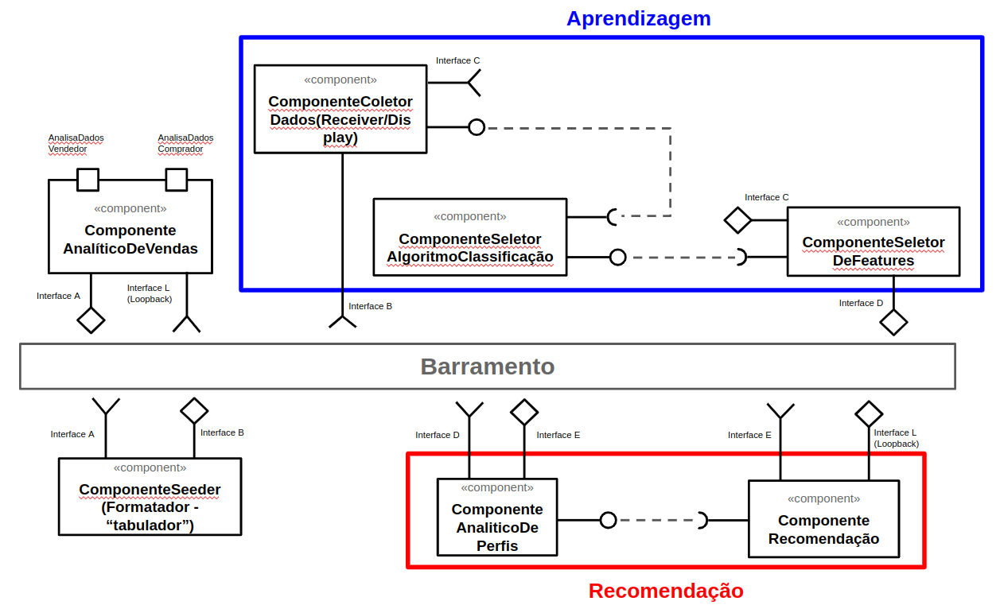

# Modelo para Apresentação do Lab01 - Estilos Arquiteturais

Estrutura de pastas:

~~~
├── README.md  <- arquivo apresentando a tarefa
│
└── images     <- arquivos de imagens usadas no documento
~~~

# Aluno
* `Daniel Pinheiro Cunha - ex164437`

## Tarefa 1 - Dados para Treinamento e Recomendação

> Coloque a lista de campos como itens e subitens, conforme exemplo a seguir:
>
### Treinamento
* Entidade Comprador:
	* Estado(Logradouro)
	* Cidade(Logradouro)
	* Valor-médio-das-compras(ultimas-10)
	* Lista-últimas-categorias-pesquisadas(ultimas-10)
	* Avaliação-média-produtos-comprados(ultimos-10)
 
* Entidade Vendedor:
	* Estado(Logradouro)
	* Cidade(Logradouro)
	* Pontuação-Vendedor(Avaliações)
	* Quantiadde-Vendas
 
* Entidade Produto:
	* Valor
	* Média-Avaliações-Produto(notas-recebidas-por-compradores)
	* Quantidade-de-vezes-que-foi-vendido
	* Descrição-do-produto
	* Categoria

### Recomendação
* Entidade Anúncio:
	* ListaProdutos
	* VendedorResponsável
	* Histórico-Preços(é-oferta?)
	* Valor
	* Média-Avaliações-Por-Produto(notas-recebidas-por-compradores)
	* Quantidade-de-vezes-que-foi-vendido
	* Descrição-do-produto
	* Categoria

## Tarefa 2 - Breve descrição de Composições Dinâmica e Estática

> Escreva duas breves descrições, conforme exemplos a seguir:
>
### Composição Dinâmica
> Acredito que componentes do sistema cuja responsabilidade é a de treinamento, em específico componentes que vão receber os dados de treinamento sejam combinados dinamicamente, visto que diferentes seeders, ou fonte da dados podem ser utilizados, ou ainda diferentes algoritmos, de classificação, de geração de texto, entre outros (os quaisque podem estar dentro de um seletor de algoritmos [sendo o um componente possível a implementação do Strategy Pattern?]), permitindo a experimentação do melhor modelo/algoritmo a fim de obter maior acurácia na recomendação.

### Composição Estática
> Por outro lado penso que composições estáticas estejam melhor adaptadas aos componentes dp módulo de recomendação, o qual se baseará no resultado, ou no aprendizado, do módulo de treinamento para rankear os produtos recomendados. O output final é fixo, ou seja, sempre uma lista de produtos rankeados.
Para os componentes estáticos, onde não está prevista a combinação dinâmica dos componentes, não há uma necessidade estrita de que as interfaces requeridas e providas sejam necessariamente simétricas, isto é, o tipo dos artefatos de entrada e saída sejam exatamente os mesmos (entra uma tabela e sai uma tabela de cada componente), contanto que uma vez definido os tipos de artefatos de entrada e saída de cada componente estático, estes tipos não poderiam ser alterados sem a necessidade de uma alteração dos componentes, daí a estaticidade.

## Tarefa 3 - Composição para Treinamento e Recomendação

> Coloque a imagem PNG do diagrama, conforme exemplo a seguir:
>

