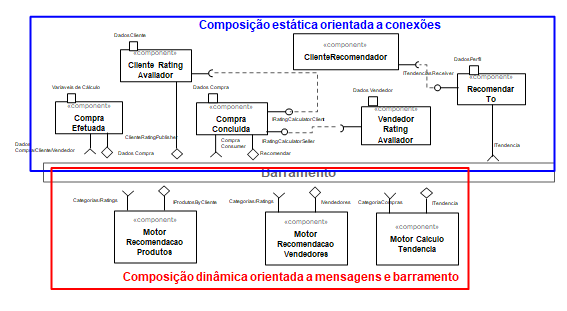

# Modelo para Apresentação do Lab01 - Estilos Arquiteturais

Estrutura de pastas:

~~~
├── README.md  <- arquivo apresentando a tarefa
│
└── images     <- arquivos de imagens usadas no documento
~~~

# Aluno
* `Rafael Gonçalves Vastag - RA: 2022601254`

## Tarefa 1 - Dados para Treinamento e Recomendação

> Coloque a lista de campos como itens e subitens, conforme exemplo a seguir:
>
### Treinamento
* Entidade PRODUTO
  * ID
  * NOME
  * CATEGORIA_ID
  * SUBCATEGORIA_ID
  * RATING
* Entidade CATEGORIA  
  * ID
  * NOME
* Entidade SUBCATEGORIA
  * ID
  * CATEGORIA_ID
  * NOME
* Entidade TENDENCIA
  * ID
  * CATEGORIA_ID
  * SUBCATEGORIA_ID
  * HABILITADA
### Recomendação
* Entidade VENDEDOR
  * ID
  * RATING
  * CATEGORIAS
  * SUBCATEGORIAS
  * PERFIL
* Entidade CLIENTE
  * ID
  * FAIXA_VALOR_PREFERIDA
  * PERFIL
* Entidade COMPRA
  * ID
  * PRODUTOS
  * CLIENTE_ID

## Tarefa 2 - Breve descrição de Composições Dinâmica e Estática

> Escreva duas breves descrições, conforme exemplos a seguir:
>
### Composição Dinâmica
> Na composição dinâmica temos a incorporação do barramento de mensagem que em tempo de running do programa alimentará sob demanda as recomendações com base nas variações de tendêcia, rating do cliente e do vendedor, e quais quer outros campos com comportamento perene. A composição é formada pela troca de dados referentes a venda, assim que a compra é completa e consolidada são disparados efeitos para os motores de recomendação e com isso de forma dinâmica novas recomendações são feitas com base nos inputs recebidos. Além da avaliação das tendências com base nas compras e consequentemente postagem das recomendações para determinado cliente.
### Composição Estática
> Na composição estática temos a atribuição de interfaces de identificação do Cliente e Vendedor, levando em consideração seus perfis assim, como isso é possivel entender qual serão os melhores motores de indicação aplicados. A abordagem estática está no recebimento de dados de fontes conhecidas como, por exemplo, dados do vendedor e do cliente, que são obtidos de uma base de dados, hipoteticamente ... Além disso o componente de recomendação recebe uma interface conhecida de tendências filtradas com base no perfil do cliente.

## Tarefa 3 - Composição para Treinamento e Recomendação

> Coloque a imagem PNG do diagrama, conforme exemplo a seguir:
>

