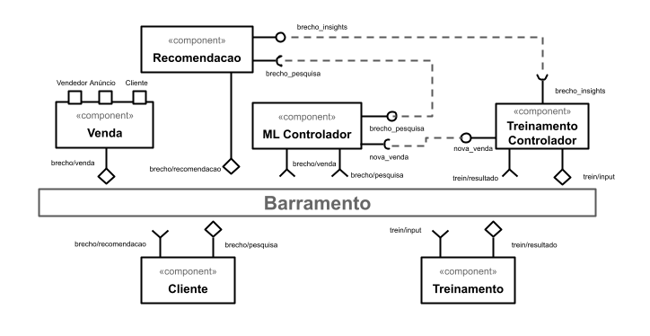

# Modelo para Apresentação do Lab02 - Design

Estrutura de pastas:

~~~
├── README.md  <- arquivo apresentando a tarefa
│
└── images     <- arquivos de imagens usadas no documento
~~~

# Aluno
* `Raul Mendes de Souza`

## Tarefa 1 - Dados para Treinamento e Recomendação

> Coloque a lista de campos como itens e subitens, conforme exemplo a seguir:
>
### Treinamento
* Vendedor
  * Vendas realizadas
  * Data de cadastro
  * Reputação
  * Anúncios

* Cliente
  * Localização
  * Gênero
  * Faixa etária
  * Compras realizadas
  * Anúncios visitados

* Anúncio
  * Título
  * Faixa de preço
  * Vendas
  * Visitas
  * Categoria
  * Avaliações

### Recomendação
* Vendedor
  * Vendas realizadas
  * Reputação

* Cliente
  * Localização
  * Gênero
  * Faixa etária
  * Compras realizadas
  * Anúncios visitados

* Anúncio
  * Título
  * Faixa de preço
  * Se está em oferta
  * Vendas
  * Visitas
  * Categoria
  * Avaliações

## Tarefa 2 - Breve descrição de Composições Dinâmica e Estática

> Escreva duas breves descrições, conforme exemplos a seguir:
>
### Composição Dinâmica
> A combinação de forma dinâmica pode ser utilizada principalmente nos componentes que aplicam as técnicas de aprendizado de máquina, pois existem melhorias em técnicas e processos a todo momento e uma mudança no ‘como’ o processo é realizado não deveria impactar o resultado, que deveria continuar a entregá-lo no formato pré-definido e aguardado por outros componentes. 

### Composição Estática
> Para composição estática, pode-se entender que os serviços que enviam e recebem mensagens sobre as compras realizadas devem manter sempre o mesmo fluxo de dados: quem, o quê, quando e como, identificando quem comprou o quê, e fornecendo os dados das compras para o treinamento de recomendações.

## Tarefa 3 - Composição para Treinamento e Recomendação

> Coloque a imagem PNG do diagrama, conforme exemplo a seguir:
>

