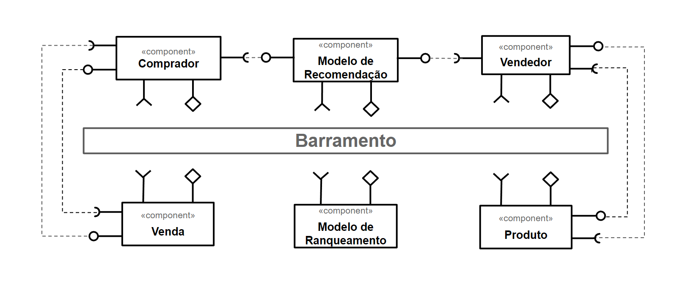

# Modelo para Apresentação do Lab01 - Estilos Arquiteturais

Estrutura de pastas:

~~~
├── README.md  <- arquivo apresentando a tarefa
│
└── images     <- arquivos de imagens usadas no documento
~~~

# Aluno
* `Thiago Silva de Souza`

## Tarefa 1 - Dados para Treinamento e Recomendação

>
### Treinamento
Cliente :
*genero
*endereço
*idade
*carrinho
*listaHistóricoDeCompras
*listaDeDesejos
*categoriasPreferidas

Vendedor :
*genero
*endereço
*idade
*listaDeVendas
*listaDeAnuncios
*categoriasMaisAnunciadas

Produto :
*id
*nome
*descricao
*categoria
*localizacao
*dataDeCadastro
*codigo
*quantidadeEmEstoque

Venda :
*id
*vendedor
*cliente
*valor
*pagamento
*listaDeProdutos
*dataDaVenda

### Recomendação
*Cliente :
*id
*nome
*sobrenome
*cpf
*genero
*endereço
*idade
*carrinho
*listaHistóricoDeCompras
*listaDeDesejos
*categoriasPreferidas

*Vendedor :
*id
*nome
*sobrenome
*cpf
*genero
*endereço
*idade
*listaDeVendas
*listaDeAnuncios
*categoriasMaisAnunciadas

*Produto :
*id
*nome
*descricao
*categoria
*localizacao
*dataDeCadastro
*codigo
*quantidadeEmEstoque

*Venda :
*id
*vendedor
*cliente
*valor
*pagamento
*listaDeProdutos
*dataDaVenda

## Tarefa 2 - Breve descrição de Composições Dinâmica e Estática
>
### Composição Dinâmica
> Como composição dinâmica, podemos categorizar os componentes de interação entre os usuários, pois além de ocorrerem de forma assíncrona, estão mais sucetiveis de sofrerem alterações em seus requisitos
### Composição Estática
> Como coposição estática é possivel definir o treinamento do modelo de recomendação de produtos, uma vez que a coleta e tretamento dos dados é feita de forma periódica.

## Tarefa 3 - Composição para Treinamento e Recomendação

>

