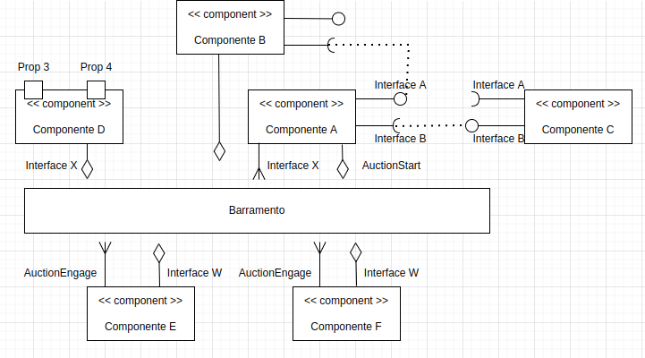

# Modelo para Apresentação do Lab01 - Estilos Arquiteturais

Estrutura de pastas:

~~~
├── README.md  <- arquivo apresentando a tarefa
│
└── images     <- arquivos de imagens usadas no documento
~~~

# Aluno
* `João Paulo Cardoso`

## Tarefa 1 - Dados para Treinamento e Recomendação

> Coloque a lista de campos como itens e subitens, conforme exemplo a seguir:
>
## Treinamento
* Entidade cliente
  * campo id
  * campo nome
  * campo itens comprados
  * campo lista de desejos
  * campo carrinho
* Entidade produto
  * campo id
  * campo nome
  * campo valor
  * campo categoria
  * campo itens disponíveis
 
 ## Recomendação 
* Entidade cliente
  * campo id
  * campo nome
  * campo itens comprados
  * campo lista de desejos
  * campo carrinho
* Entidade produto
  * campo id
  * campo nome
  * campo valor
  * campo categoria
  * campo itens disponíveis

## Tarefa 2 - Breve descrição de Composições Dinâmica e Estática

> Escreva duas breves descrições, conforme exemplos a seguir:
>
### Composição Dinâmica
> Componentes do sistema podem ser adicionados, removidos, substuídos e reconfigurados em tempo de execução. A principal vantagem é que o sistema pode se adequar dinamicamente a novas necessidades.
### Composição Estática
> Na composição estática, podem ser combinados diversos componentes em tempo de compilação ou projeto. A principal desvantagem é que uma vez gerado, o sistema não pode mais ser alterado em tempo de execução, pois toda alteração requer que o sistema seja interrompido, atualizado e reiniciado.

## Tarefa 3 - Composição para Treinamento e Recomendação

> Coloque a imagem PNG do diagrama, conforme exemplo a seguir:
>

