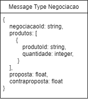
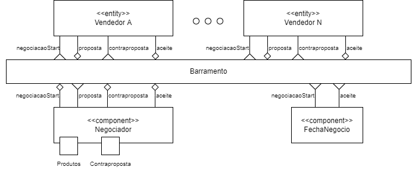
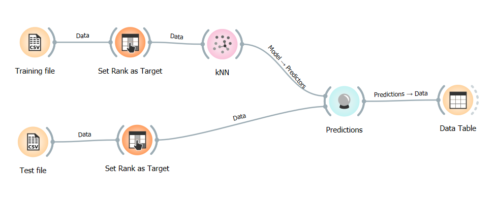
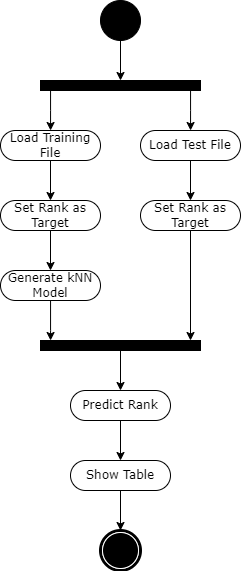

# Modelo para Apresentação do Lab03 - Coreografia e Orquestração no Brechó Online

Estrutura de pastas:

~~~
├── README.md  <- arquivo apresentando a tarefa
│
├── images     <- arquivos de imagens usadas no documento
│
└── workflows  <- arquivos de workflows
~~~

# Aluno
* `Allan Ferreira Fonseca`

## Tarefa 1 - Detalhando a Negociação das Ofertas

a) Representação do DTO

b) Diagrama de Componentes e Descrição

* passo 1: O cliente abre uma negociação através do Negociador ao selecionar um produto no qual está interessado, o que dispara uma mensagem startNegociacao com o DTO Negociacao
* passo 2: Os Vendedores subscritos a mensagem startNegociacao para aquele tipo de produto são notificados e podem fazer uma proposta de valor
* passo 3: O cliente recebe a mensagem com a proposta e pode dar um aceite na proposta, o que encerra a negociação, ou fazer uma contraproposta.
* passo 4: Caso o cliente decida fazer uma contraproposta, essa é recebida pelo Vendedor que fez a proposta original e ele pode ou não dar um aceite, finalizando a negociação.

## Tarefa 2 - Recomendação de Preço

a) Workflow em Orange para recomendação

[Arquivo Orange](workflows/lab3.ows)

b) Workflow em uma representação UML

