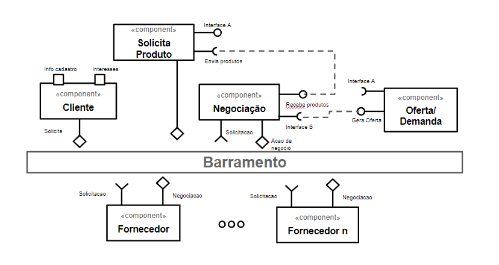
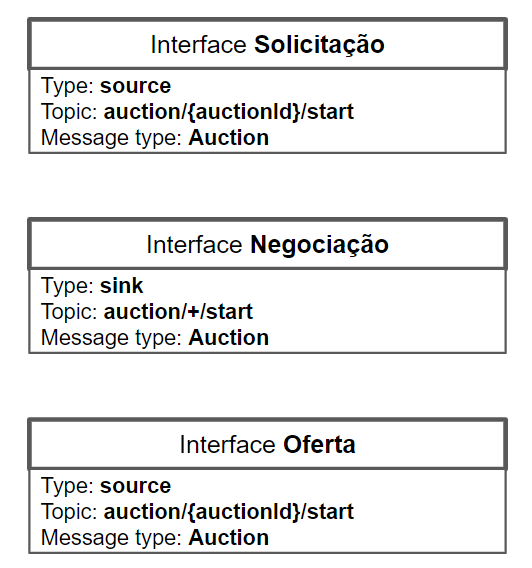
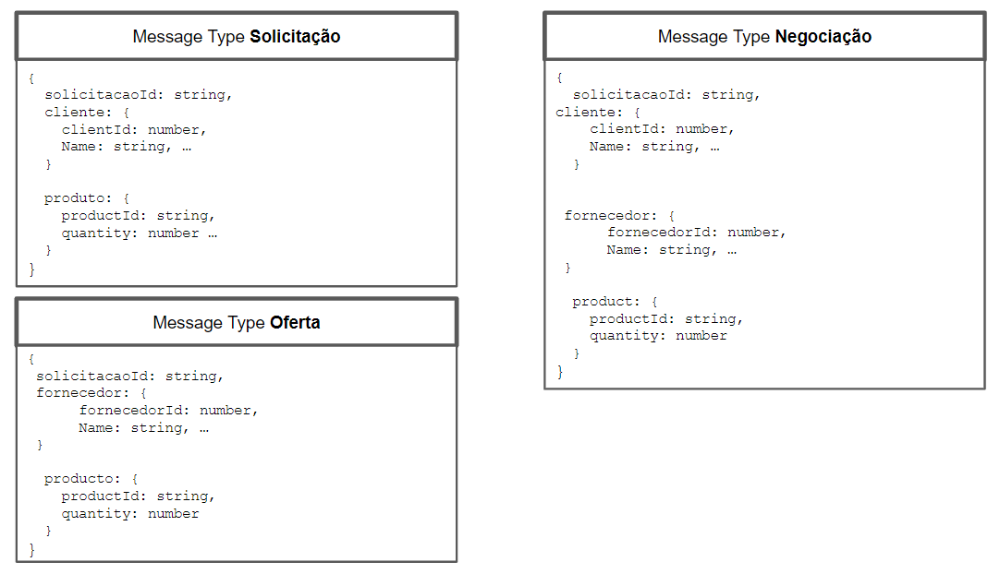
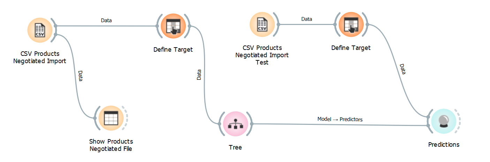
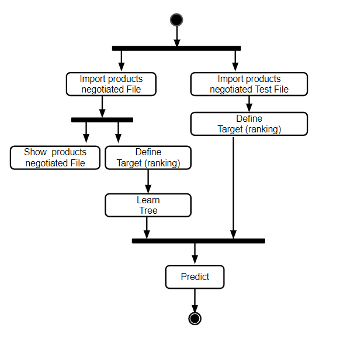
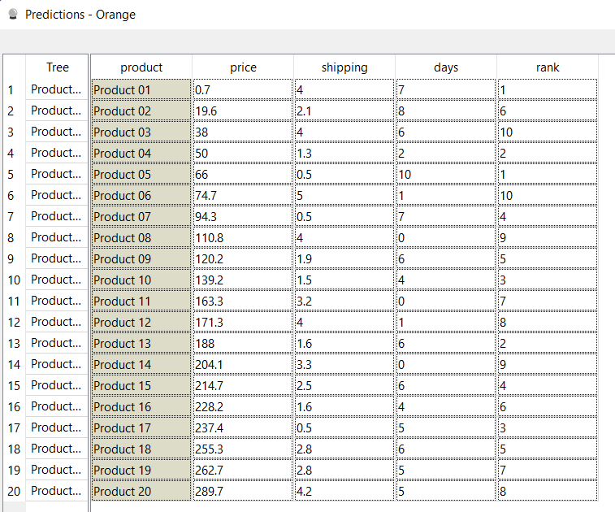

# Aluno
* `Fábio Fernandes Domingues`

## Tarefa 1 - Detalhando a Negociação das Ofertas

a) Representação do DTO

b) Diagrama de Componentes e Descrição

>

> * Cliente solicita produto 
> * Fornecedor posta produto 
> * Negociacao é intermediada pelo espaço de negociacao

## Tarefa 2 - Recomendação de Preço

a) Workflow em Orange para recomendação

>
>

b) Workflow em uma representação UML

