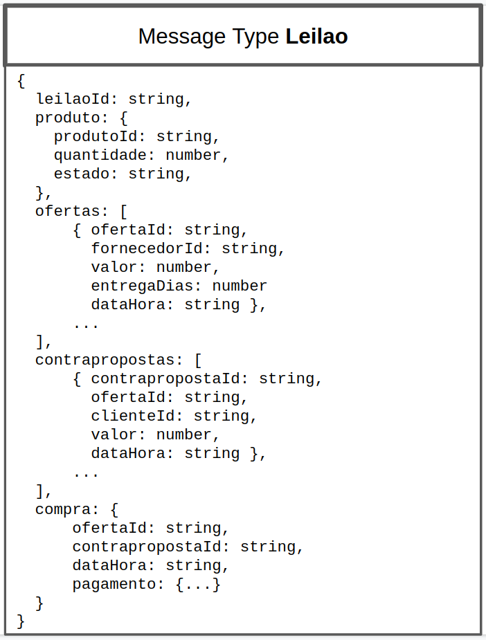
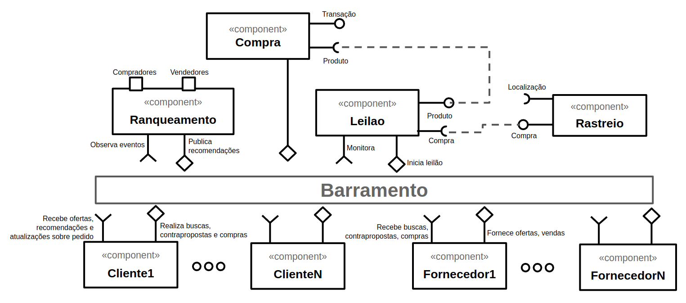
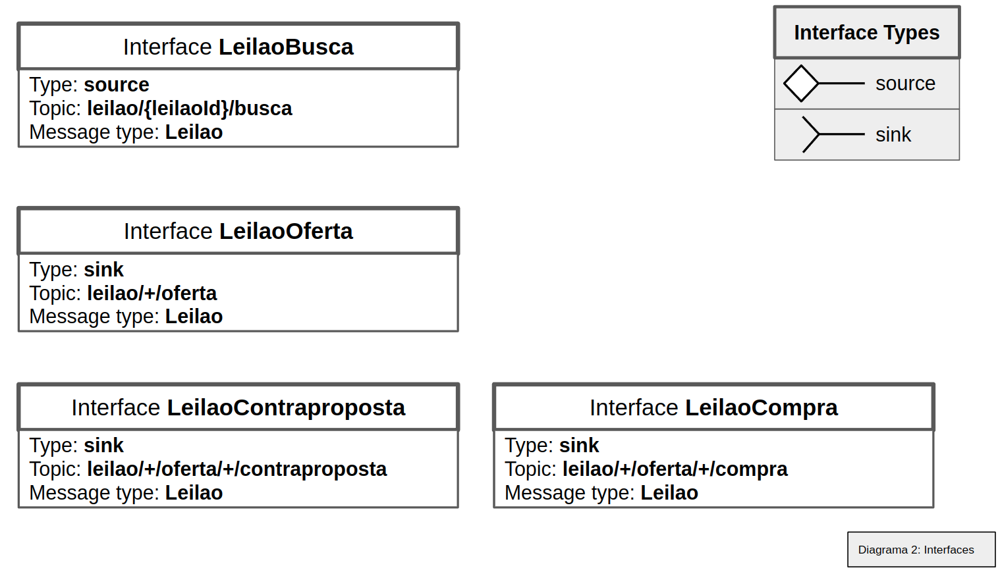
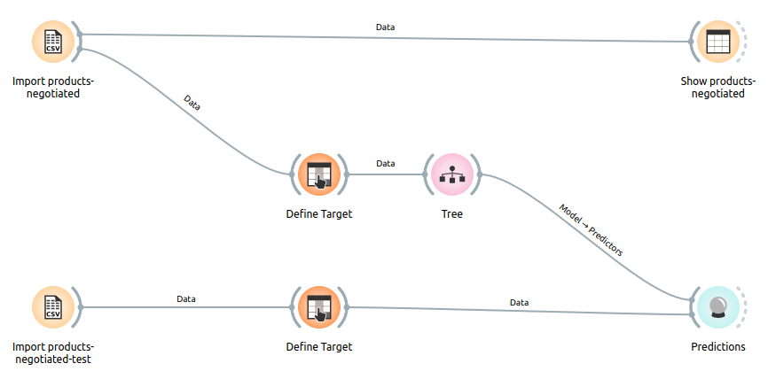
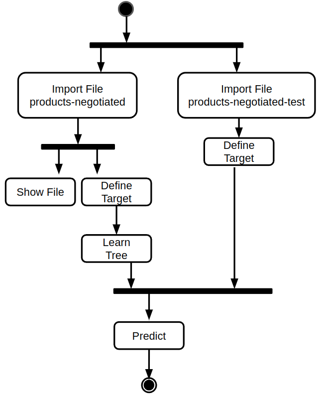

# Modelo para Apresentação do Lab03 - Coreografia e Orquestração no Brechó Online

Estrutura de pastas:

~~~
├── README.md  <- arquivo apresentando a tarefa
│
├── images     <- arquivos de imagens usadas no documento
│
└── workflows  <- arquivos de workflows
~~~

# Aluno
* `Guilherme Pedrozo Abacherli`

## Tarefa 1 - Detalhando a Negociação das Ofertas

a) Representação do DTO

> Coloque a imagem PNG do diagrama do DTO, conforme exemplo a seguir:
>

b) Diagrama de Componentes e Descrição

> Imagem PNG do diagrama de componentes:
>

>
> Imagem PNG dos tópicos associados aos DTOs:

>
> Breve descrição de como a coreografia opera na forma de tópicos:
>
> * Cliente inicia a busca por um leilão de um produto;
> * Fornecedores respondem com suas ofertas (valor, prazo de entrega, etc);
> * Cliente pode aceitar a oferta ou enviar uma contraproposta;
> * Fornecedor pode aceitar a contraproposta ou não;
> * Se a oferta ou a contraproposta for aceita a compra é realizada;
> * Enquanto isso o componente de Ranqueamento fica coletando dados sobre ofertas, contrapropostas e compras e eventualmente publica recomendações para novos clientes e/ou fornecedores;
> * A localização do produto comprado pode ser obtida com o componente de Rastreio;

## Tarefa 2 - Recomendação de Preço

a) Workflow em Orange para recomendação

> Imagem PNG da captura de tela workflow em Orange:
>

>
> Link para o arquivo em Orange – o arquivo está na pasta workflows:
[Workflow Orange](workflows/workflow-orange.ows)

b) Workflow em uma representação UML

> Imagem PNG da captura de tela workflow em UML:
>

