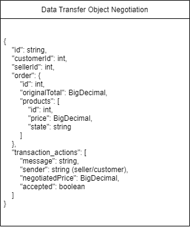
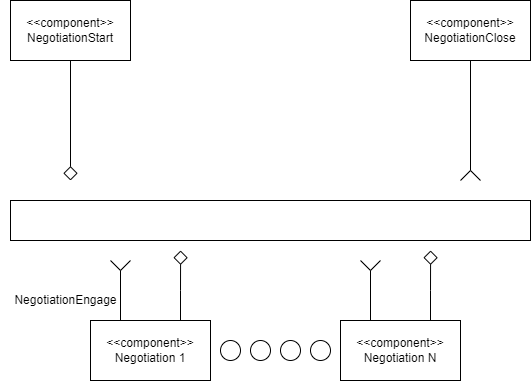
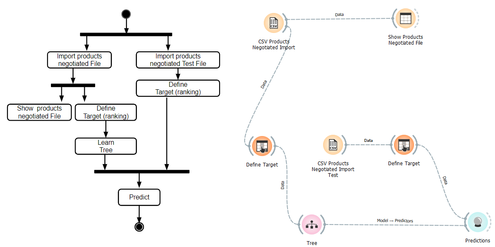

# Modelo para Apresentação do Lab03 - Coreografia e Orquestração no Brechó Online

Estrutura de pastas:

~~~
├── README.md  <- arquivo apresentando a tarefa
│
├── images     <- arquivos de imagens usadas no documento
│
└── workflows  <- arquivos de workflows
~~~

# Aluno
* `Nicole Bertolo Rodrigues`

## Tarefa 1 - Detalhando a Negociação das Ofertas

a) Representação do DTO

> Coloque a imagem PNG do diagrama do DTO, conforme exemplo a seguir:

b) Diagrama de Componentes e Descrição

> Coloque a imagem PNG do diagrama de componentes, conforme exemplo a seguir:

> Coloque a imagem PNG dos tópicos associados aos DTOs (veja exemplo a seguir). Este item é opcional, a associação pode ser feita na descrição.

> Escreva uma breve descrição de como a coreografia opera na forma de tópicos, conforme exemplo a seguir:
>
* Cliente ao abrir uma negociação, o vendedor é notificado e então começa-se a troca de ações da transação.
* Podendo existir *N* ações de negociação, o DTO armazena todos em um array/lista, informando a mensagem escrita, qual foi a parte quem enviou (comprador/vendedor), preço negociado e se a proposta foi aceita pelo lado.
* Ao termino da *N* ação de negociação, o último objeto escrito dentro do array/lista terá seu campo "accepted" indicado como true (verdadeiro).
* Finalizado o processo de negociação, o cliente segue para o pagamento do pedido.

## Tarefa 2 - Recomendação de Preço

a) Workflow em Orange para recomendação

> Coloque a imagem PNG da captura de tela workflow em Orange, conforme exemplo a seguir:

> Coloque um link para o arquivo em Orange – o arquivo deverá estar na pasta workflows (veja estrutura acima). Coloque os arquivos de dados na mesma pasta. Veja exemplo a seguir:

[Workflow em Orange](workflows/workflow.ows)

b) Workflow em uma representação UML

> Coloque a imagem PNG da captura de tela workflow em UML, conforme exemplo a seguir:

