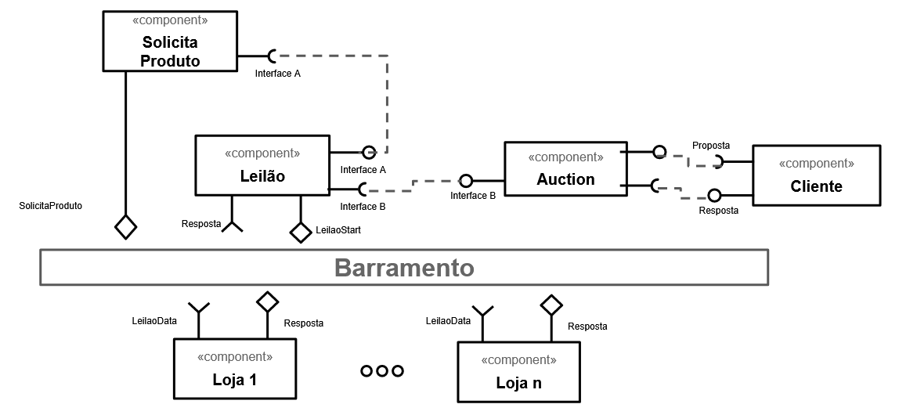
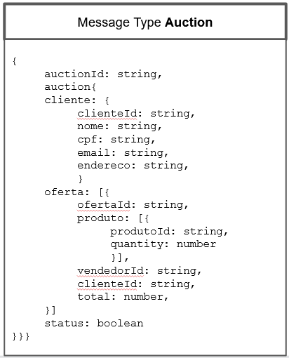
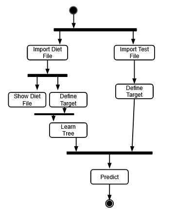

# Modelo para Apresentação do Lab03 - Coreografia e Orquestração no Brechó Online

Estrutura de pastas:

~~~
├── README.md  <- arquivo apresentando a tarefa
│
├── images     <- arquivos de imagens usadas no documento
│
└── workflows  <- arquivos de workflows
~~~

# Aluno
* `<Lucas Lopes Moreira>`

## Tarefa 1 - Detalhando a Negociação das Ofertas

a) Representação do DTO

b) Diagrama de Componentes e Descrição

> Coloque a imagem PNG do diagrama de componentes, conforme exemplo a seguir:
>

>
> Coloque a imagem PNG dos tópicos associados aos DTOs. Este item é opcional, a associação pode ser feita na descrição.
>
> Escreva uma breve descrição de como a coreografia opera na forma de tópicos, conforme exemplo a seguir:
>
> * 1. O componente cliente lanca uma nova solicitacao de compra feita pelo usuario
> * 2. O componente Auction gerencia as mensagens entre o componentes cliente e leilao 
> * 3. O componente Solicitacao Produto e Leilao Postam no barramento os produtos solicitados e o valor da oferta
> * 4. Os componente Loja recebem os dados da solicitacao no barramento e, apos receber a resposta dos vendedores, responde a solicitacao no barramento
> * 5. Leilao recebe as respostas no barramento e envia a lista de volta ao cliente atravez do componentes auction e cliente
> * 6. O processo se repete ate se concluir

## Tarefa 2 - Recomendação de Preço

a) Elabore um workflow em Orange para recomendação. Utilize o arquivo [products-negotiated.csv](products-negotiated.csv) para o treinamento e o arquivo [products-negotiated-test.csv]( products-negotiated-test.csv) para teste.

b) Transforme esse workflow em uma representação UML.

