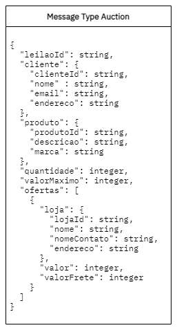
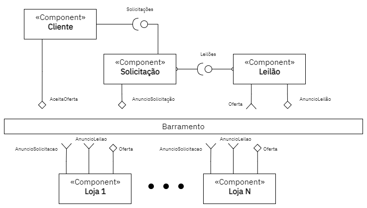
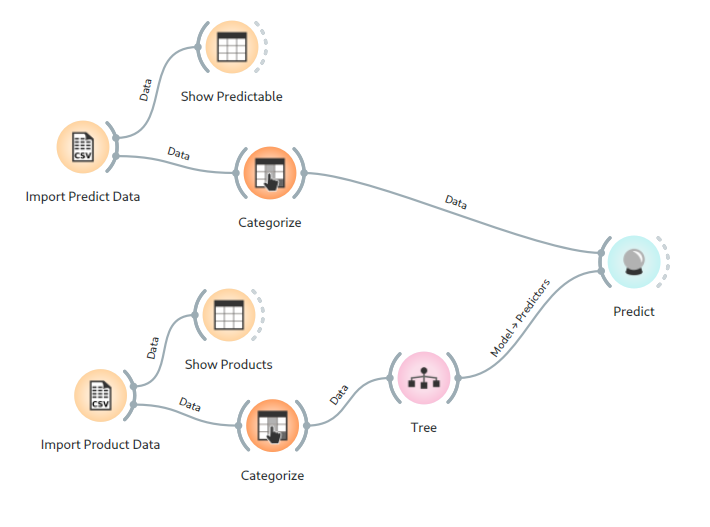
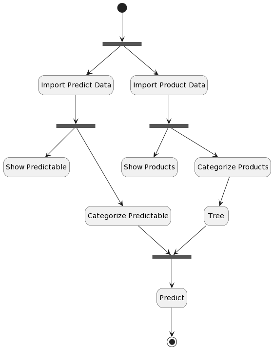

# Aluno
* Tulio Bassaco Bustos

## Tarefa 1 - Detalhando a Negociação das Ofertas

a) Representação do DTO

b) Diagrama de Componentes e Descrição

1. O componente Cliente lança uma nova Solicitação de compra
2. Esta Solicitação é emitida no barramento
3. Ao mesmo tempo, um Leilão é criado a partir da solicitação, sendo também emitido
4. As Lojas, tendo lido as mensagens de Solicitação e Leilão, emitem suas Ofertas do produto solicitado, incluindo o valor
5. O componente Leilão agrega estas ofertas
6. O cliente, tendo recebido uma oferta favorável, a aceita, emitindo esta informação no barramento para que a solicitação seja concluída.

## Tarefa 2 - Recomendação de Preço

a) Workflow em Orange para recomendação

b) Workflow em uma representação UML

