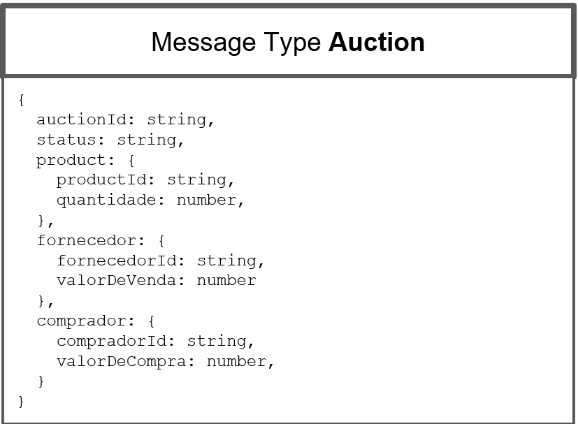
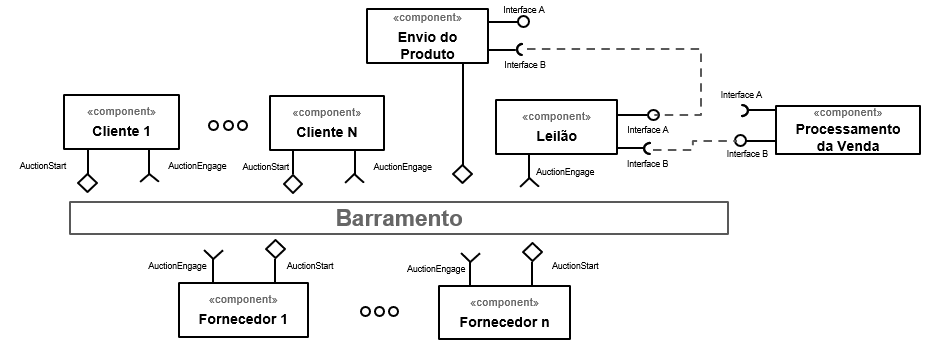
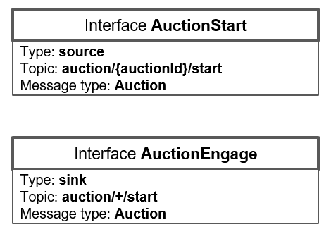
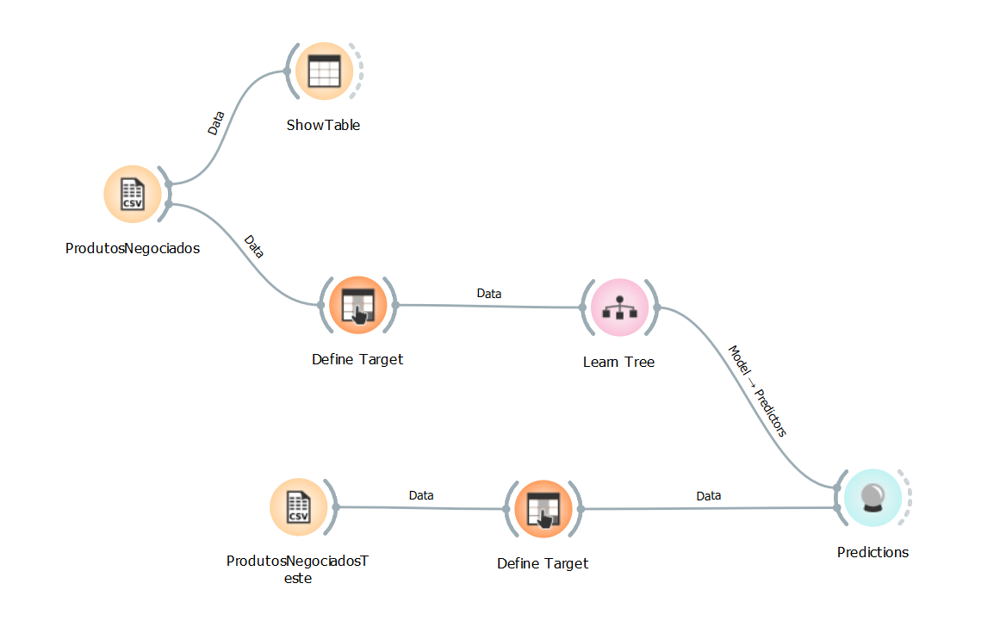
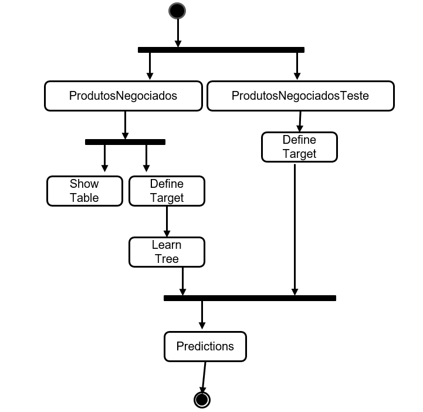

# Modelo para Apresentação do Lab03

# Aluno
* `Gabriel Teixeira Callado - RG 45.022.276-7`

## Tarefa 1 - Detalhando a Negociação das Ofertas
>
### a) Representação do DTO

### b) Diagrama de Componentes e Descrição

A ideia é que tanto o fornecedor quanto o comprador possam enviar o DTO de oferta de compra ou venda ao barramento para que algum comprador ou fornecedor responda à ela – e o componente Leilão fica apenas ouvindo para atuar quando a negociação for feita. Por exemplo, se um fornecedor enviar uma mensagem (DTO no formato do slide anterior) ao barramento, ela virá com o status ‘Não Vendida’, informações do produto vendido (id e quantidade), informação sobre o fornecedor (seu id e sua oferta de venda) e os dados de comprador virão vazios. Assim que um comprador ouvir a mensagem e quiser fazer uma contraproposta, ele acessa a mensagem, modifica os campos de comprador (com seu id e sua oferta de compra) e envia de volta ao barramento. No momento que o valor de venda do fornecer e o valor de compra do comprador forem iguais, a venda é realizada e o status da mensagem é atualizado para ‘Vendido’ - e aí o componente “Leilão” processará a venda e fará todos os passos para que seja realizada. No DTO proposto é feita uma única oferta de compra e venda por vez e por produto.

## Tarefa 2 - Recomendação de Preço

> Coloque a lista de campos como itens e subitens, conforme exemplo a seguir:
>
### a) Workflow em Orange para recomendação

### b) Workflow em uma representação UML

