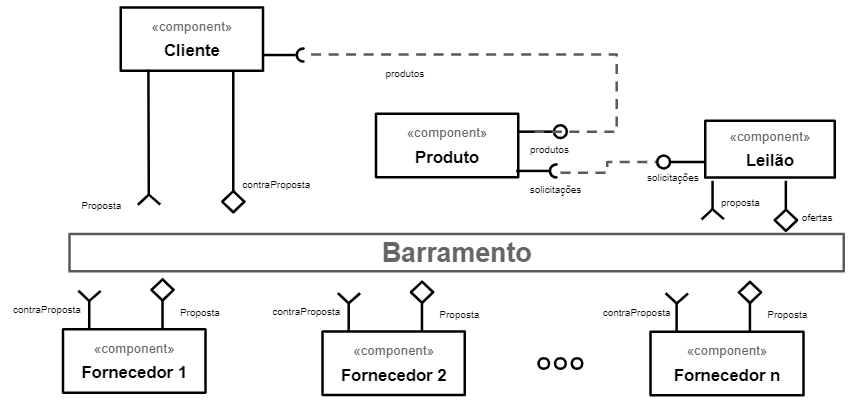
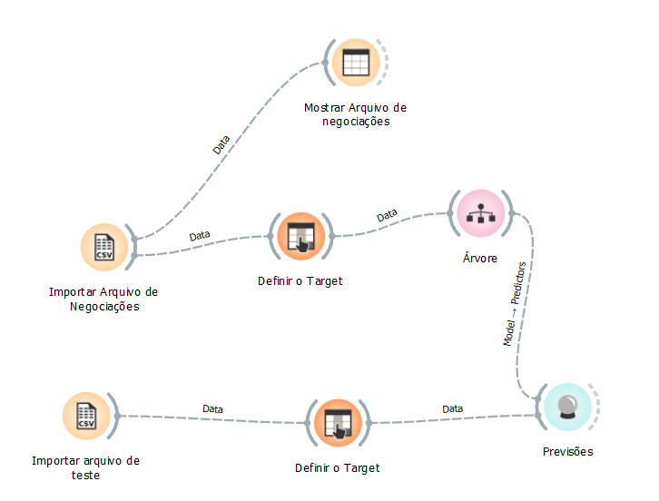
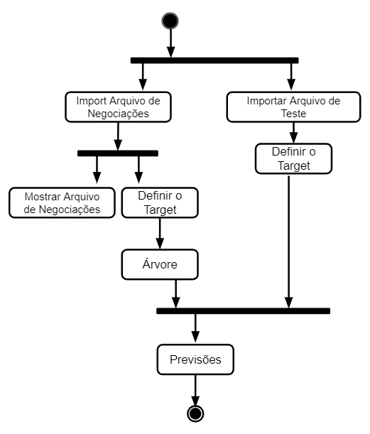

# Aluno
* `Claudio Augusto Pereira Rolim`

## Tarefa 1 - Detalhando a Negociação das Ofertas

a) Representação do DTO

b) Diagrama de Componentes e Descrição

* O componente Cliente posta um novo produto
* O componente Produto é lido pelo componente Leilão
* O componente Leilão lança ofertas no barramento
* As ofertas lançadas no barramento podem ser lidas por qualquer fornecedor
* Fornecedores lançam proposta no barramento, incluindo o valor de venda
* As propostas lançadas no barramento podem ser lidas pelo cliente
* O cliente vendo uma oferta favorável lança uma contraproposta, que é lida pelo fornecedor
* O fornecedor, concordando com o valor do cliente, aceita a contraproposta e emite essa informação no barramento para o cliente
* A negociação é concluída

## Tarefa 2 - Recomendação de Preço

a) Workflow em Orange para recomendação

b) Workflow em uma representação UML

