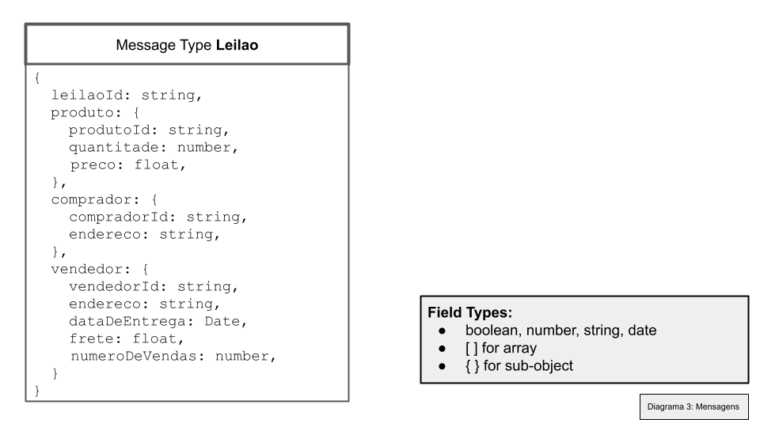
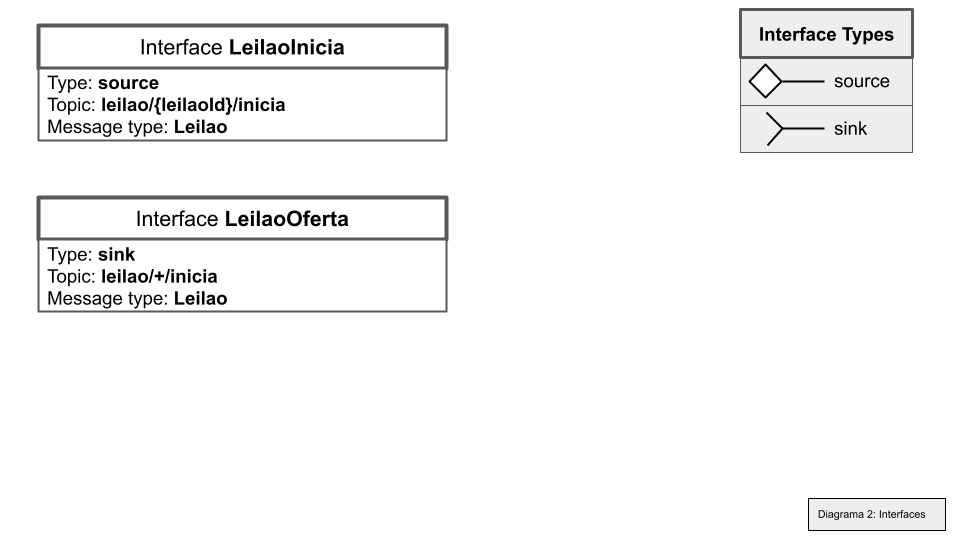
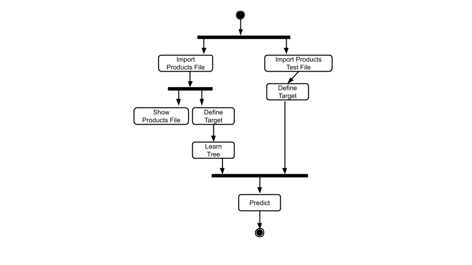

# Modelo para Apresentação do Lab03 - Coreografia e Orquestração no Brechó Online

Estrutura de pastas:

~~~
├── README.md  <- arquivo apresentando a tarefa
│
├── images     <- arquivos de imagens usadas no documento
│
└── workflows  <- arquivos de workflows
~~~

# Aluno
* `Daniel Salgado Costa`

## Tarefa 1 - Detalhando a Negociação das Ofertas

a) Representação do DTO
>

b) Diagrama de Componentes e Descrição

c) Representação das Interfaces

>
> Descrição de como a coreografia opera na forma de tópicos:
>
> * Comprador envia pedido de compra de um produto
> * SolicitaProduto intercepta este pedido e envia para o leilao
> * Leilao envia o pedido para os vendedores
> * Vendedor envia sua oferta para o Leilao
> * Leilao envia oferta para o Ranqueamento
> * Ranqueamento envia o resultado do rank para o Leilao
> * Leilao envia a melhor oferta para SolicitaProduto

## Tarefa 2 - Recomendação de Preço

a) Workflow em Orange para recomendação

> Coloque a imagem PNG da captura de tela workflow em Orange, conforme exemplo a seguir:
>

>
> Coloque um link para o arquivo em Orange – o arquivo deverá estar na pasta workflows (veja estrutura acima).

b) Workflow em uma representação UML

> Coloque a imagem PNG da captura de tela workflow em UML, conforme exemplo a seguir:
>

