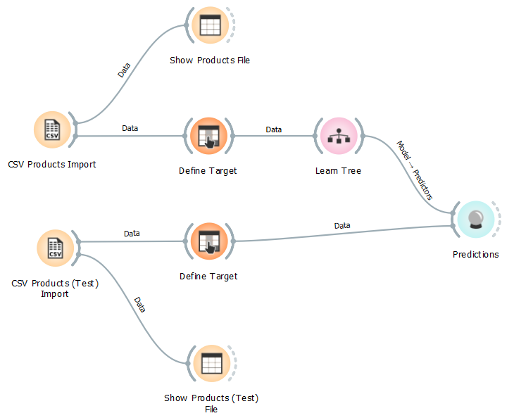
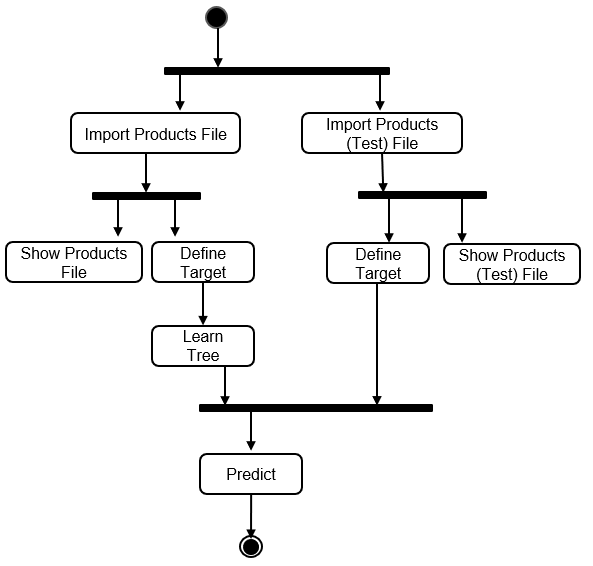

# Modelo para Apresentação do Lab03 - Coreografia e Orquestração no Brechó Online

Estrutura de pastas:

~~~
├── README.md  <- arquivo apresentando a tarefa
│
├── images     <- arquivos de imagens usadas no documento
│
└── workflows  <- arquivos de workflows
~~~

# Aluno
* `Daniel Francisco Ferreira Lopes`

## Tarefa 1 - Detalhando a Negociação das Ofertas

a) Representação do DTO

b) Diagrama de Componentes e Descrição

>
> * O Cliente gera novas solicitações de compras de produtos;
> * O componente de Solicitação de Produtos recebe essas requisições do cliente, fornece no barramento para as lojas interessadas na venda e envia a relação de produtos ao Leilão;
> * As lojas recebem as solicitações de produtos através do barramento e enviam suas propostas (negociações);
> * O componente do Leilão faz o controle de tempo das propostas, informa o status de controle ao componente de Solicitação de Produtos
> * O componente do Leilão recebe as negociações das lojas e envia ao cliente através do barramento;
> * O cliente então recebe essas propostas de venda através do barramento para decisão de compra.

## Tarefa 2 - Recomendação de Preço

a) Workflow em Orange para recomendação

>

b) Workflow em uma representação UML

