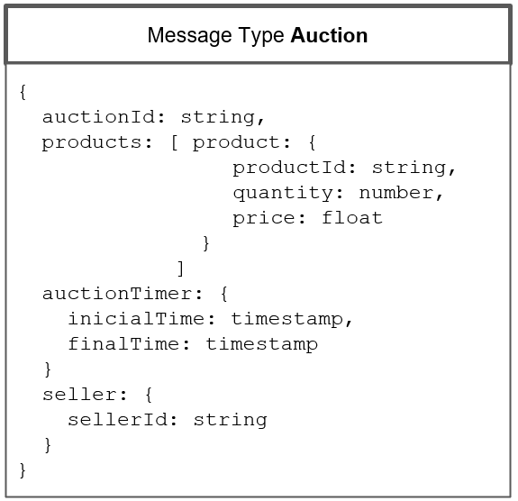
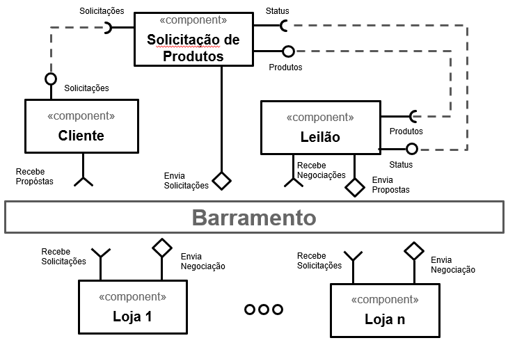

# Modelo para Apresentação do Lab03 - Coreografia e Orquestração no Brechó Online

Estrutura de pastas:

~~~
├── README.md  <- arquivo apresentando a tarefa
│
├── images     <- arquivos de imagens usadas no documento
│
└── workflows  <- arquivos de workflows
~~~

# Aluno
* `Daniel Francisco Ferreira Lopes`

## Tarefa 1 - Detalhando a Negociação das Ofertas

a) Representação do DTO

b) Diagrama de Componentes e Descrição

>
> Escreva uma breve descrição de como a coreografia opera na forma de tópicos, conforme exemplo a seguir:
>
> * passo 1
> * passo 2
> * passo 3

## Tarefa 2 - Recomendação de Preço

a) Workflow em Orange para recomendação

>
> Coloque um link para o arquivo em Orange – o arquivo deverá estar na pasta workflows (veja estrutura acima).

b) Workflow em uma representação UML

