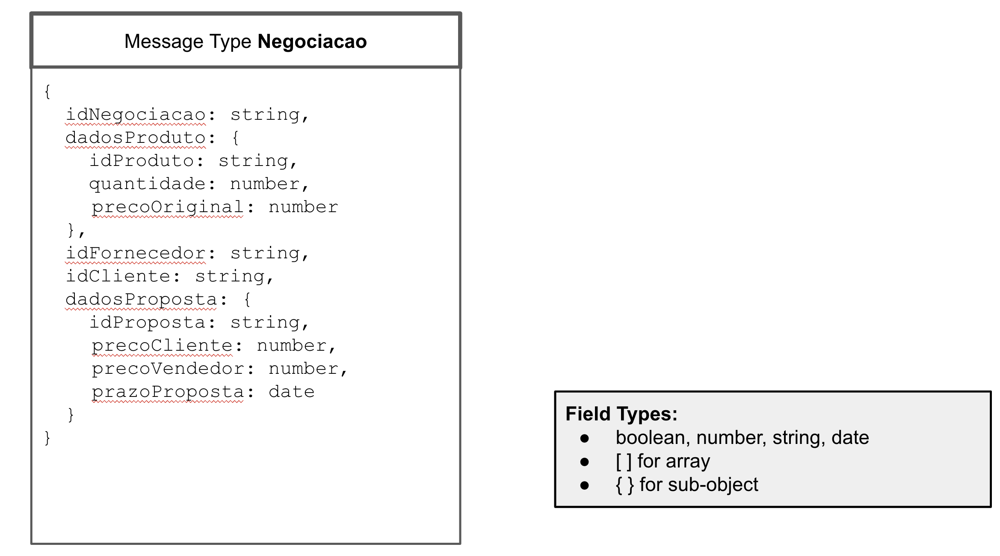
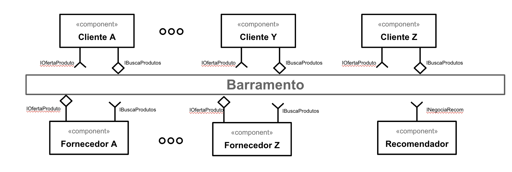
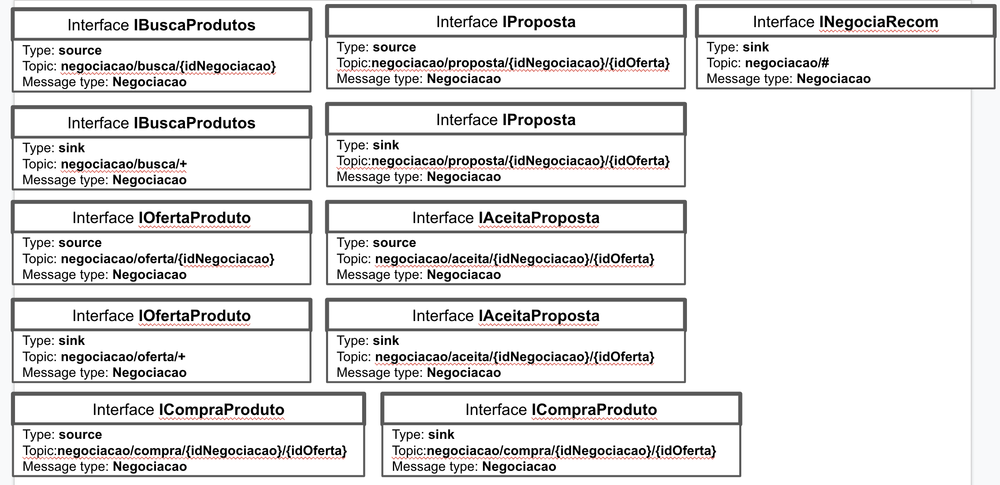
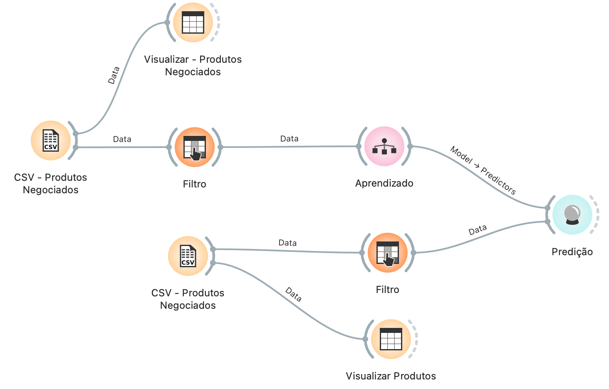
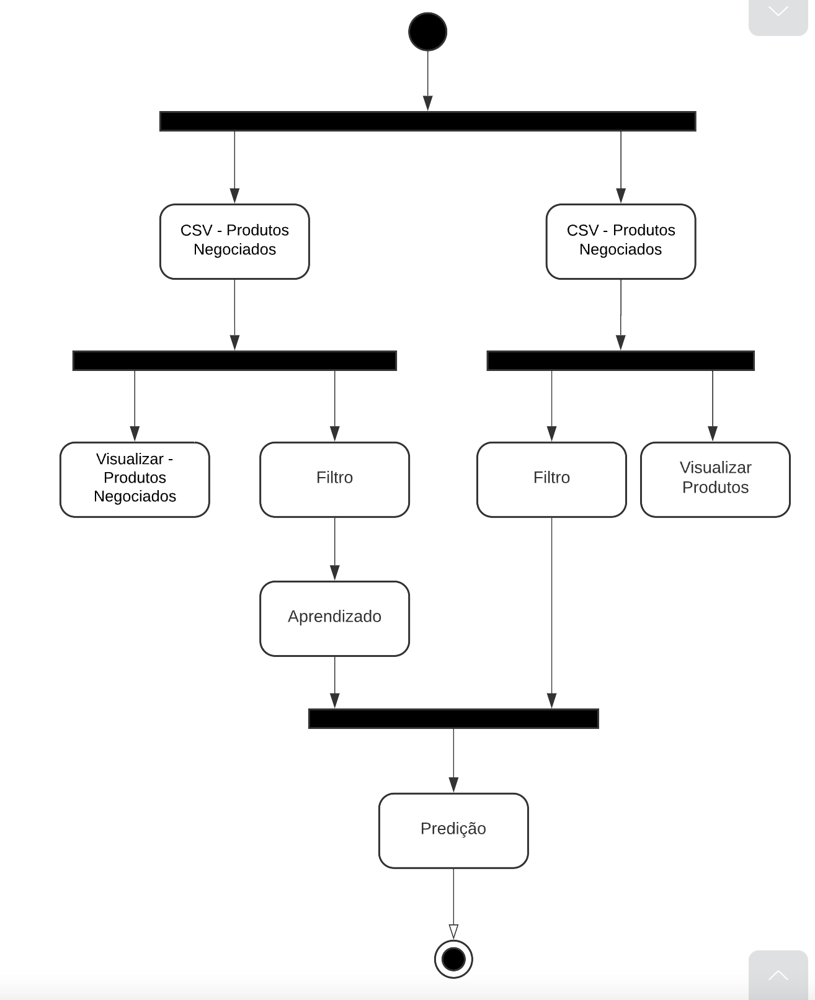

# Aluno

* Edivilson França - RG: 35.165.045-3

## Tarefa 1 - Detalhando a Negociação das Ofertas

a) Representação do DTO

b) Diagrama de Componentes e Descrição

> * O `Cliente A` realiza a busca de um produto através da interface `IBuscaProdutos` passando o id da negociação gerado por ele e o valor que está disposta a pagar.
> * Os fornecedores que assinaram o topico `negociacao/busca` respondem através da interface `IOfertaProdutos` informando o valor da oferta que será aceito por eles.
> * Caso o cliente aceite alguma proposta enviada pelos fornecedores ele responde pela interface `ICompraProduto` especificamente para o fornecedor desejado. Isso acontece porque esse fornecedor assinou o topico específico da compra.
> * Caso o aceite venha através do fornecedor ele responde através da interface `IAceitaProposta` e o processo de compra continua conforme citado anteriormente.
> * Há também a possibilidade de haver várias negociações com os fornecedores através da interface `IProposta`, onde os mesmos tentam chegar em um preço aceitável para os dois.

## Tarefa 2 - Recomendação de Preço

a) Workflow em Orange para recomendação
>

>
[Workflow em Orange](workflows/example-workflow.ows)

b) Workflow em uma representação UML

> Coloque a imagem PNG da captura de tela workflow em UML, conforme exemplo a seguir:
>

