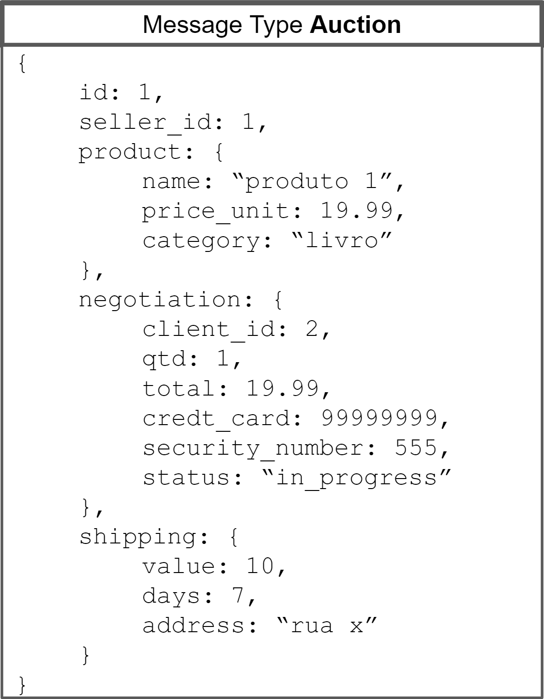
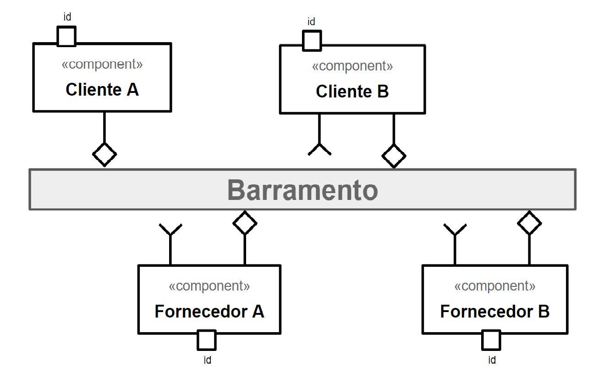
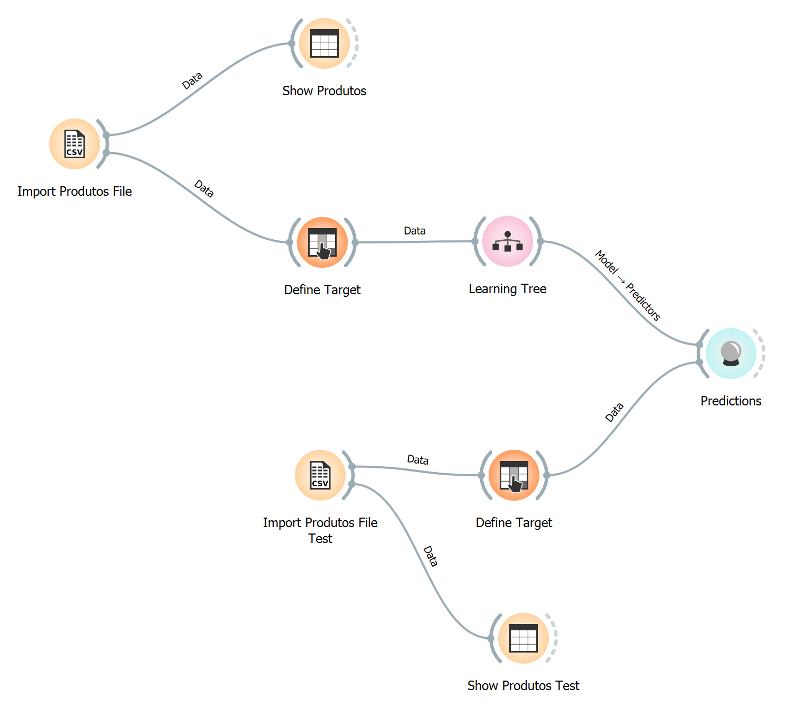
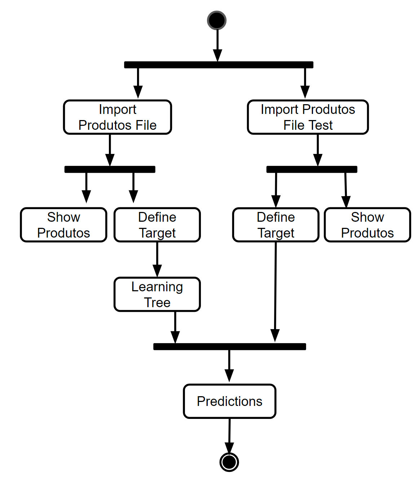

# Modelo para Apresentação do Lab03 - Coreografia e Orquestração no Brechó Online

Estrutura de pastas:

~~~
├── README.md  <- arquivo apresentando a tarefa
│
├── images     <- arquivos de imagens usadas no documento
│
└── workflows  <- arquivos de workflows
~~~

# Aluno
* `Estevan Luis Gregori`

## Tarefa 1 - Detalhando a Negociação das Ofertas

a) Representação do DTO

> Coloque a imagem PNG do diagrama do DTO, conforme exemplo a seguir:
>

b) Diagrama de Componentes e Descrição

> Coloque a imagem PNG do diagrama de componentes, conforme exemplo a seguir:
>

>
> Coloque a imagem PNG dos tópicos associados aos DTOs. Este item é opcional, a associação pode ser feita na descrição.
>
> Escreva uma breve descrição de como a coreografia opera na forma de tópicos, conforme exemplo a seguir:
>
> * passo 1: vendedor disponibiliza no barramento informações do produto (id, seller_id e product).
> * passo 2: cliente seleciona o produto, a quantidade desejada e acrescenta ao DTO as informações em negotiation com o status "in_progress" juntamente com algumas infors do modo de pagamento e reenvia o mesmo para o barramento.
> * passo 3: o vendedor recebe o DTO e complementa-o com as informações de frete no campo shipping e altera o status da negociação.
> * passo 4: o cliente confirma a operação, alterando novamente o status e finalizando a coreografia.

## Tarefa 2 - Recomendação de Preço

a) Workflow em Orange para recomendação

> Coloque a imagem PNG da captura de tela workflow em Orange, conforme exemplo a seguir:
>

>
> Coloque um link para o arquivo em Orange – o arquivo deverá estar na pasta workflows (veja estrutura acima).

b) Workflow em uma representação UML

> Coloque a imagem PNG da captura de tela workflow em UML, conforme exemplo a seguir:
>

