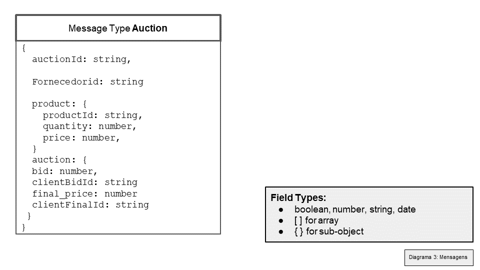
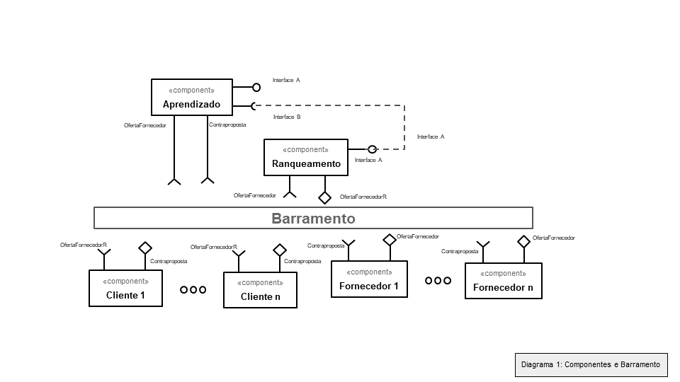
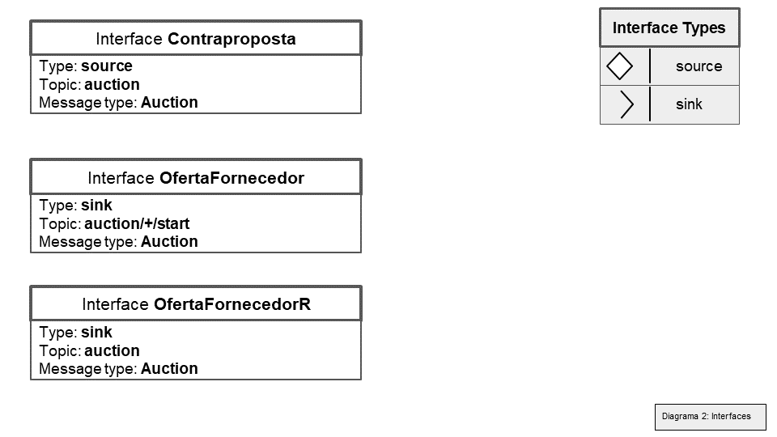

# Modelo para Apresentação do Lab03 - Coreografia e Orquestração no Brechó Online

# Aluno
* `Giuliana Cirelli - RG 29.418.252-4`

## Tarefa 1 - Detalhando a Negociação das Ofertas

a) Representação do DTO

> Coloque a imagem PNG do diagrama do DTO, conforme exemplo a seguir:
>

b) Diagrama de Componentes e Descrição

> Coloque a imagem PNG do diagrama de componentes, conforme exemplo a seguir:
>

>
> Coloque a imagem PNG dos tópicos associados aos DTOs. Este item é opcional, a associação pode ser feita na descrição.

> Escreva uma breve descrição de como a coreografia opera na forma de tópicos, conforme exemplo a seguir:
>
 * passo 1: Fornecedores estão constantemente postando ofertas de produtos (interface OfertaFornecedor), o campo preço é o valor ofertado.
 * passo 2: O módulo de aprendizado captura tudo que passa pelo barramento, ou seja, busca feita pelos clientes, ofertas de produtos dos fornecedores e contrapropostas dos clientes. Com esses dados, visto como uma caixa preta, faz a listagem dos interesses do cliente e envia esses dados para o ranqueamento dos fornecedores.
 * passo 3: O ranqueamento ordena os fornecedores (realiza o ranqueamento de fato) e envia para os clientes as ofertas de interesse do cliente (interface OfertaFornecedorR).
 * passo 4: O cliente recebe as ofertas ranqueadas e podem fazer uma contraproposta (preenchendo o campo bid e clientBidID da mensagem). 
  * passo 5: O fornecedor recebe as contrapropostas e preenche o campo final_price e o clienteFinalId que ganhou o valor do leilão.

## Tarefa 2 - Recomendação de Preço

a) Workflow em Orange para recomendação

b) Workflow em uma representação UML

