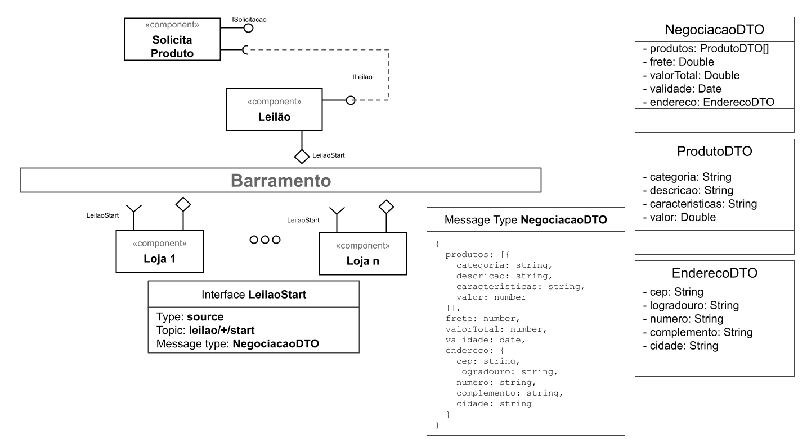
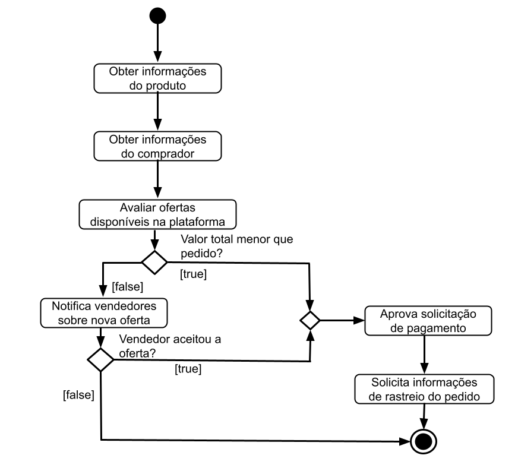

# Modelo para Apresentação do Lab03 - Coreografia e Orquestração no Brechó Online

# Aluno
* `Guilherme Cavassan - RA: 2022601122`

## Tarefa 1 - Detalhando a Negociação das Ofertas

a) Representação do DTO

b) Diagrama de Componentes e Descrição

>
> Coloque a imagem PNG dos tópicos associados aos DTOs. Este item é opcional, a associação pode ser feita na descrição.
>
> Escreva uma breve descrição de como a coreografia opera na forma de tópicos, conforme exemplo a seguir:
>
> * passo 1
> * passo 2
> * passo 3

## Tarefa 2 - Recomendação de Preço

a) Workflow em Orange para recomendação

> Coloque a imagem PNG da captura de tela workflow em Orange, conforme exemplo a seguir:
>

>
> Coloque um link para o arquivo em Orange – o arquivo deverá estar na pasta workflows (veja estrutura acima).

b) Workflow em uma representação UML

> Coloque a imagem PNG da captura de tela workflow em UML, conforme exemplo a seguir:
>

