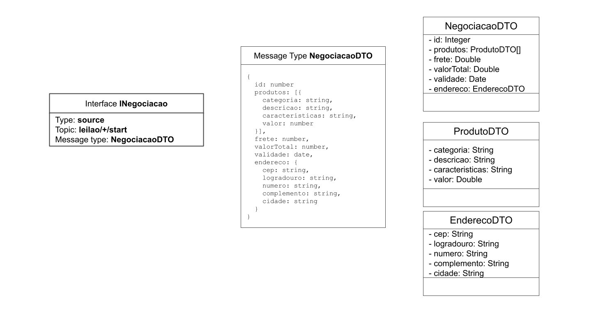
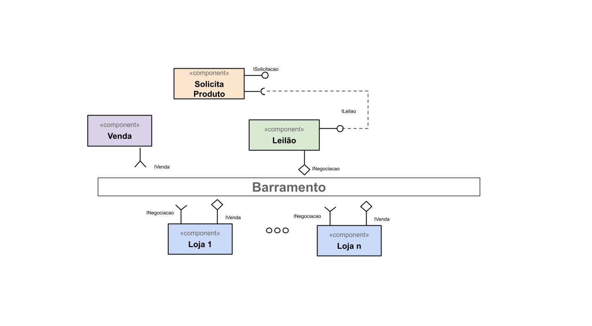
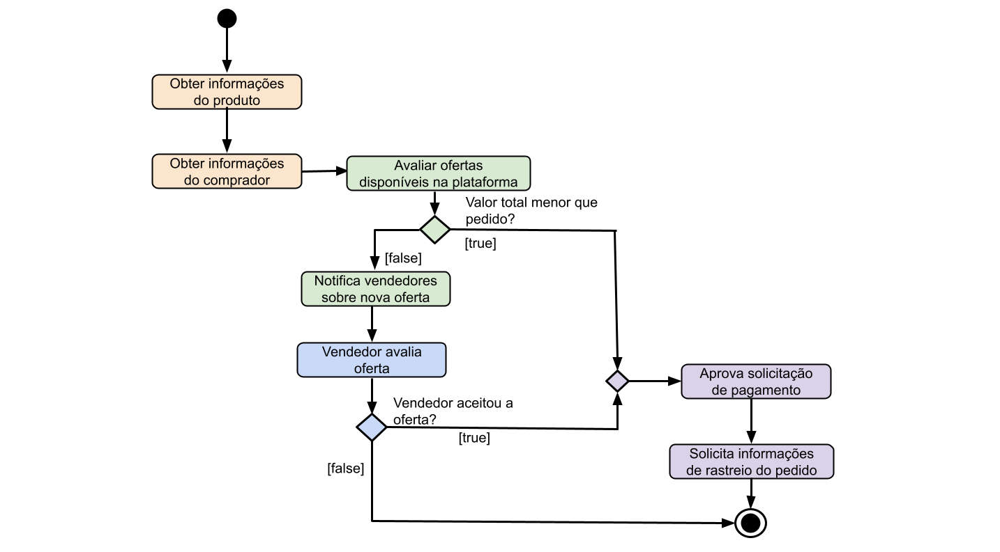

# Modelo para Apresentação do Lab03 - Coreografia e Orquestração no Brechó Online

# Aluno
* `Guilherme Cavassan - RA: 2022601122`

## Tarefa 1 - Detalhando a Negociação das Ofertas

a) Representação do DTO

b) Diagrama de Componentes e Descrição

Diagrama de atividades relacionadas a orquestração dos serviços, passo a passo: 

## Tarefa 2 - Recomendação de Preço

a) Workflow em Orange para recomendação

> Coloque a imagem PNG da captura de tela workflow em Orange, conforme exemplo a seguir:
>

>
> Coloque um link para o arquivo em Orange – o arquivo deverá estar na pasta workflows (veja estrutura acima).

b) Workflow em uma representação UML

> Coloque a imagem PNG da captura de tela workflow em UML, conforme exemplo a seguir:
>

