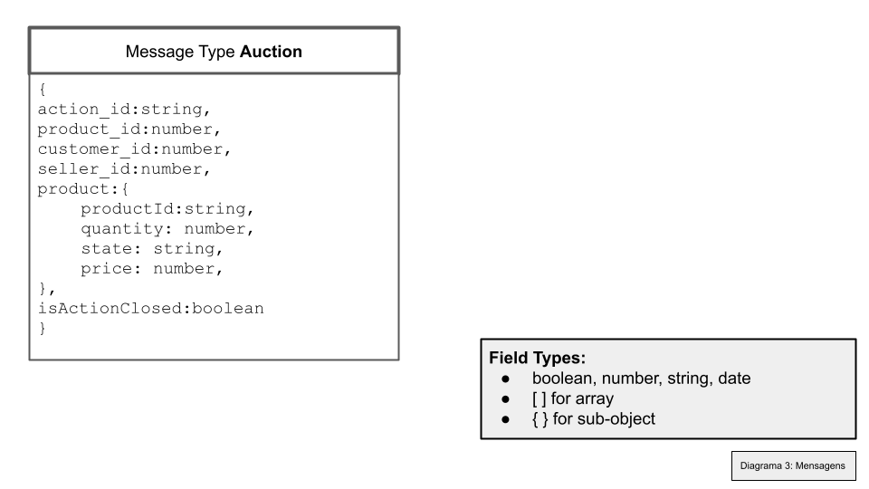
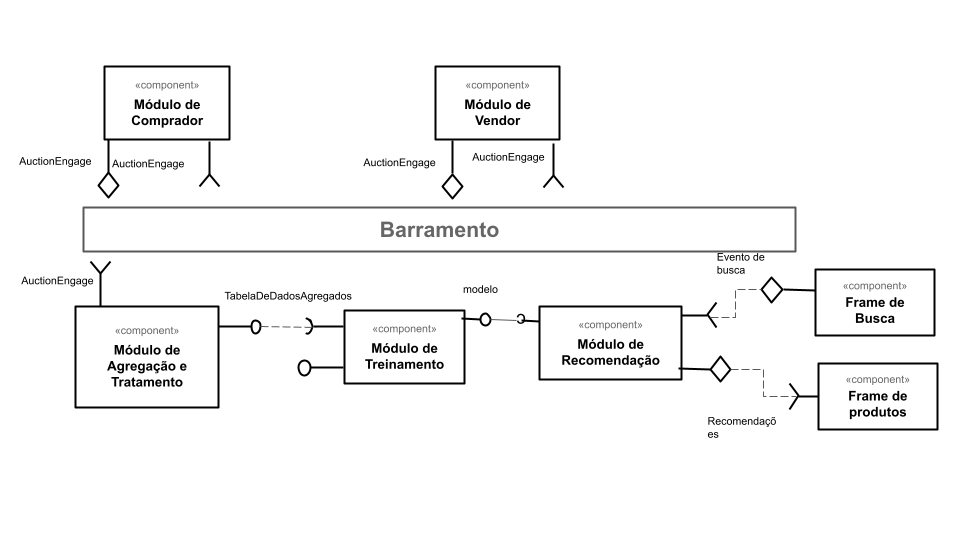
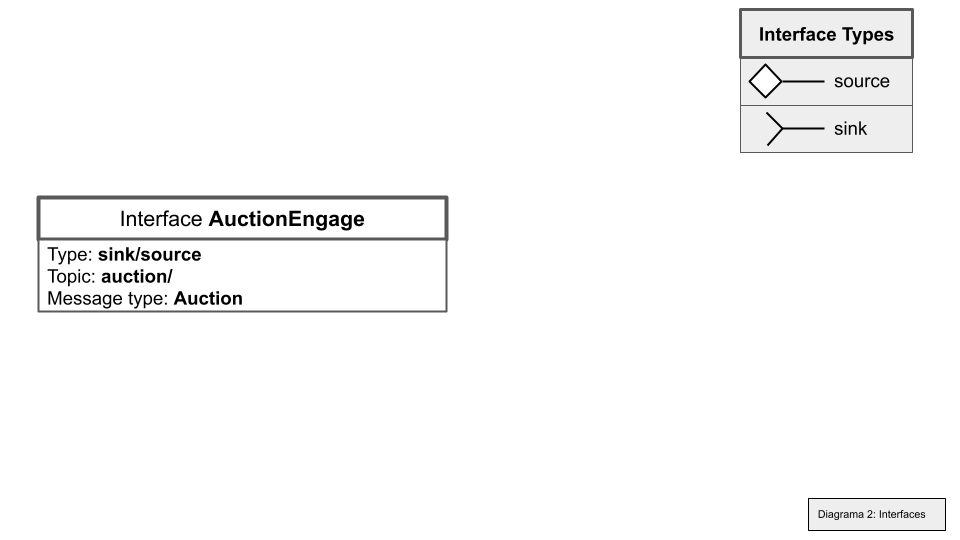
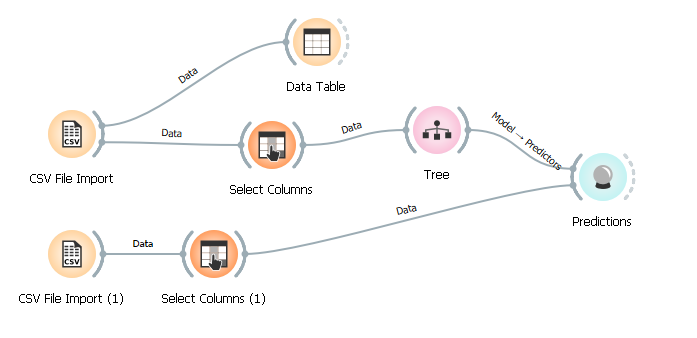
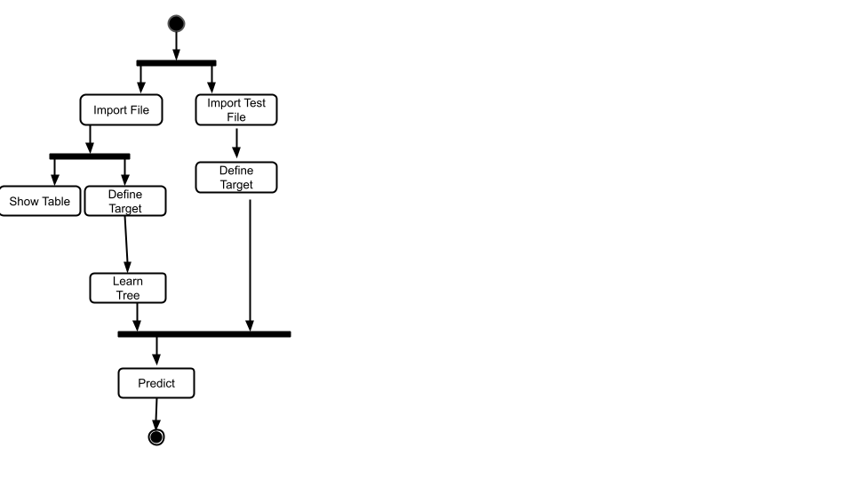

# Aluno
Joao Igor dos Santos Pereira

## Tarefa 1 - Detalhando a Negociação das Ofertas

a) Representação do DTO

b) Diagrama de Componentes e Descrição

1-Modulo do Cliente publica no tópico de auctionEngage com o campo de seller e preço vazios.
2-Modulo dos Vendedores detectam inicio/pedido de auction pela falta de preenchimento nos campos citados e respondem no mesmo tópico com o mesmo DTO, agora preenchendo os campos com seus ID's e valores
3-Modulo do Cliente agrega as respostas e decide através de leilão

## Tarefa 2 - Recomendação de Preço

a) Workflow em Orange para recomendação

b) Workflow em uma representação UML

