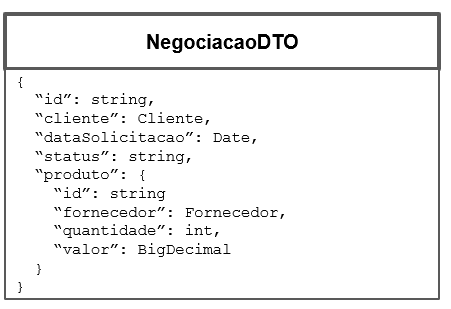
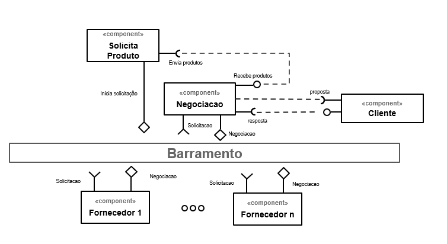
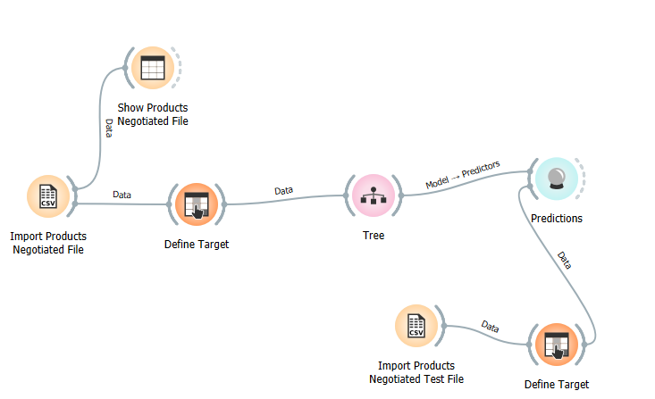
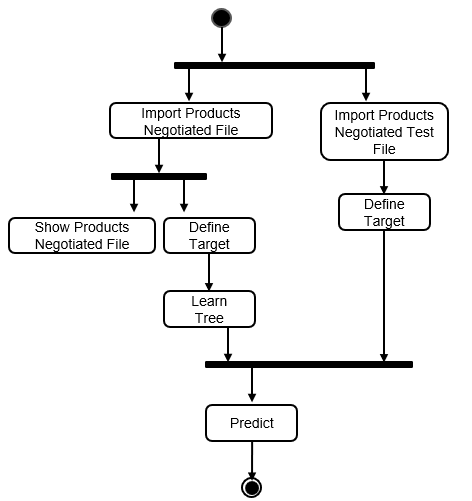

# Modelo para Apresentação do Lab03 - Coreografia e Orquestração no Brechó Online

# Aluno

- `Julia Giorgi Martin`

## Tarefa 1 - Detalhando a Negociação das Ofertas

a) Representação do DTO

b) Diagrama de Componentes e Descrição

- Cliente solicita a negociação
- Fornecedor posta o produto
- A negociação faz a intermediação entre o fornecedor e o cliente
- A negociação envia a proposta para o cliente
- O cliente aceita ou não o valor da proposta

## Tarefa 2 - Recomendação de Preço

a) Workflow em Orange para recomendação

[Workflow em Orange](workflows/workflow.ows)

b) Workflow em uma representação UML

