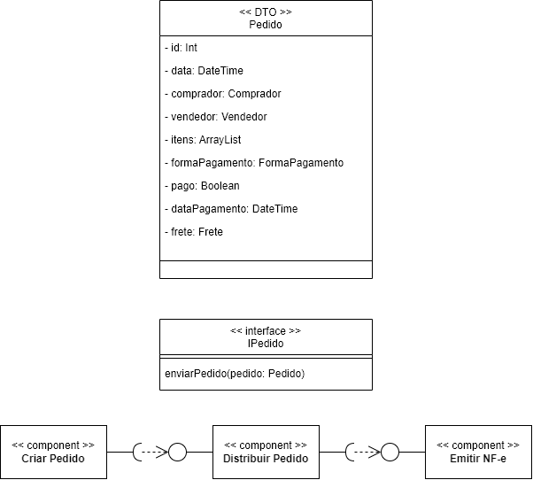
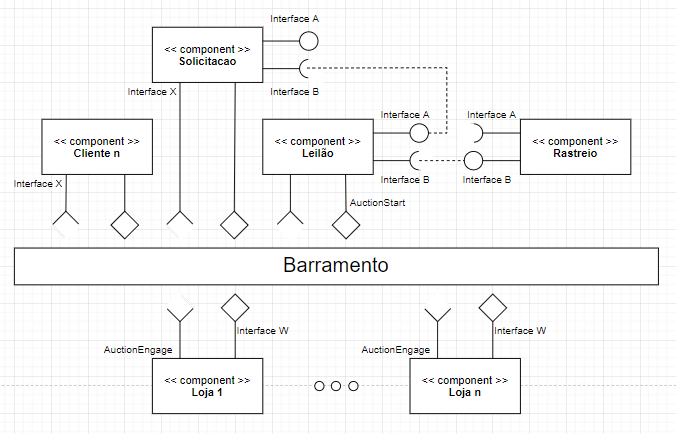
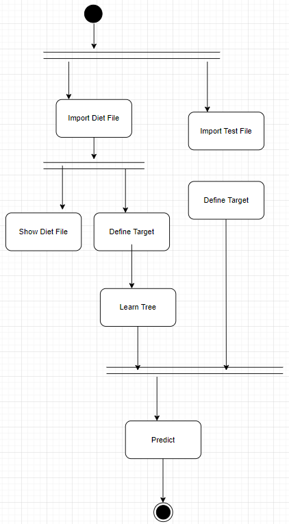

# Aluno
* `Julio Cesar Souto Filho - RA: EX161655`

## Tarefa 1 - Detalhando a Negociação das Ofertas

a) Representação do DTO

>

b) Diagrama de Componentes e Descrição

>

>
> Escreva uma breve descrição de como a coreografia opera na forma de tópicos, conforme exemplo a seguir:
>
> * Cliente envia solicitação (pedido) ao barramento
> * Módulo de leilão e rastreio recebem esse pedido
> * Vendedores podem acessar esse pedido e enviar ao módulo de leilão o aceite ou contraoferta
> * Módulo de leilão ao perceber um acordo, atualiza o barramento com uma mensagem que será recebida pelo cliente

## Tarefa 2 - Recomendação de Preço

a) Workflow em Orange para recomendação

>

>
b) Workflow em uma representação UML

>

