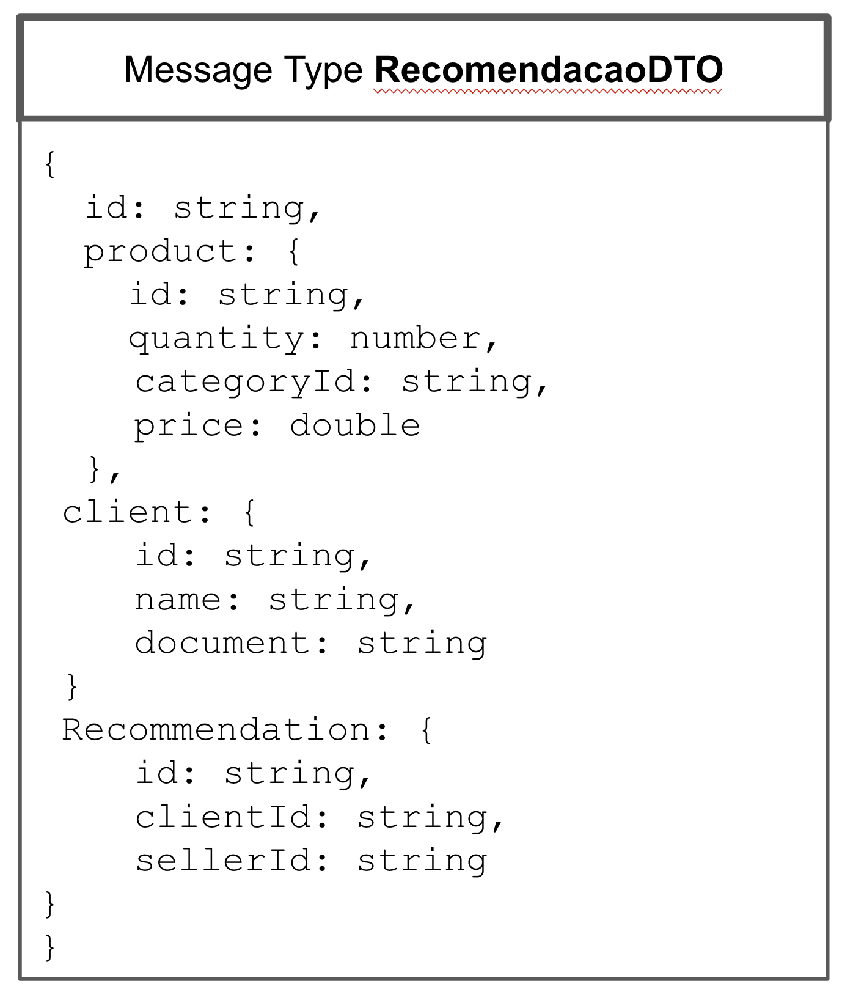
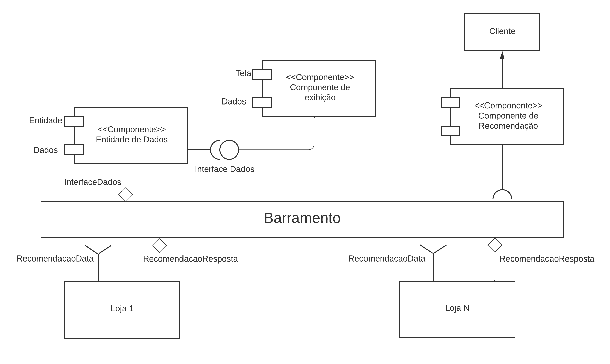
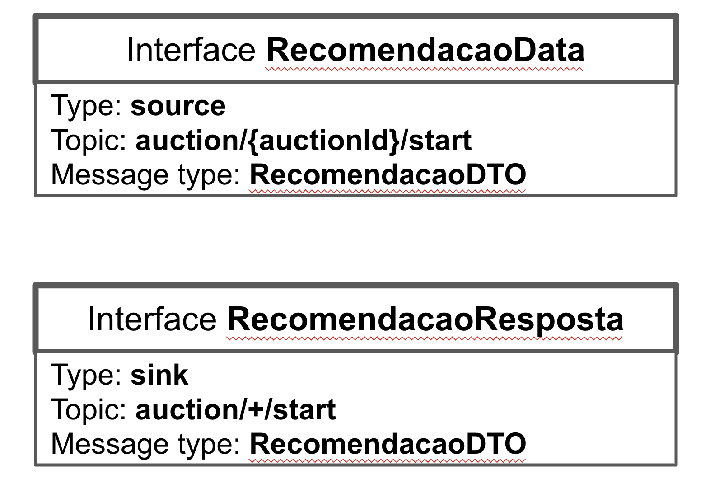
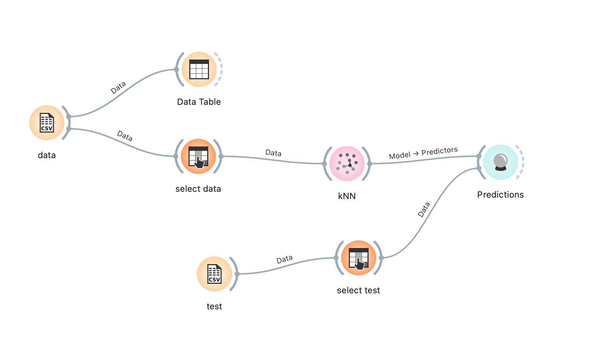
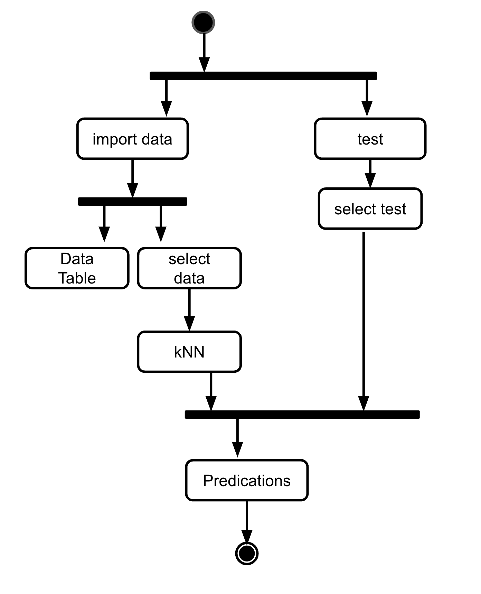

# Modelo para Apresentação do Lab03 - Coreografia e Orquestração no Brechó Online

# Aluno
* Leonardo Machado Moscardo. RA: EX161698

## Tarefa 1 - Detalhando a Negociação das Ofertas

a) Representação do DTO

b) Diagrama de Componentes e Descrição

* Passo 1 - Entrada de dados referente a compras já realizadas para analisar as negociações
* Passo 2 - Análise das recomendações que serão enviadas ao cliente
* Passo 3 - Envio das recomendações de negociações ao cliente

## Tarefa 2 - Recomendação de Preço

a) Workflow em Orange para recomendação

[Workflow](workflows/workflow.ows)

b) Workflow em uma representação UML

