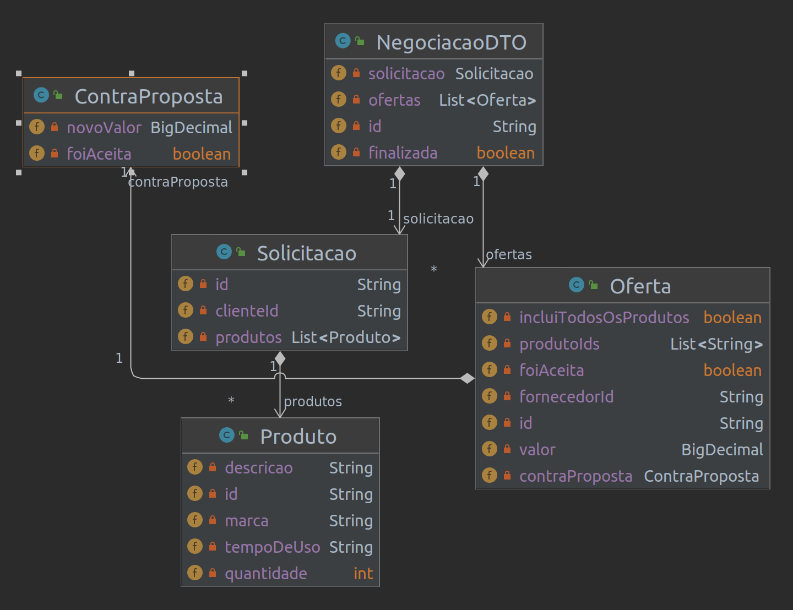
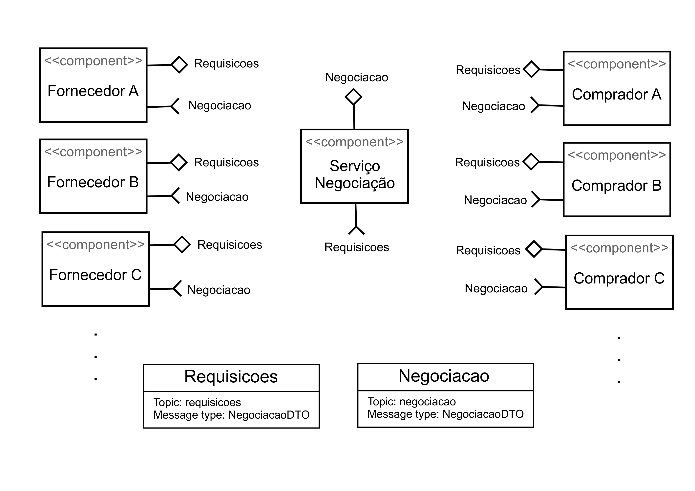
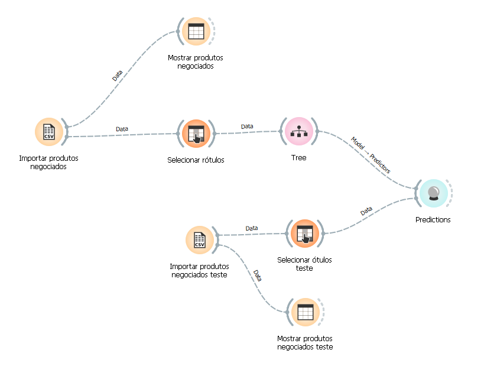
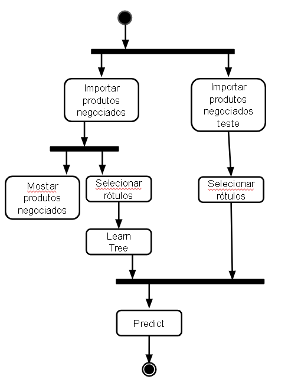

# Aluno
* `Luís Filipe Menten Gomes de Soutello`

## Tarefa 1 - Detalhando a Negociação das Ofertas

a) Representação do DTO

b) Diagrama de Componentes e Descrição

> Escreva uma breve descrição de como a coreografia opera na forma de tópicos, conforme exemplo a seguir:
>
* O cliente define os produtos que quer comprar e cria uma solicitação
* Essa solicitação é incluída na classe NegociacaoDTO e é enviada no tópico de requisições
* A mensagem é consumida pelo serviço de negociação que valida os dados e persiste o estado inicial dessa negociação
* Se os dados estiverem válidos, o serviço de nogociação publica uma mensagem avisando todos os fornecedores e compradores sobre esta negociação
* Um fornecedor cria uma oferta, adiciona a NegociacaoDTO e manda uma mensagem no tópico de requisições
* O serviço de nogiação recebe eventos de todos os fornecedores, tratando eventuais concorrencias, valida os dados, atualiza o estado da negociação e posta uma mensagem no tópico de negociação avisando todos os outros componentes
* O comprador recebe esse ebvento e pode aceitar ou fazer uma contra proposta
* Se uma contra proposta for feita, o fornecedor pode aceitar ou não
* É possível que um fornecedor faça uma oferta parcial, isto é, sem incluir todos os produtos da solicitação. Nesse caso, a oferta é aceita mas a negociação não acabada dando oportunidade para outros fornecedore completarem os resto dos pedidos.

## Tarefa 2 - Recomendação de Preço

a) Workflow em Orange para recomendação

[Workflow em Orange](workflows/example-workflow.ows)

