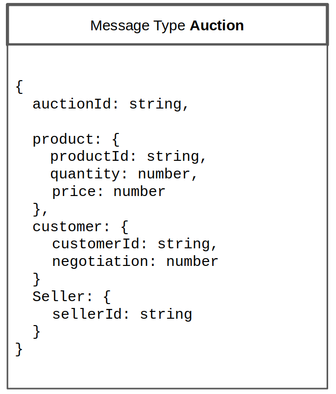
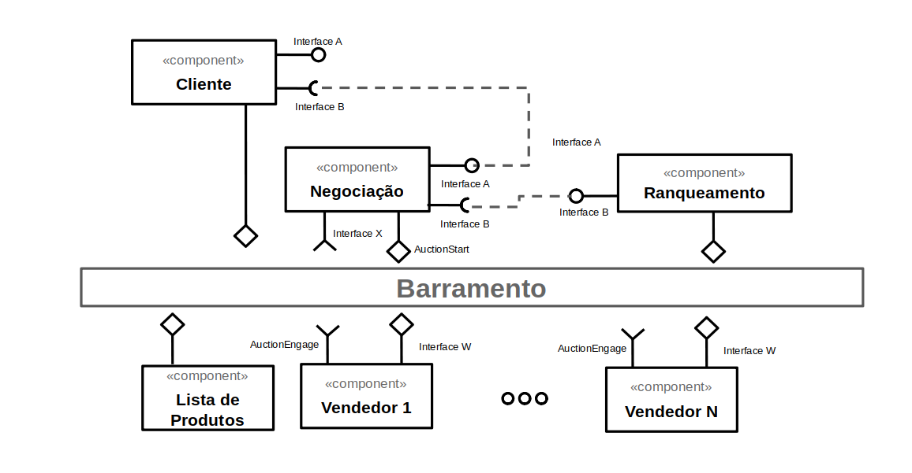
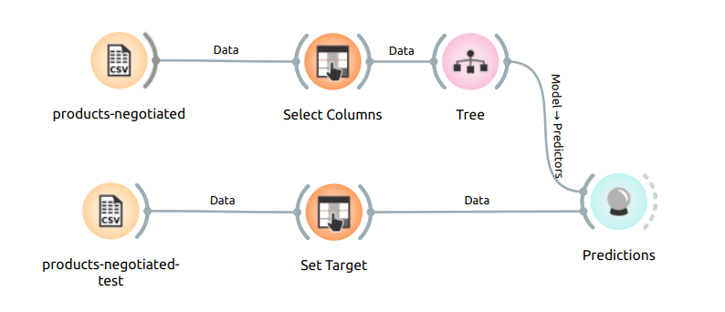

#Lab03 - Coreografia e Orquestração no Brechó Online

Estrutura de pastas:

~~~
├── README.md  <- arquivo apresentando a tarefa
│
├── images     <- arquivos de imagens usadas no documento
│
└── workflows  <- arquivos de workflows
~~~

# Aluno
* `Fabiano Louzada Cesario`

## Tarefa 1 - Detalhando a Negociação das Ofertas

a) Representação do DTO

b) Diagrama de Componentes e Descrição

>
> Breve descrição de como a coreografia opera:
>
> * Cliente posta uma solicitação
> * Inicia o processo de negociacao
> * Fornecedores postam suas ofertas
> * Cliente recebe propostas

## Tarefa 2 - Recomendação de Preço

a) Workflow em Orange para recomendação

b) Workflow em uma representação UML

