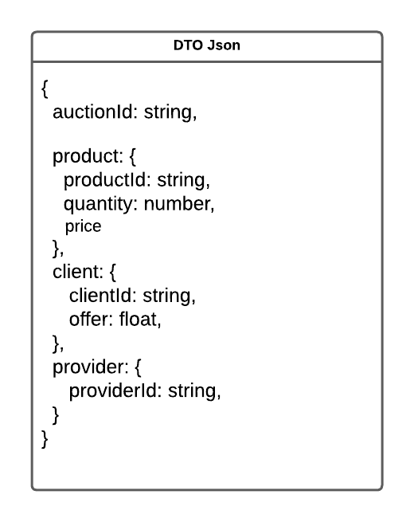
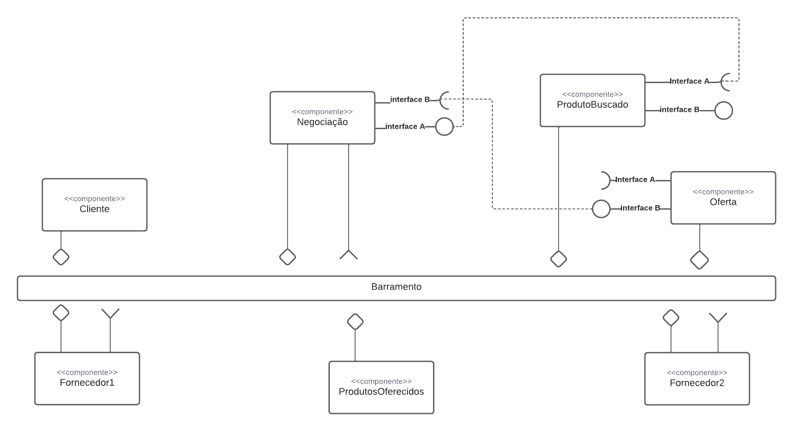
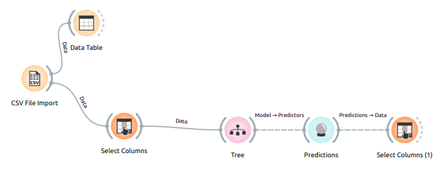
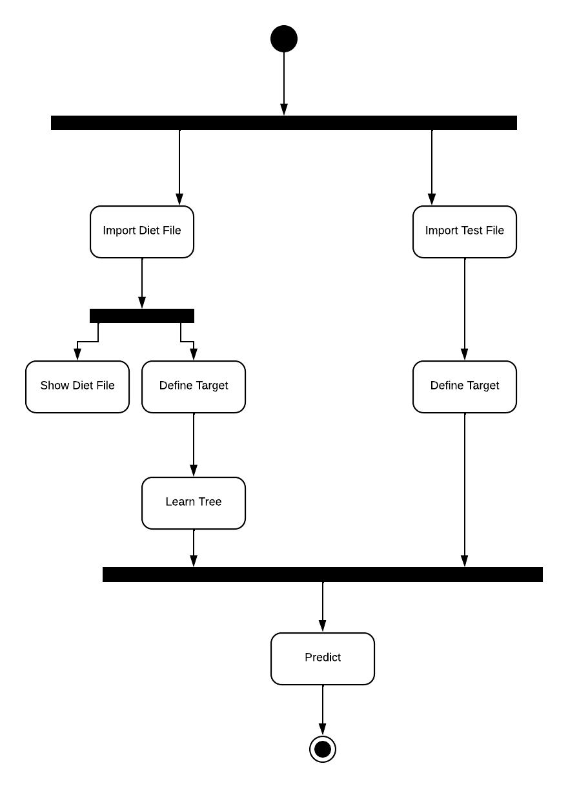

# Lab03 - Coreografia e Orquestração no Brechó Online

# Aluno
* `Mayara Ferreira Fernandes`

## Tarefa 1 - Detalhando a Negociação das Ofertas

a) Representação do DTO

b) Diagrama de Componentes e Descrição

## Tarefa 2 - Recomendação de Preço

a) Workflow em Orange para recomendação

b) Workflow em uma representação UML

