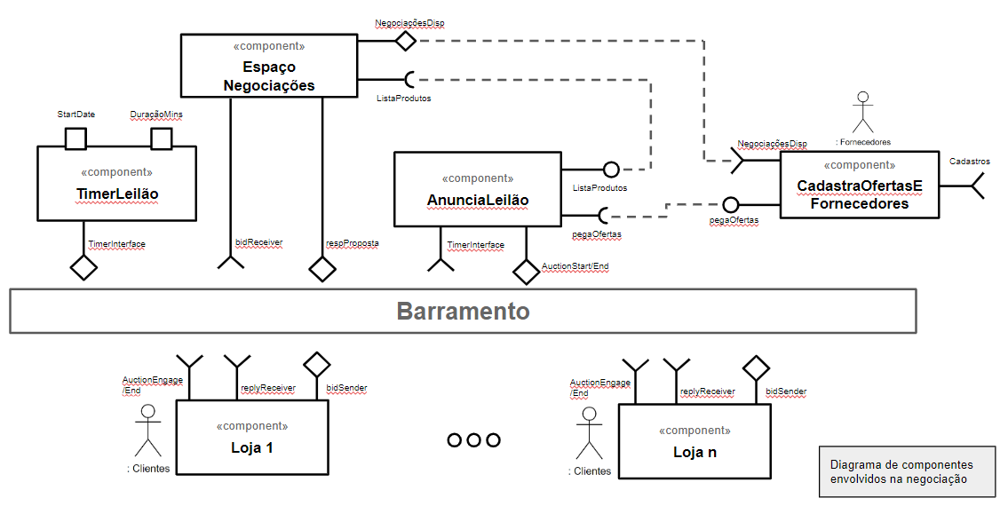
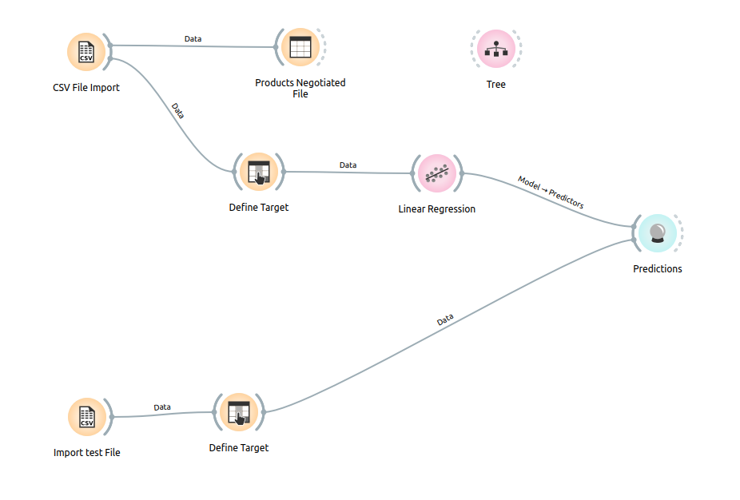
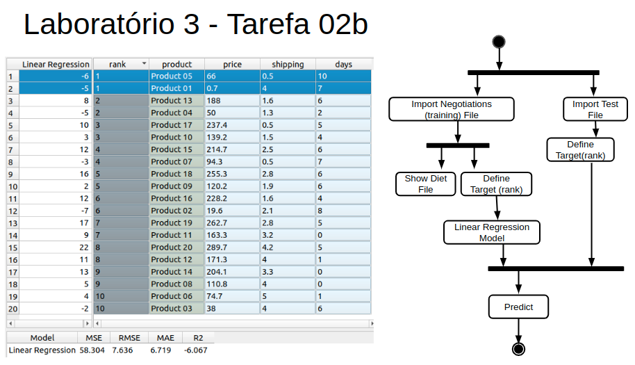

# Modelo para Apresentação do Lab03 - Coreografia e Orquestração no Brechó Online

Estrutura de pastas:

~~~
├── README.md  <- arquivo apresentando a tarefa
│
├── images     <- arquivos de imagens usadas no documento
│
└── workflows  <- arquivos de workflows
~~~

# Aluno
* `Daniel Pinheiro Cunha (ex164437)`

## Tarefa 1 - Detalhando a Negociação das Ofertas

a) Representação do DTO

> Representação do DTO:
>

b) Diagrama de Componentes e Descrição

> Representação Diagrama de Componentes:
>

>
> Coloque a imagem PNG dos tópicos associados aos DTOs. Este item é opcional, a associação pode ser feita na descrição.
>
> Escreva uma breve descrição de como a coreografia opera na forma de tópicos, conforme exemplo a seguir:
>
> Premissas: 
> * Passo 0: Os fornecedores devem estar devidamente cadastrados e devem ter cadastrado suas ofertas através da Interface Cadastros no Componente "CadastraOfertasEFornecedores"
> Descrição Coreografia:
> * Passo 1: O componente "TimerLeilão" dispara o evento de início de um determinado Leilão(especificado pelo ID na mensagem do tipo AuctionDTO) através da Interface "TimerInterface" no exato momento configurado no próprio componente pelo parâmetro "StartDate". A mensagem enviada popula o objeto JSON "auctionTimeControl" dentro da mensagem do tipo AuctionDTO(vide Imagem descritiva do DTO). Mensagens enviadas por este componente utilizam o barramento para que as lojas assinantes deste componente possam ouvir as mensagens de aviso prévio de início e término de cada leião em curso.
> * Passo 2: O Componente AnunciaLeilão "puxa"(pull) as ofertas publicadas previamente no componente CadastroOfertasEFornecedores, bem como os respectivos dados dos fornecedores. 
> * Passo 3: O Componente AnunciaLeilão, que é asinante da mensage de tipo AuctionDTO, ao receber o objeto auctionTimeControl, anuncia o início do Leilão para todas as N lojas que 'assinam' as mensagens enviadas pela Interface "AuctionStart/End". Apesar de no diagrama não haver correspondência do nome da Interface "AuctionStart/End" com a Interface AuctionEngage/End, estas são as interfaces que se comunicam na coreografia com mensagens de inicio e fim do Leião.
> * Passo 4: O Componente AnunciaLeilão envia a lista de produtos leiloados ao Espaço de Negociações, que também pode receber de modo assincrono, ou orientado a eventos, um anúncio relâmpago cadastrado no componente "CadastraOfertasEFornecedores", o qual será também enviado ao Espaço de Negociações para todos os Leilões que estieverem abertos.
> * Passo 5: Os Clientes enviam suas ofertas para aqueles produtos de seu interesse e que estejam disponíveis no Espaço de Negociações, representado pelo componente EspaçoNegociações. Esta comunicação também é feita através do barramento, para que todos os Clientes participantes do Leilão saibam da oferta enviada ao espaço de negociações antes de receberem uma resposta do Fornecedor, ou mesmo antes de o componente EspaçoNegociações ter processado a devida oferta.
> * Passo 6: Os Fornecedores podem enviar uma contraproposta ou aceitar as ofertas recebidas nos respectivos produtos da lista de ofertas.
> * Passo 7: O Leião termina quando o componente TimerLeião tiver contabilizado o tempo estipulado em DuraçãoMins para o respectivo Leilão. Negociações que chegaram a um acordo  serão processadas no módulo de pagamentos, não demonstrado no diagrama por estar fora do recorte proposto. 

## Tarefa 2 - Recomendação de Preço

a) Workflow em Orange para recomendação

> Cptura de tela do workflow Orange:
>

>
> Coloque um link para o arquivo em Orange – o arquivo deverá estar na pasta workflows (veja estrutura acima).

b) Workflow em uma representação UML

>

