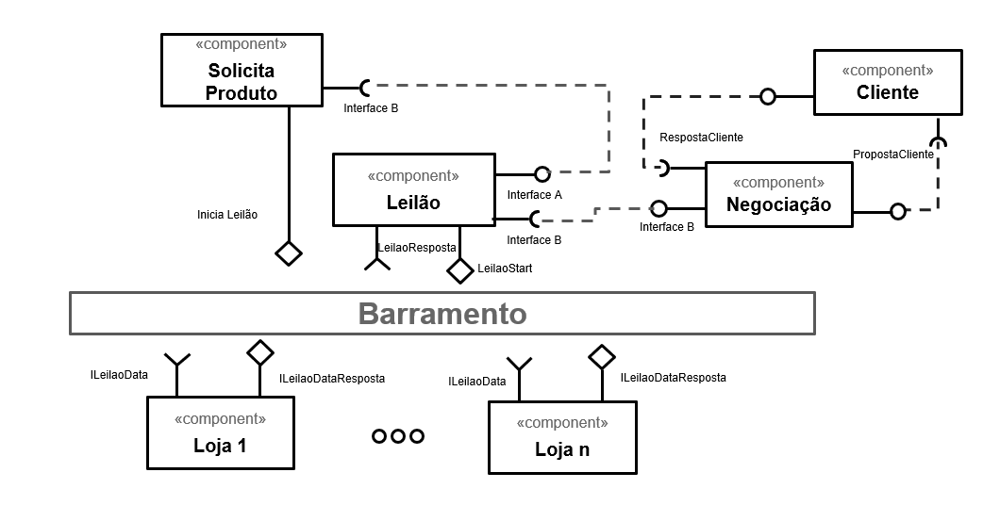
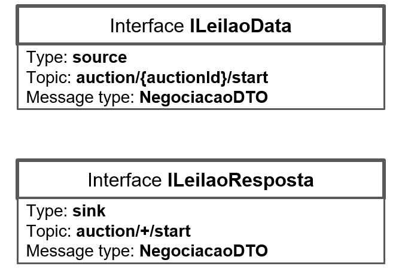
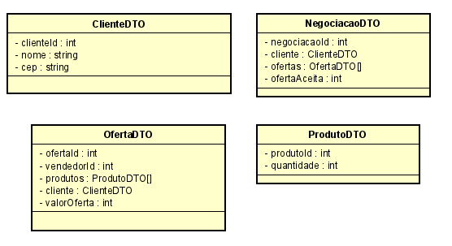
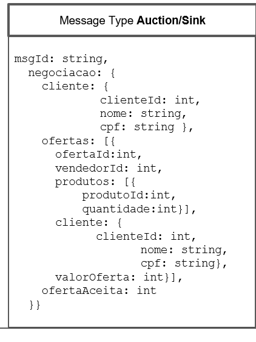
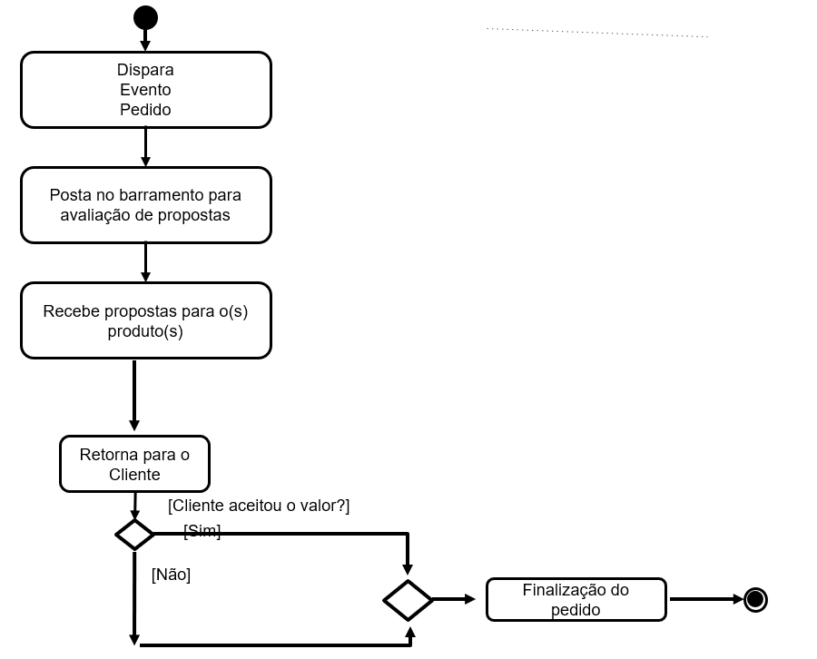
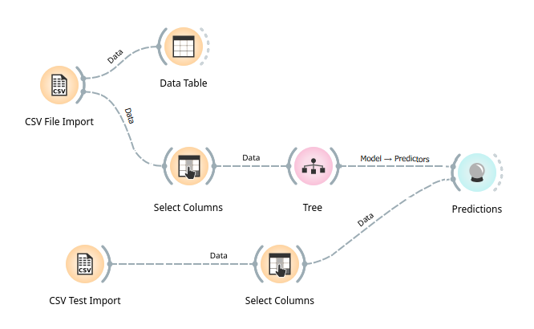

# Aluno
* `Rafael Vastag - RA: 2022601254`

## Tarefa 1 - Detalhando a Negociação das Ofertas

### a) Representação dos DTOs e das Interfaces para a troca de mensagem

### b) Diagrama dos componentes envolvidos na negociação

### Os componentes envolvidos apresentam os seguintes papeis:
   
   1. SolicitaProduto: Responsável por fazer o link entre o produto pedido e o componente de leilão.
   2. Leilão: Componente responsável pela troca de informações da negociação e do produto pedido com o barramento de mensagem.
   3. Cliente: Componente responsável pela interação entre a negociação e  o cliente.
   4. Negociação: Componente responsável pelo gerenciamento da mensagem recebida pelo componente leilão e o cliente, tendo responsabilidade sobre a gestão dessa negociação.
   5. LojaX: Componentes relacionados com os vendedores, fazem tratamento e recebimento das mensagens recebidas pelo barramento, e também posta a negociação proposta pelo vendedor para determinado produto.

## Tarefa 2 - Workflow Orange
