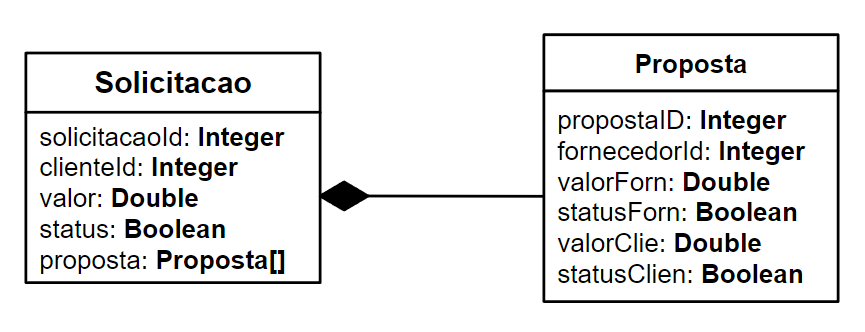
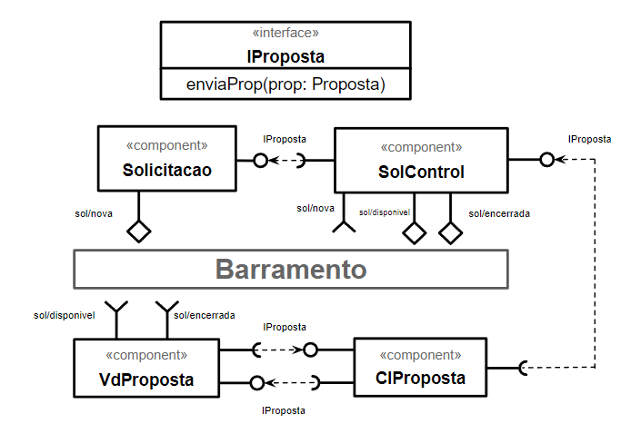
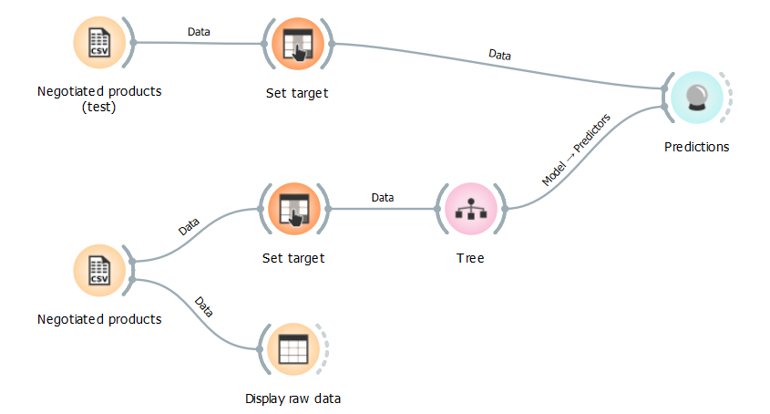
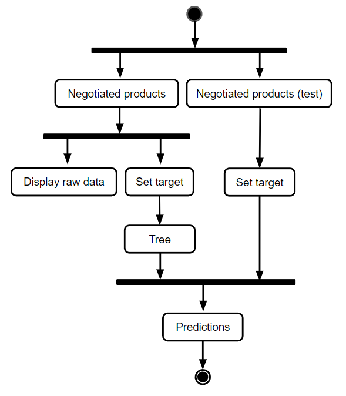

# Aluno
* `Raul Mendes de Souza`

## Tarefa 1 - Detalhando a Negociação das Ofertas

a) Representação do DTO

b) Diagrama de Componentes e Descrição

> * Uma nova solicitação é disponibilizada ao sistema pelo cliente (sol/nova);
> * Um controlador captura essa solicitação e dispara o evento para que os fornecedores possam acessá-la (sol/disponivel);
> * Fornecedores podem (ou não) enviar propostas diretamente aos clientes e estes podem (ou não) enviar contrapropostas;
> * As propostas são sempre finalizadas pelos clientes, uma vez que ambas as partes concordem com a proposta;
> * Quando finalizada uma proposta, este evento é repassado ao controlador que verifica se a solicitação ainda está aberta;
> * Caso esteja aberta, o status da proposta – definido pelo cliente – é verificado para decidir se ela continua disponível para fornecedores ou se deve ser encerrada;
> * Caso esteja encerrada, a proposta é cancelada e não é agregada a solicitação.
> * Quando uma solicitação é encerrada, os fornecedores são notificados pelo controlador e não podem mais enviar propostas.

## Tarefa 2 - Recomendação de Preço

a) Workflow em Orange para recomendação

[orange.ows](workflows/orange.ows)

b) Workflow em uma representação UML

