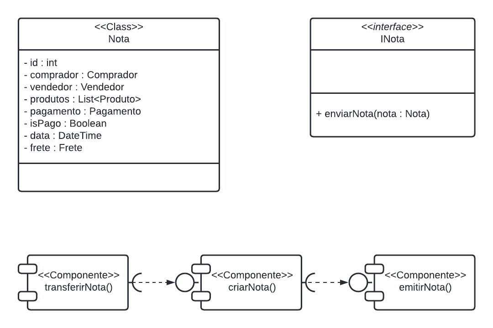
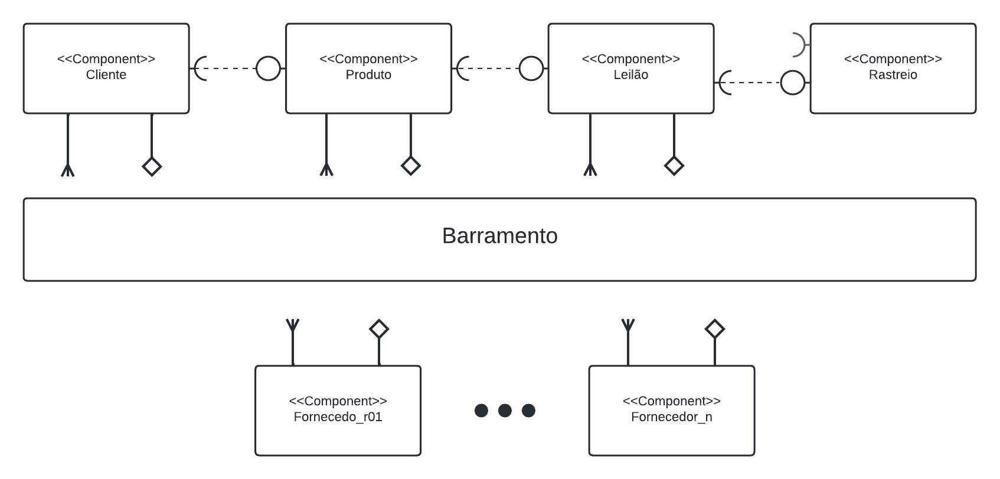
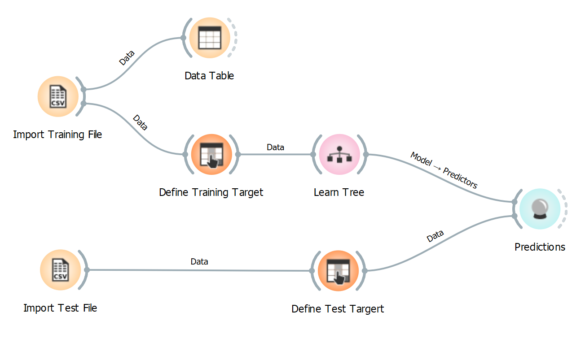
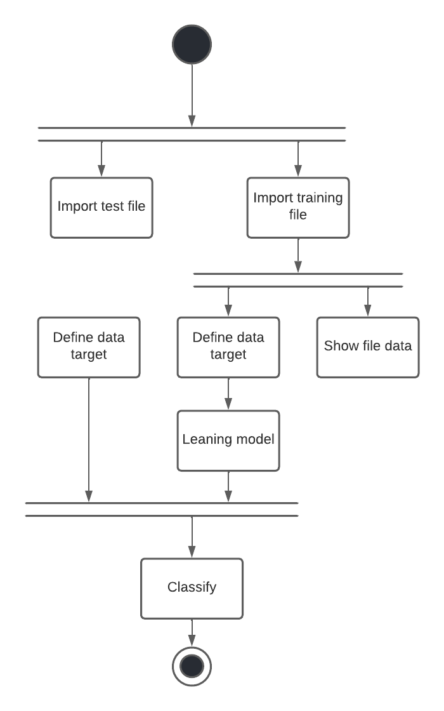

# Modelo para Apresentação do Lab03 - Coreografia e Orquestração no Brechó Online

Estrutura de pastas:

~~~
├── README.md  <- arquivo apresentando a tarefa
│
├── images     <- arquivos de imagens usadas no documento
│
└── workflows  <- arquivos de workflows
~~~

# Aluno
* `Thiago Silva de Souza`

## Tarefa 1 - Detalhando a Negociação das Ofertas

a) Representação do DTO
>

b) Diagrama de Componentes e Descrição
>

>
> Descrição de como a coreografia opera na forma de tópicos, conforme exemplo a seguir:
>
> * Cliente inicia solicitação de novo pedido;
> * Componente de leilão é notificado do novo pedido;
> * Componentes dos vendedores acessam novos pedidos;
> * Componentes leilão notifica componente Rastreio.

## Tarefa 2 - Recomendação de Preço

a) Workflow em Orange para recomendação
>

>[Arquivo Orange] (https://github.com/tssilvaa/component2learn/blob/entregas-labs-2022/labs/2022/03-composition/solucoes/tssilvaa/workflows/OrangeFile.ows)
>

b) Workflow em uma representação UML
>

