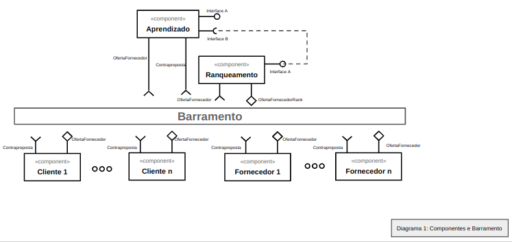
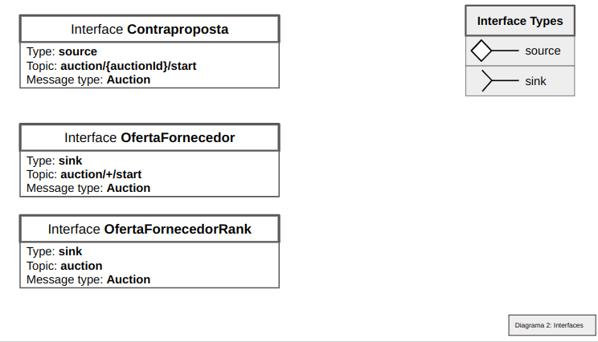

# Modelo para Apresentação do Lab03 - Coreografia e Orquestração no Brechó Online

Estrutura de pastas:

~~~
├── README.md  <- arquivo apresentando a tarefa
│
├── images     <- arquivos de imagens usadas no documento
│
└── workflows  <- arquivos de workflows
~~~

# Aluno
* `João Paulo Cardoso`

## Tarefa 1 - Detalhando a Negociação das Ofertas

a) Representação do DTO

> Coloque a imagem PNG do diagrama do DTO, conforme exemplo a seguir:
>

b) Diagrama de Componentes e Descrição

> Coloque a imagem PNG do diagrama de componentes, conforme exemplo a seguir:
>

>
> Coloque a imagem PNG dos tópicos associados aos DTOs. Este item é opcional, a associação pode ser feita na descrição.
> 
>
> Escreva uma breve descrição de como a coreografia opera na forma de tópicos, conforme exemplo a seguir:
>
> * As negociações são abertas pelos clientes que iniciam o processo enviando uma oferta.
> * O módulo aprendizado é responsável por capturar as ofertas que passam pelo barramento, sejam de fornecedores ou clientes.
> * Após receber esses dados, a listagem é feita enviando para o ranqueamento dos fornecedores.
> * O ranqueamento envia para o cliente as ofertas de seu interesse.
> * O cliente pode fazer uma contraproposta após receber as ofertas ranqueadas.
> * O fornecedor recebe as contrapropostas, podendo aceitá-la ou recusá-la.
> * O DTO é responsável por essa troca de informações da negociação, informando campos como mensagem, sender (cliente/fornecedor), valor de contraproposta e um boolean para informar se a proposta foi aceita ou recusada.

## Tarefa 2 - Recomendação de Preço

a) Workflow em Orange para recomendação

> Coloque a imagem PNG da captura de tela workflow em Orange, conforme exemplo a seguir:
>

>
> Coloque um link para o arquivo em Orange – o arquivo deverá estar na pasta workflows (veja estrutura acima).

b) Workflow em uma representação UML

> Coloque a imagem PNG da captura de tela workflow em UML, conforme exemplo a seguir:
>

