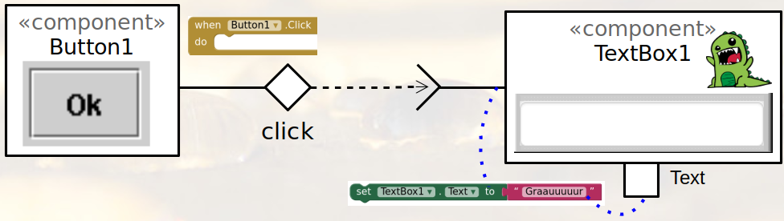

# MVC e Event-driven App
*Lab de Componentização e Reúso de Software 20/08/2022*

## Tarefa 1

Elabore um protótipo de uma interface gráfica com um usuário no MIT App Inventor que simule uma interface de compra, com as seguintes funcionalidades:
1. apresente uma interface com as seguintes áreas:
  * uma lista opções com o nome de três produtos (a sua escolha);
  * um quadro de detalhes do produto;
  * um campo para o usuário digitar a quantidade que deseja comprar;
  * um botão de efetivação da compra;
  * um campo de mensagens no rodapé.
2. ao clicar no produto da lista de opções, deve ser apresentado no quadro de detalhamento:
  * a imagem do produto;
  * seu nome;
  * o valor unitário e a unidade (g, kg, l);
3. quando o botão de efetivação da compra for clicado, deve ser mostrado no campo de mensagem (rodapé) os dados da compra sendo efetivada: nome do produto, quantidade e o valor total a ser pago.

Neste protótipo, não haverá uso de bancos de dados. Tudo será executado

# Tarefa 2

Considere a seguinte abordagem visual para representar os componentes da sua composição e as relações usando uma abordagem dirigida a eventos:

Apresente um diagrama equivalente para a aplicação que você desenvolveu na Tarefa 1, considerando:
* para cada evento representado pela cláusula do MIT App Inventor [When (...).Click do], deve haver uma interface que gera eventos equivalente, cujo evento é o capturado (no exemplo apresentado, o evento é o Click);
* a geração do evento está sempre associado ao componente que o produz, neste exemplo, é o Button1;
* capture a imagem Box do MIT App Inventor que representa a captura do evento e coloque próximo à interface, como está na ilustração;
* o componente que responde ao evento deve ter uma interface que monitora o respectivo evento;
* capture as instruções executadas quando o evento é capturado e coloque próximo ao evento que responde - conecte essas instruções à interface que recebe o evento e propriedades relacionadas, como ilustra a figura.

Para construir o diagrama, utilize o [Diagramas de Referência do Lab 04](https://docs.google.com/presentation/d/1QC90mYCfkMdhwZctH1R_JqXZGURLgSJbQNWn4rDR8aU/edit?usp=sharing).
