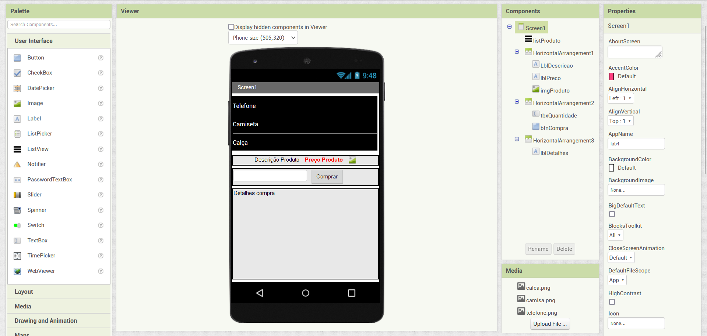
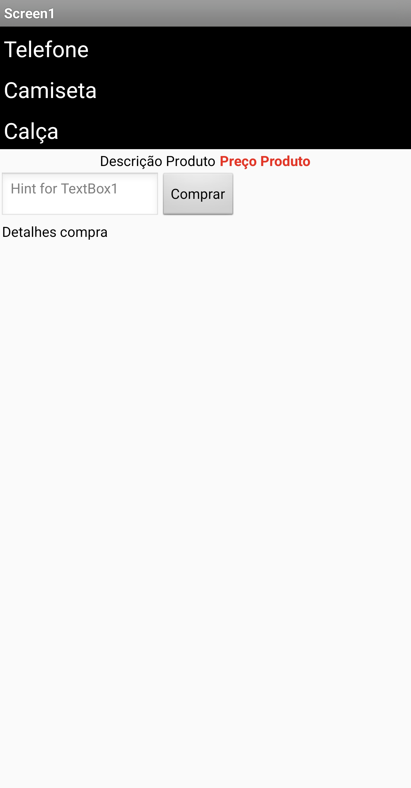
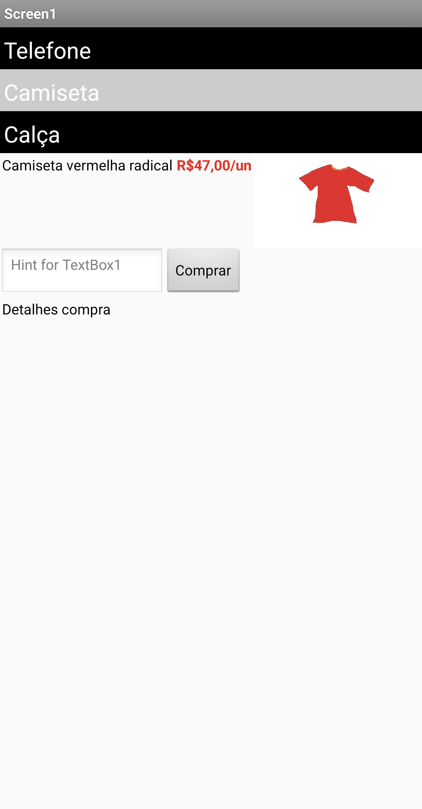
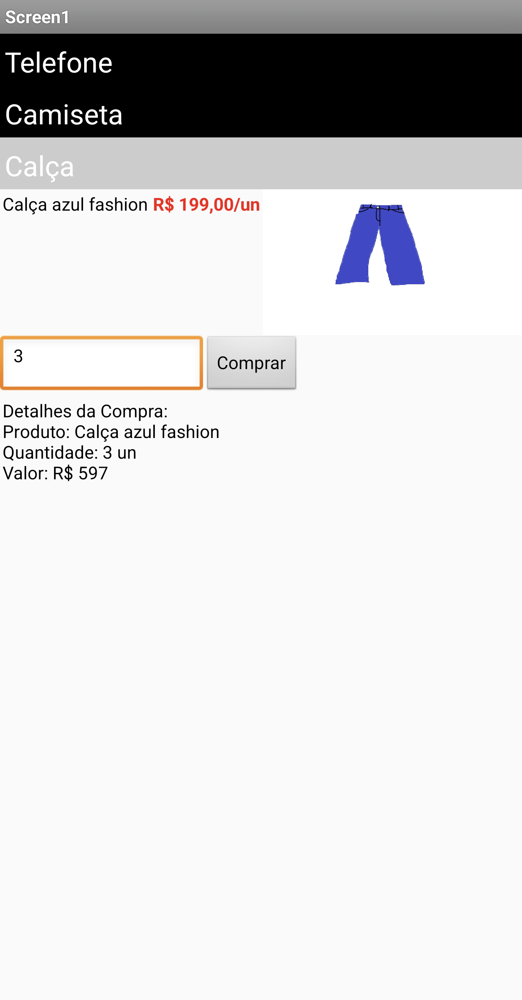
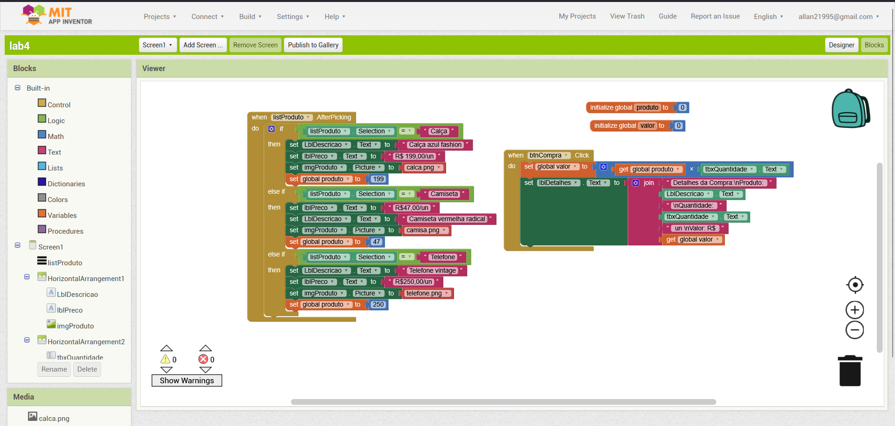
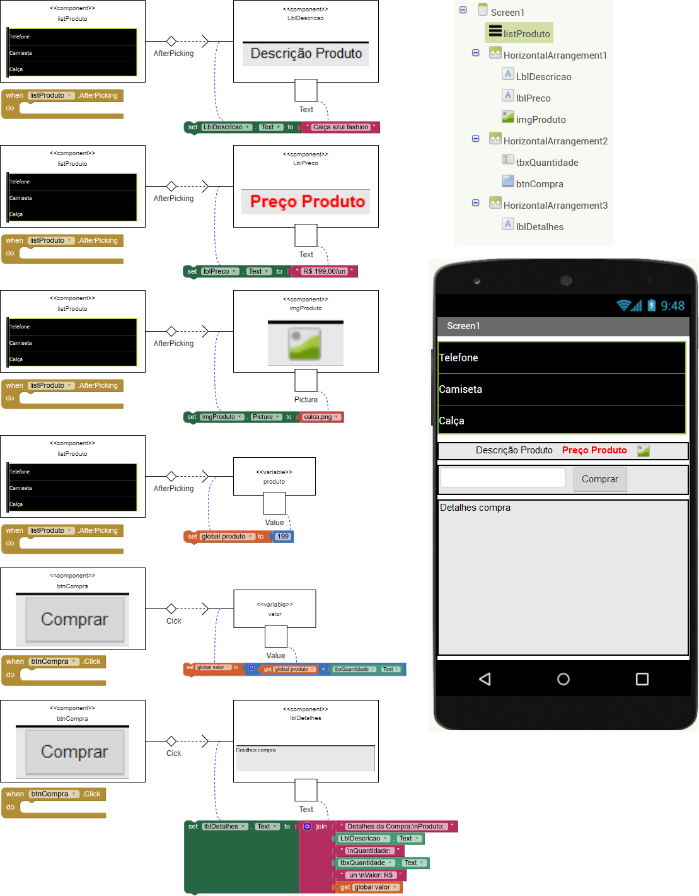

# Modelo para Apresentação do Lab04 - MVC

Estrutura de pastas:

~~~
├── README.md  <- arquivo apresentando a tarefa
│
├── images     <- arquivos de imagens usadas no documento
│
└── app        <- apps do MIT App Inventor exportados em formato `aia`
~~~

# Aluno
* `Allan Ferreira Fonseca`

# Tarefa 1 - App no MIT App Inventor

> Coloque as imagens PNG da captura de seis telas do seu aplicativo:
> * tela 1 - captura da tela completa de design de interface
> 
> * tela 2 - captura de tela do app com nenhum produto selecionado
> 
> * tela 3 - captura de tela do app com primeiro produto selecionado
> 
> * tela 4 - captura de tela do app com segundo produto selecionado
> 
> * tela 5 - compra de um dos produtos efetivada
> 
> * tela 6 - diagrama de blocos do aplicativo
> 

> [App](app/lab4.aia)

# Tarefa 2 - Diagrama de Componentes dirigida a Eventos

