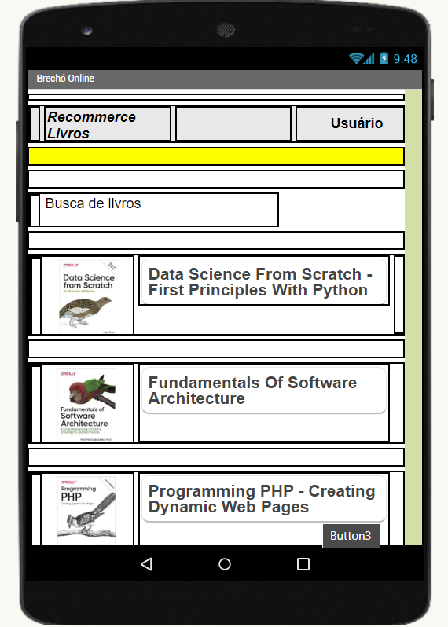
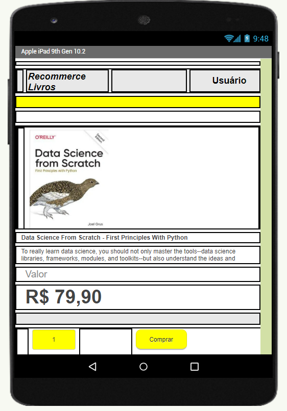
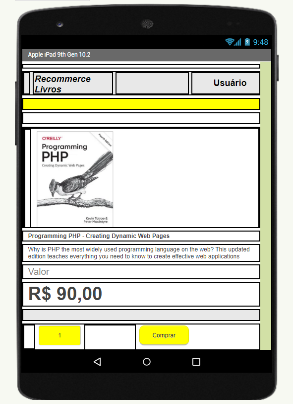
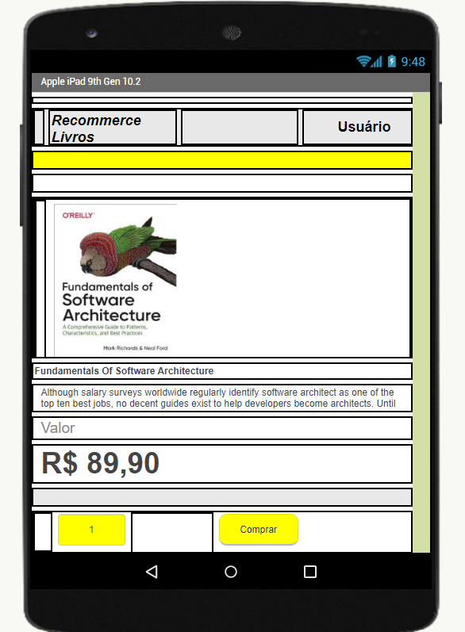
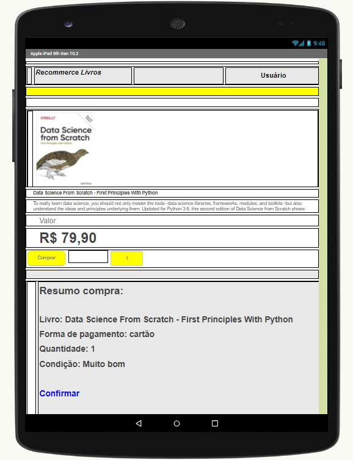
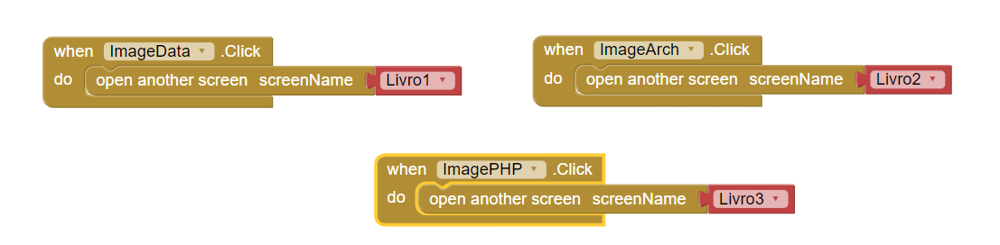
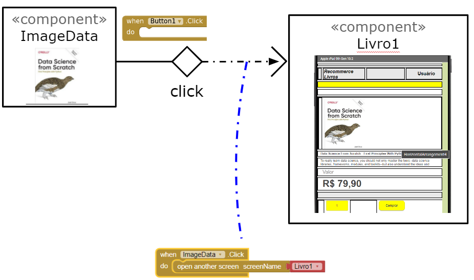
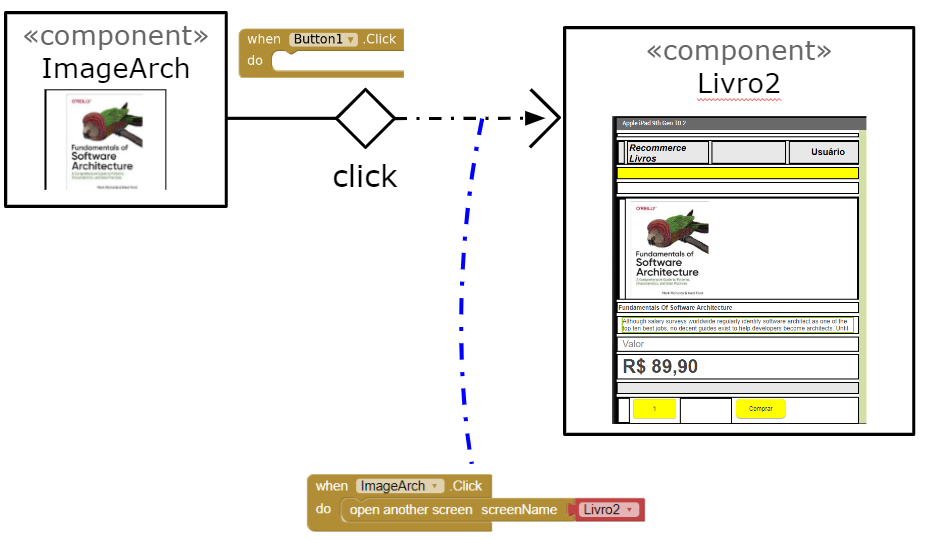
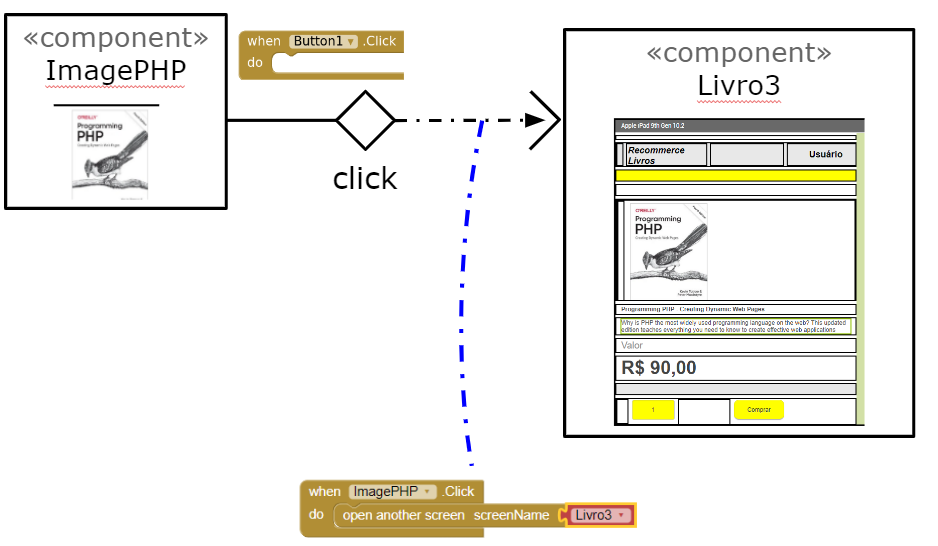
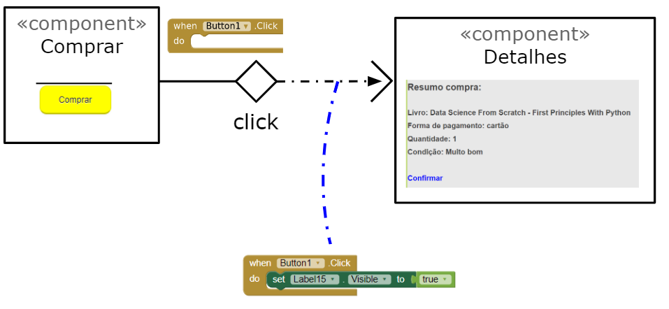

# Aluno
* `Fábio Fernandes Domingues`
>
# Tarefa 1 - App no MIT App Inventor
>
> * tela 1 - captura da tela completa de design de interface
> 
> * tela 2 - captura de tela do app com nenhum produto selecionado
> 
> * tela 3 - captura de tela do app com primeiro produto selecionado
> 
> * tela 4 - captura de tela do app com segundo produto selecionado
> 
> * tela 5 - compra de um dos produtos efetivada
> 
> * tela 6 - diagrama de blocos do aplicativo
> 
>
> Link para o arquivo do aplicativo exportado a partir do MIT App Inventor em formato `aia`. Ele estará dentro da pasta `app`.
> 
>
# Tarefa 2 - Diagrama de Componentes dirigida a Eventos
>
> 
> 
> 
> 
