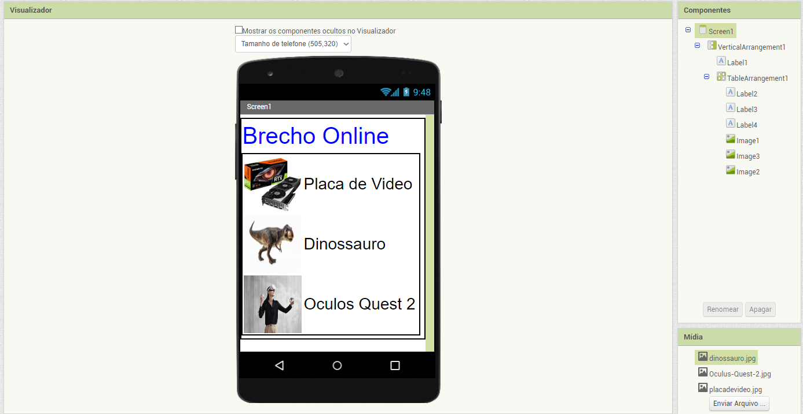
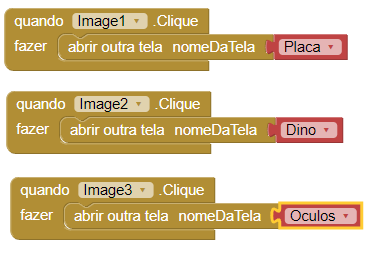
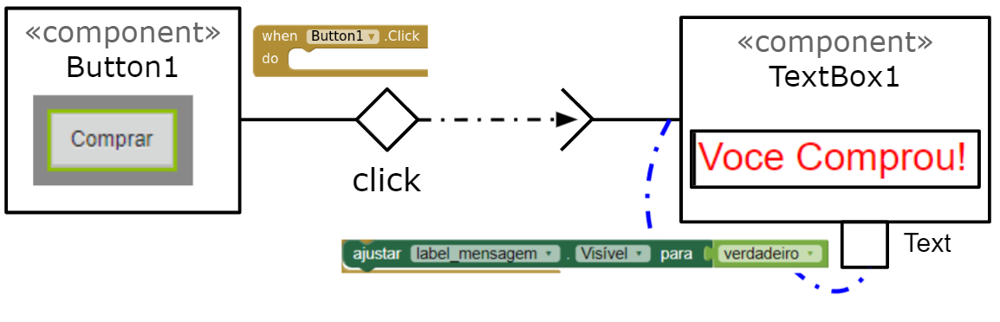

# Modelo para Apresentação do Lab04 - MVC

Estrutura de pastas:

~~~
├── README.md  <- arquivo apresentando a tarefa
│
├── images     <- arquivos de imagens usadas no documento
│
└── app        <- apps do MIT App Inventor exportados em formato `aia`
~~~

# Aluno
* `Lucas Lopes Moreira`

# Tarefa 1 - App no MIT App Inventor

> * tela 1 - captura da tela completa de design de interface

> * tela 2 - captura de tela do app com nenhum produto selecionado
>
> * tela 3 - captura de tela do app com primeiro produto selecionado

> * tela 4 - captura de tela do app com segundo produto selecionado

> * tela 5 - compra de um dos produtos efetivada

> * tela 6 - diagrama de blocos do aplicativo

>
> [App](https://github.com/LucasLopesMoreira/component2learn/blob/master/labs/2022/04-mvc/solucoes/LucasLopesMoreira/app/lab4%20(2).aia)

# Tarefa 2 - Diagrama de Componentes dirigida a Eventos

> Coloque a imagem PNG do diagrama, conforme exemplo a seguir:
>
> 
> 
