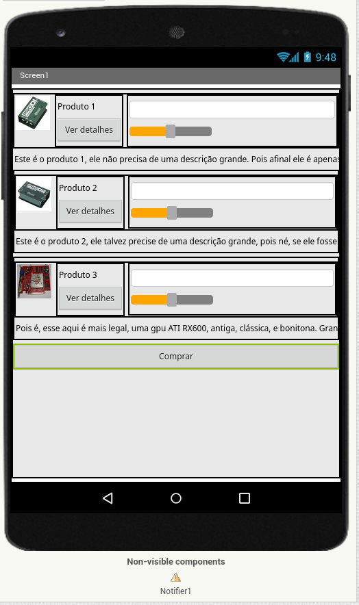
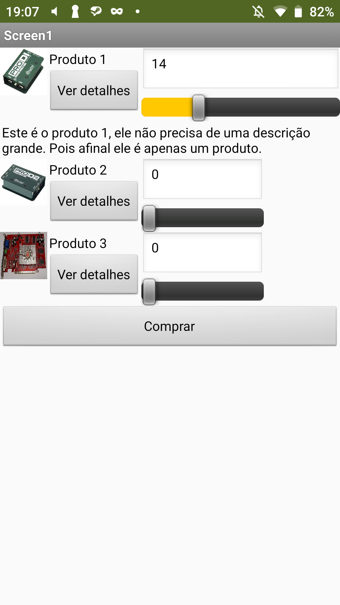
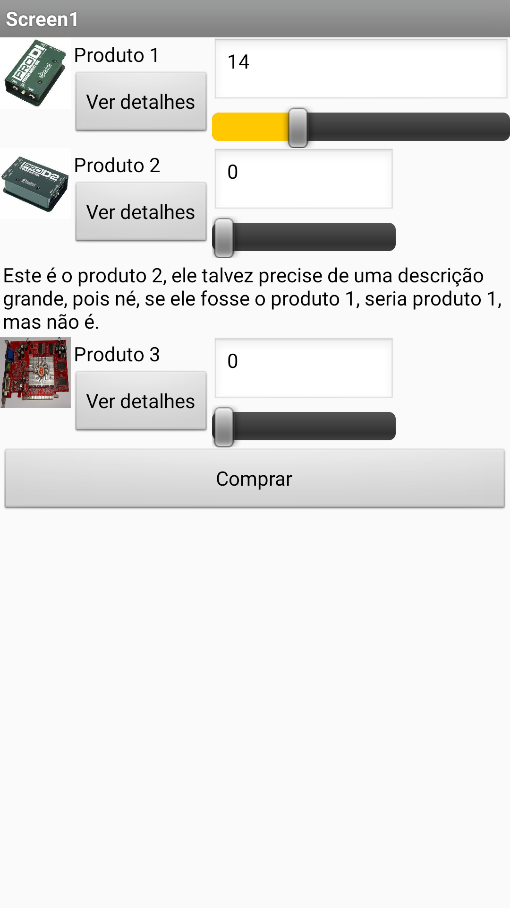
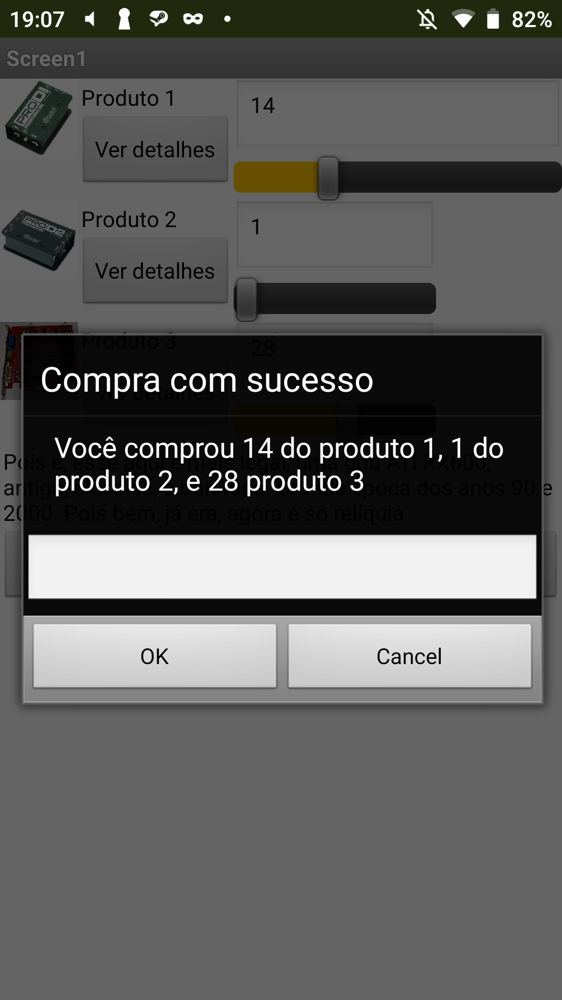
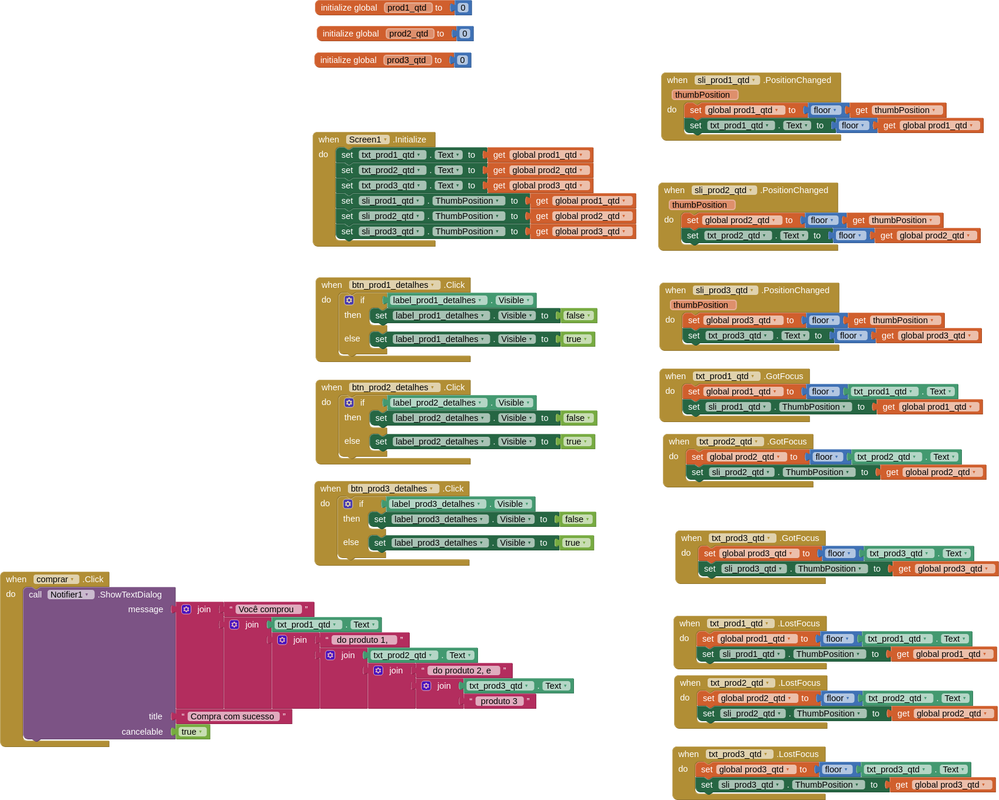
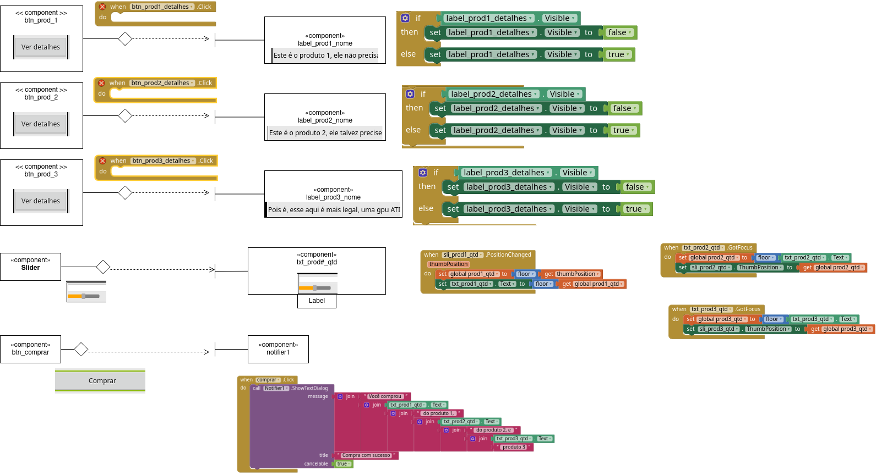

# Modelo para Apresentação do Lab04 - MVC

# Aluno
* `Alejandro Boidi Rico`

# Tarefa 1 - App no MIT App Inventor

[Arquivo Aia](app/inf331_lab04_t1.aia)

# Tarefa 2 - Diagrama de Componentes dirigida a Eventos

