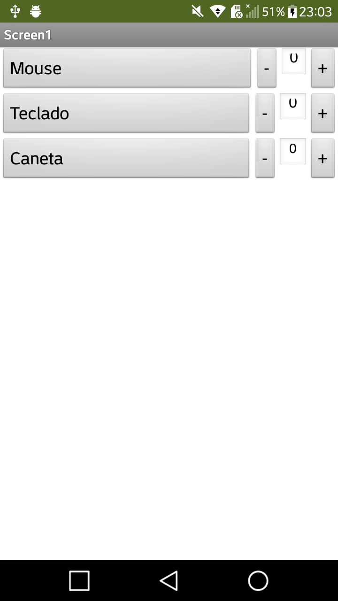
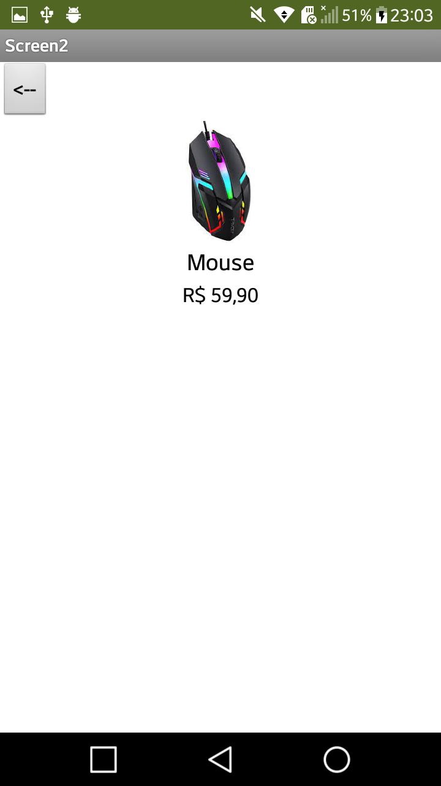
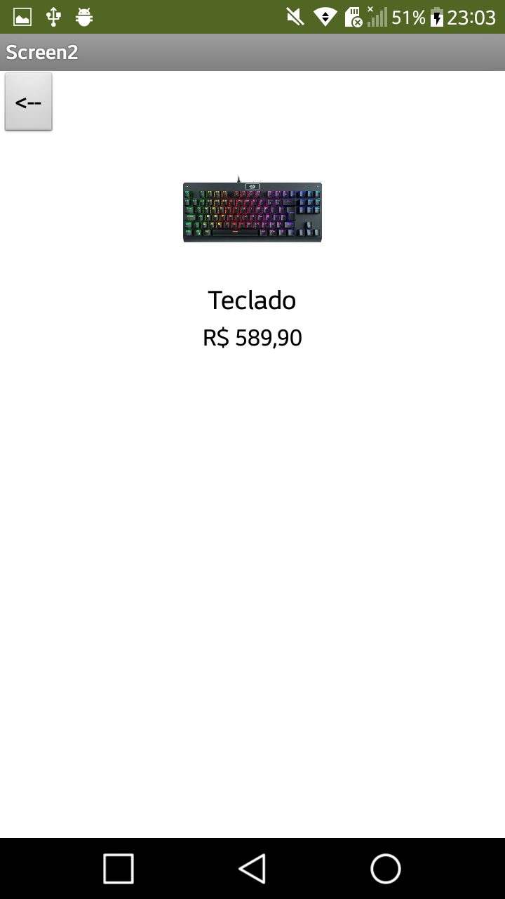
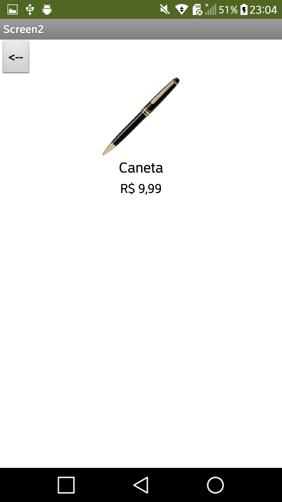
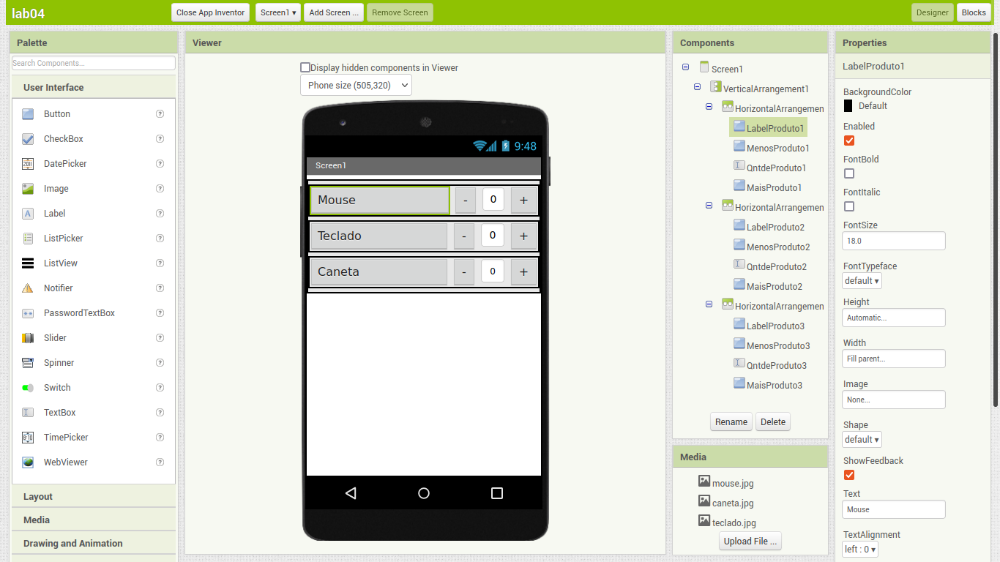
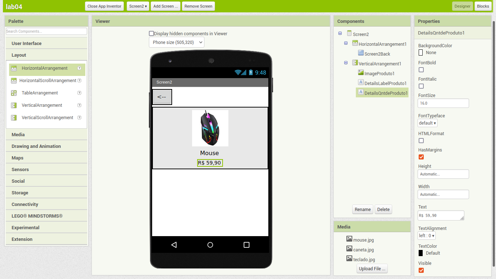
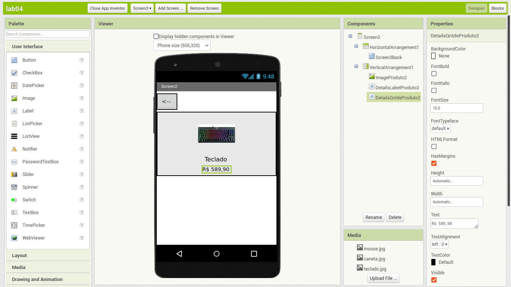
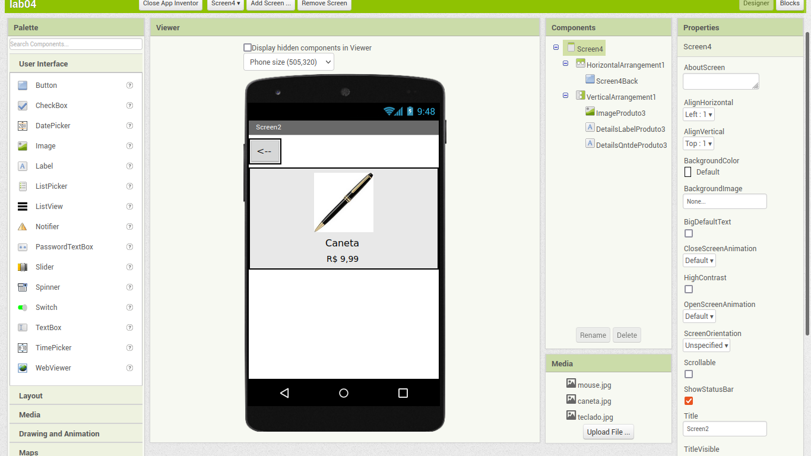
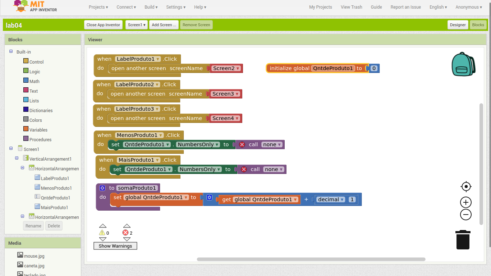
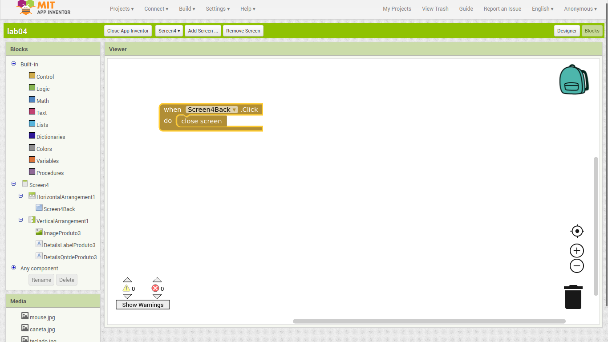

# Modelo para Apresentação do Lab04 - MVC

Estrutura de pastas:

~~~
├── README.md  <- arquivo apresentando a tarefa
│
├── images     <- arquivos de imagens usadas no documento
│
└── app        <- apps do MIT App Inventor exportados em formato `aia`
~~~

# Aluno
* `Daniel Salgado Costa`

# Tarefa 1 - App no MIT App Inventor

> Imagens PNG da captura de telas do aplicativo:
> 
> 
> 
> 

> Imagens PNG da captura de telas do site:
> 
> 
> 
> 

> Imagens PNG da captura do diagrama de blocos do aplicativo:
> 
> 
> 
> 

> Coloque um link para o arquivo do aplicativo exportado a partir do MIT App Inventor em formato `aia`. Ele estará dentro da pasta `app`.

# Tarefa 2 - Diagrama de Componentes dirigida a Eventos

> Coloque a imagem PNG do diagrama, conforme exemplo a seguir:
>
> 
