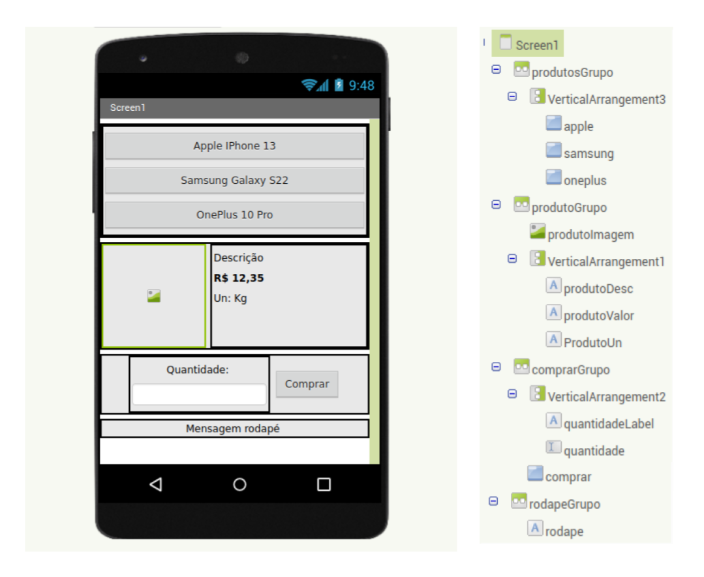
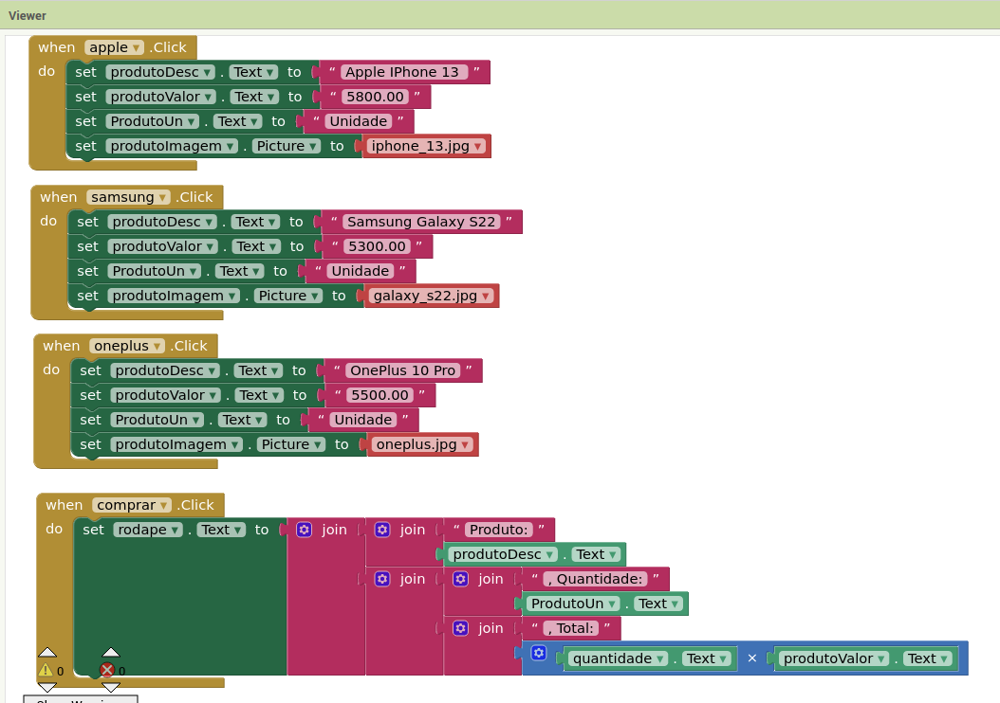
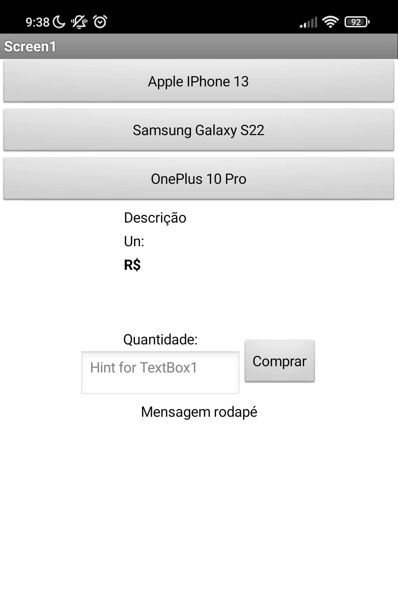
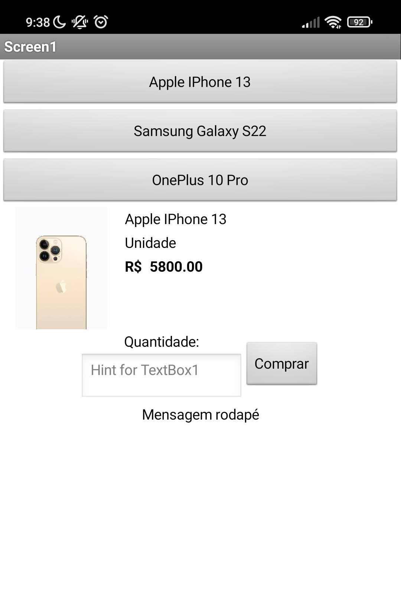
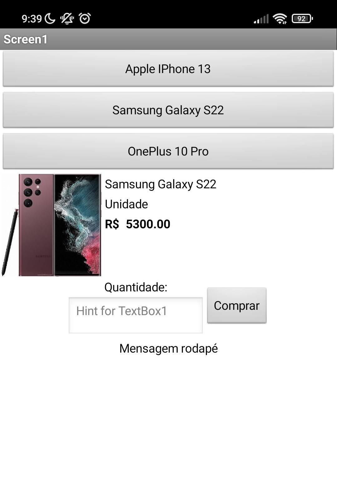
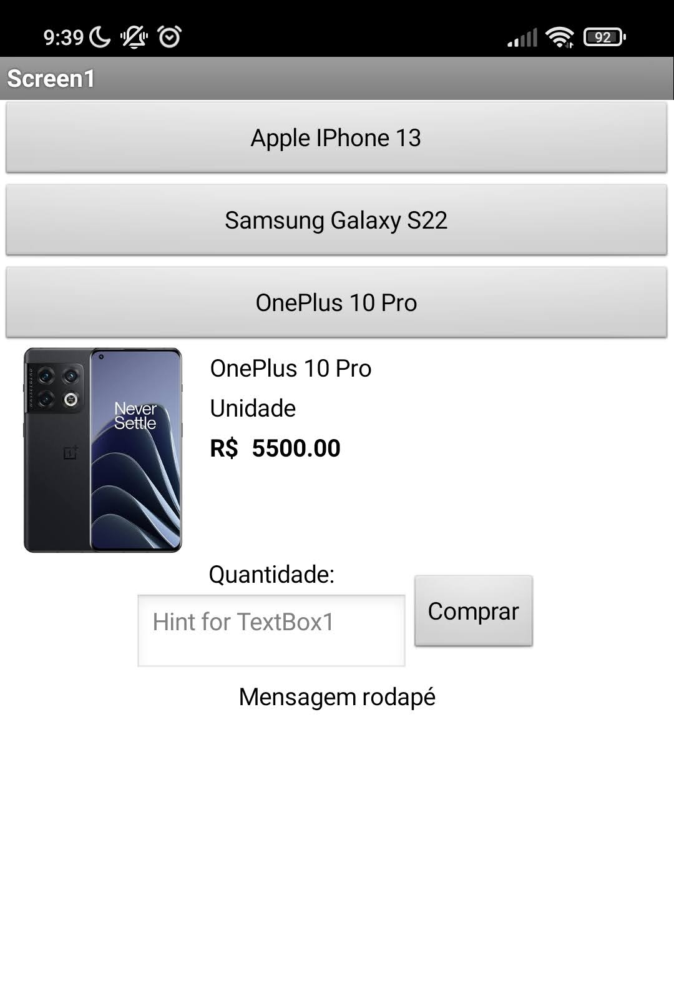
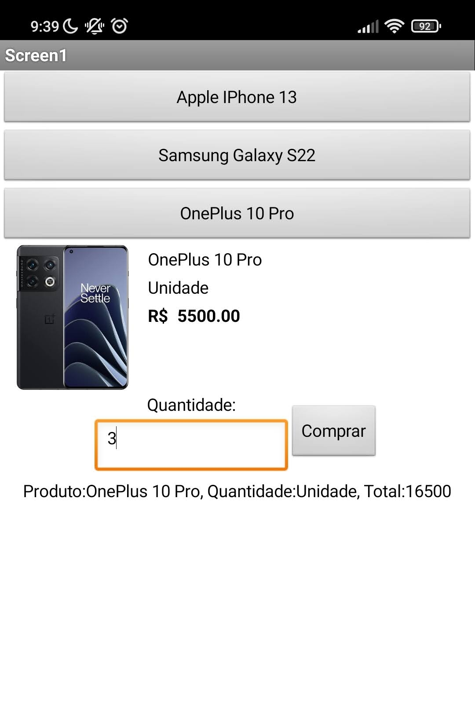
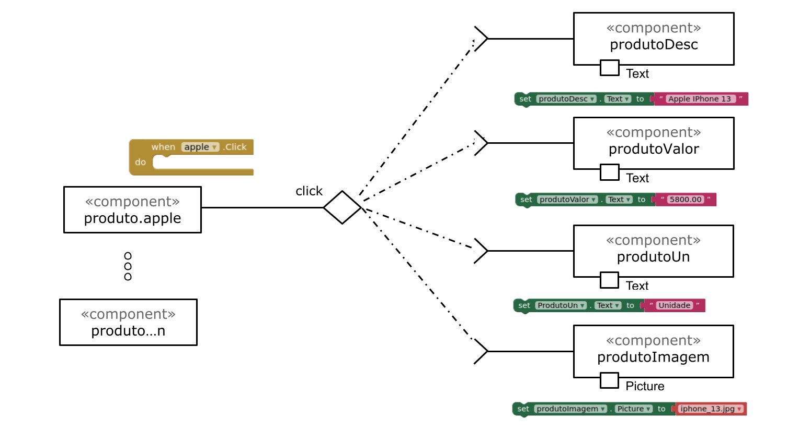
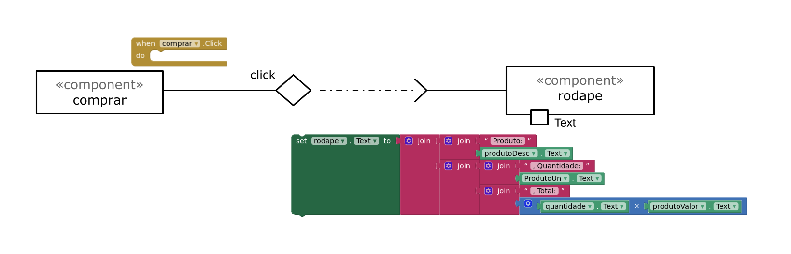

# Apresentação do Lab04 - MVC

# Aluno
* `Guilherme Cavassan - RA: 2022601122`

# Tarefa 1 - App no MIT App Inventor

## Aplicativo e componentes:

## Eventos e ações

## Tela inicial:

## Tela produto 1:

## Tela produto 2:

## Tela produto 3:

## Tela Compra realizada:

## Aplicativo AIA:

# Tarefa 2 - Diagrama de Componentes dirigida a Eventos

## Diagrama eventos Seleção de produtos:

## Diagrama eventos compra:

