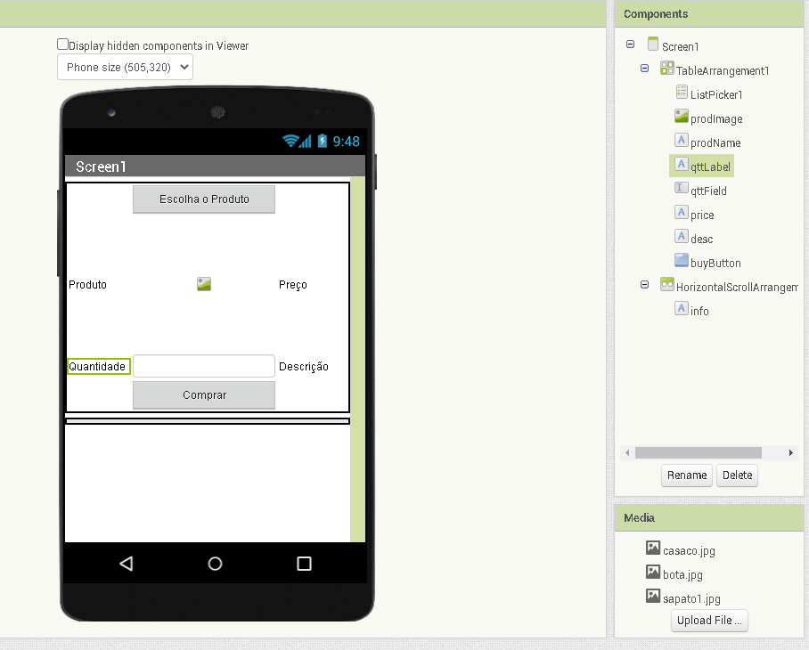
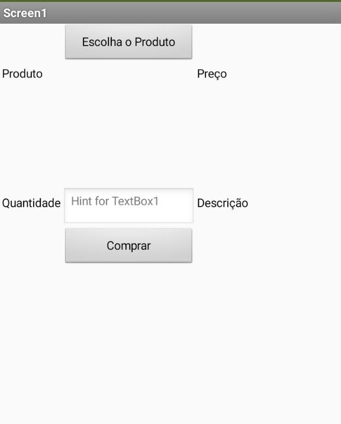
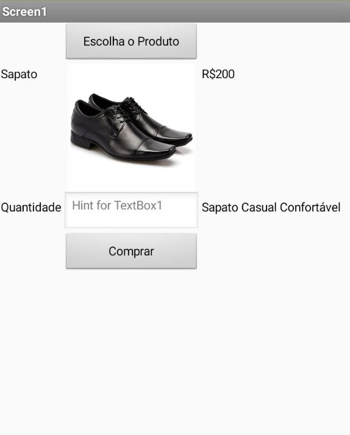
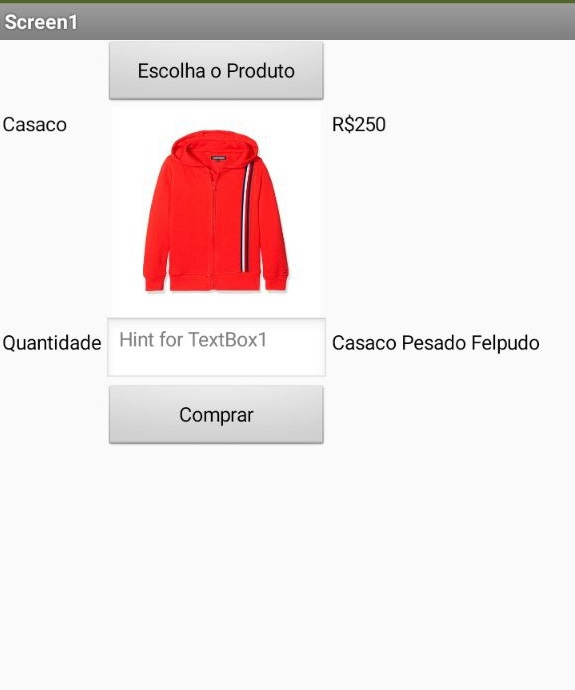
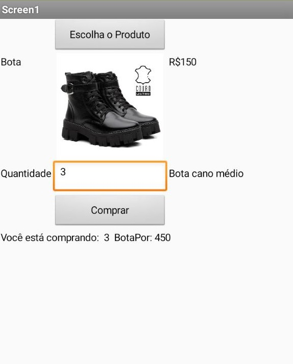
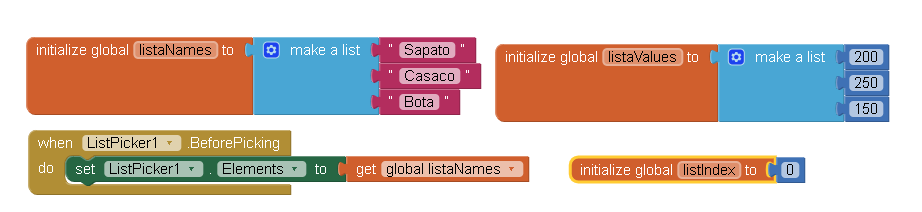
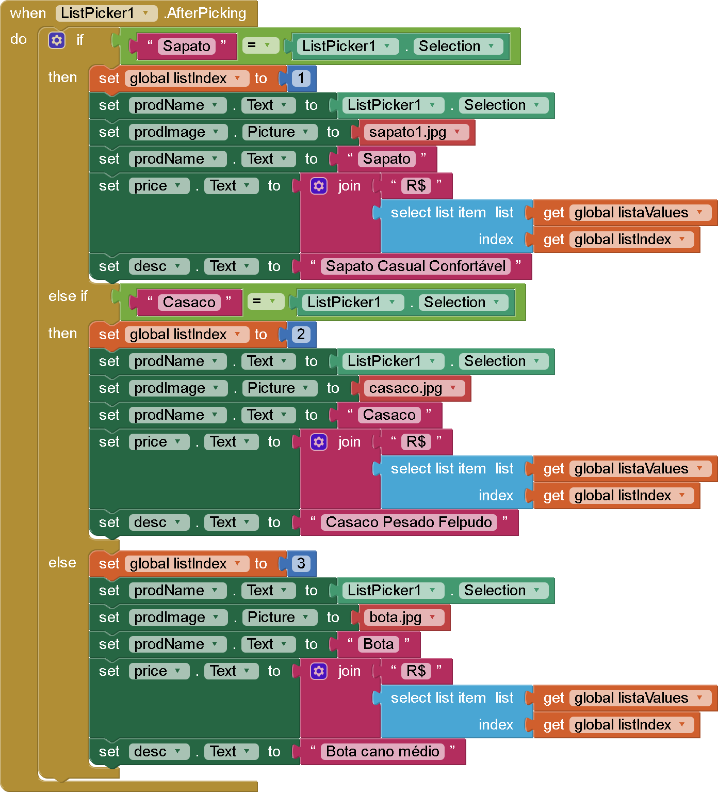
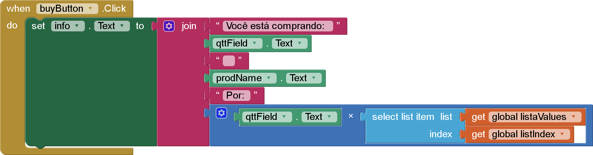
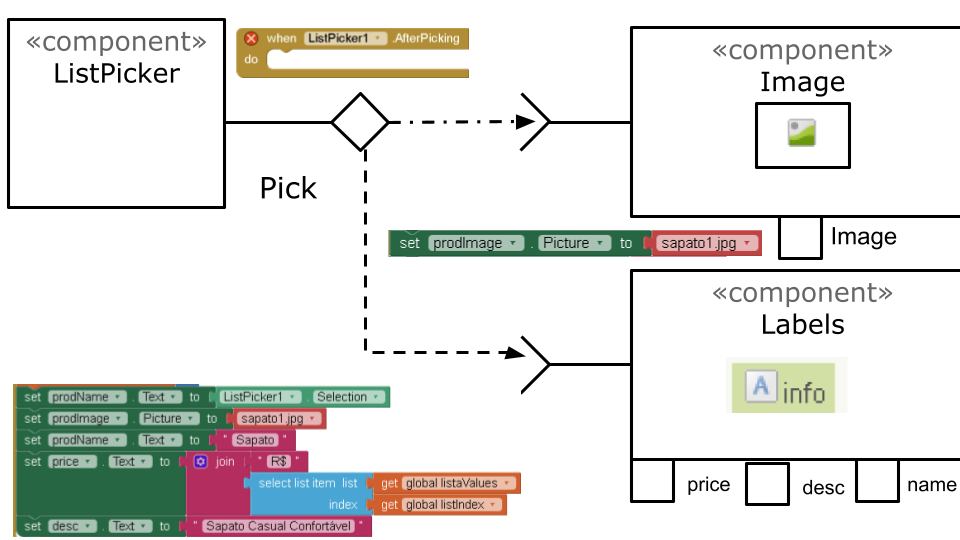
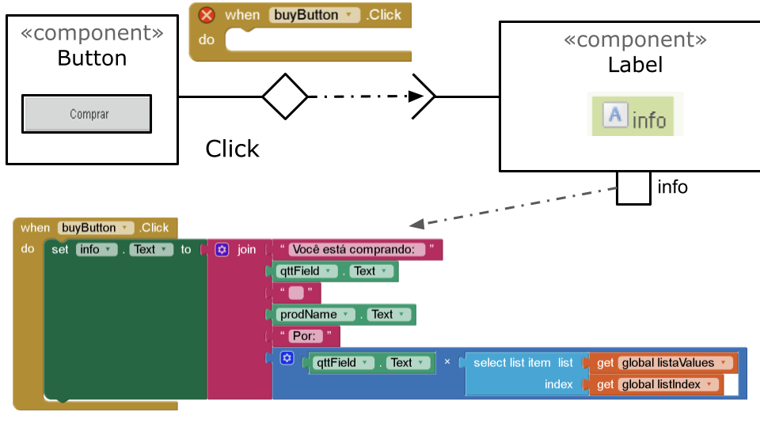

# Aluno
João Igor dos Sanos Perreira

# Tarefa 1 - App no MIT App Inventor

## Layout do app

## Sem items

## Primeiro produto

## Segundo produto

## Terceiro produto com efetivação de compra

## Blocos - Variaveis Globais

## Blocos - Atualizacao de campos

## Blocos Botão de compra

[Arquivo aia](app/lab4.aia)

# Tarefa 2 - Diagrama de Componentes dirigida a Eventos

