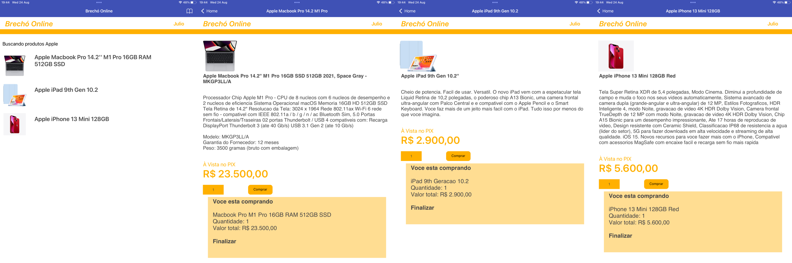
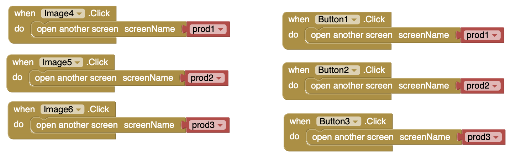

# Modelo para Apresentação do Lab04 - MVC

# Aluno
* `Julio Cesar Souto Filho`

# Tarefa 1 - App no MIT App Inventor

> * tela 1 - captura da tela completa de design de interface
> 

> * tela 2 - captura de tela do app com nenhum produto selecionado
> 

> * tela 3 - captura de tela do app com primeiro produto selecionado
> 

> * tela 4 - captura de tela do app com segundo produto selecionado
> 

> * tela 5 - compra de um dos produtos efetivada
> 

> * tela 6 - diagrama de blocos do aplicativo
> 

>
> Link para o arquivo do aplicativo exportado a partir do MIT App Inventor em formato `aia`. Ele estará dentro da pasta `app`.
> 

# Tarefa 2 - Diagrama de Componentes dirigida a Eventos

> Coloque a imagem PNG do diagrama, conforme exemplo a seguir:
>
> 
