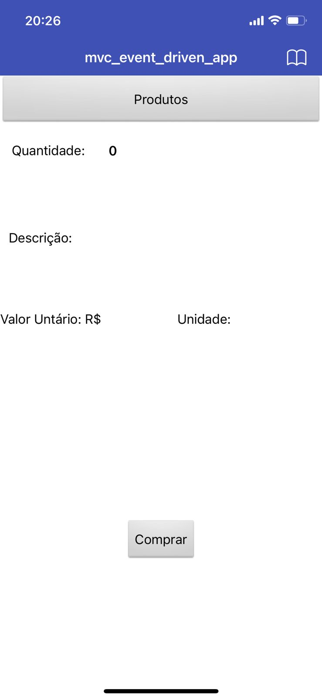
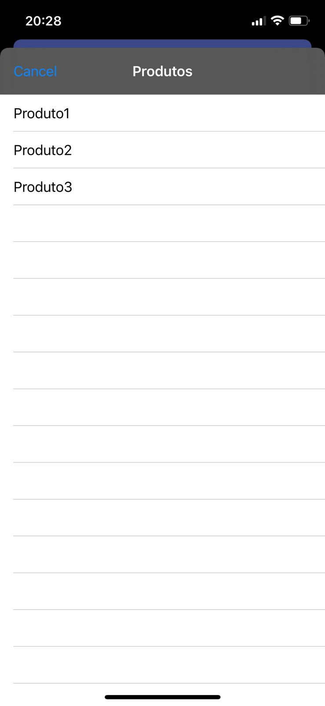
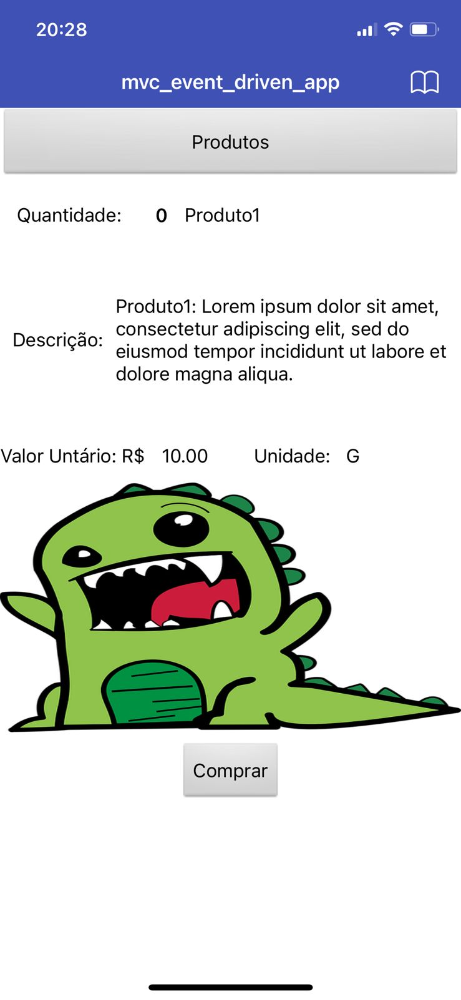
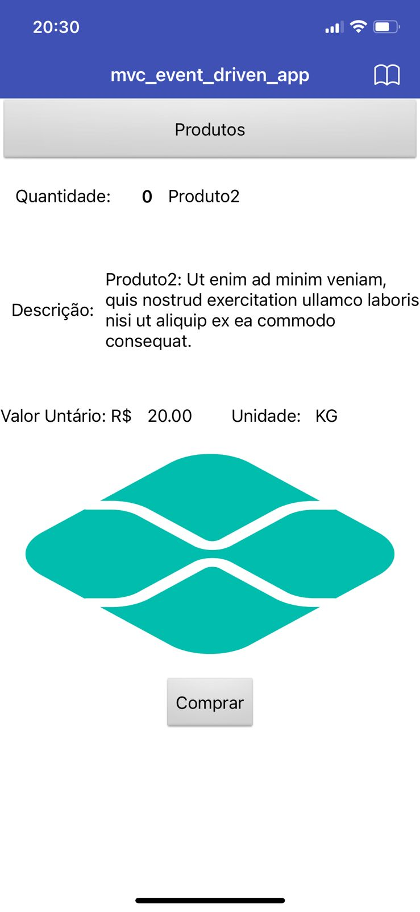
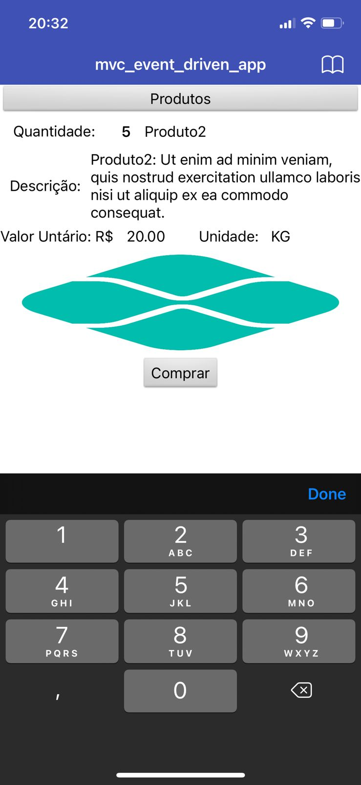
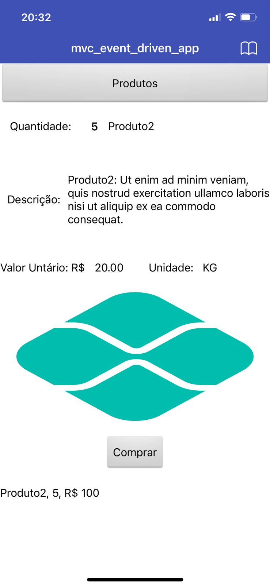
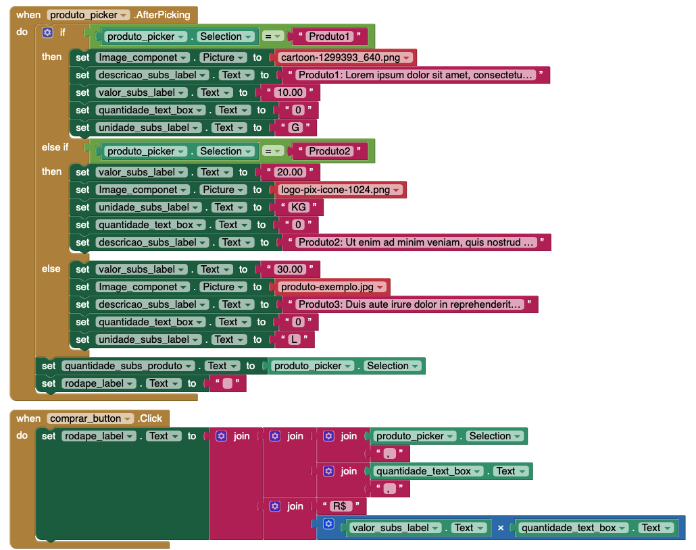
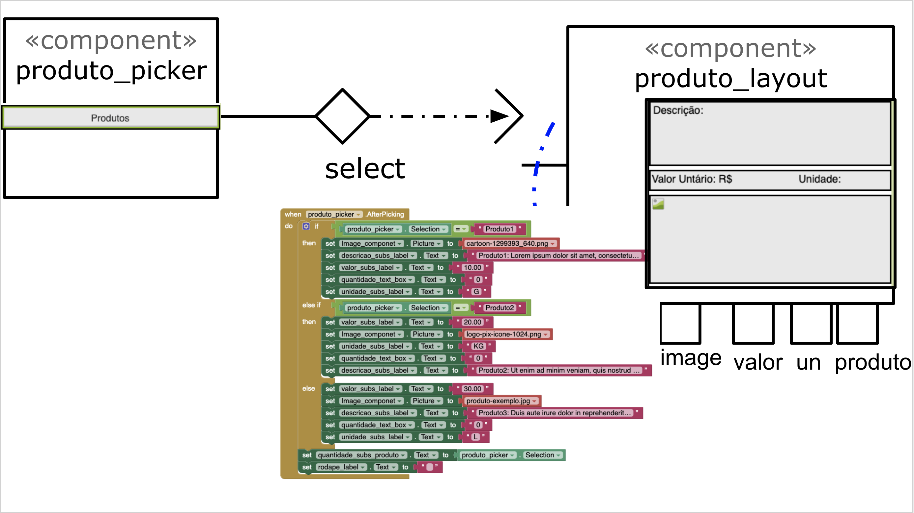
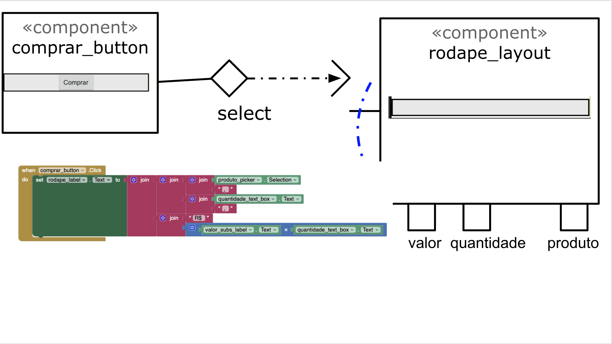

# Modelo para Apresentação do Lab04 - MVC

# Aluno
* Leonardo Machado Moscardo. RA: EX161698

# Tarefa 1 - App no MIT App Inventor
* Tela 1 - Captura da tela completa de design de interface
* 
* Tela 2 - Captura de tela do app com nenhum produto selecionado
* 
* Tela 3 - Captura de tela do app com primeiro produto selecionado
* 
* Tela 3 - Captura de tela do app com primeiro produto selecionado
* 
* Tela 4 - Captura de tela do app com segundo produto selecionado
* 
* Tela 5 - Compra de um dos produtos efetivada
* 
* Tela 5 - Compra de um dos produtos efetivada
* 
* Tela 6 - Diagrama de blocos do aplicativo 
* 

* [App](app/mvc_event_driven_app.aia)

# Tarefa 2 - Diagrama de Componentes dirigida a Eventos

