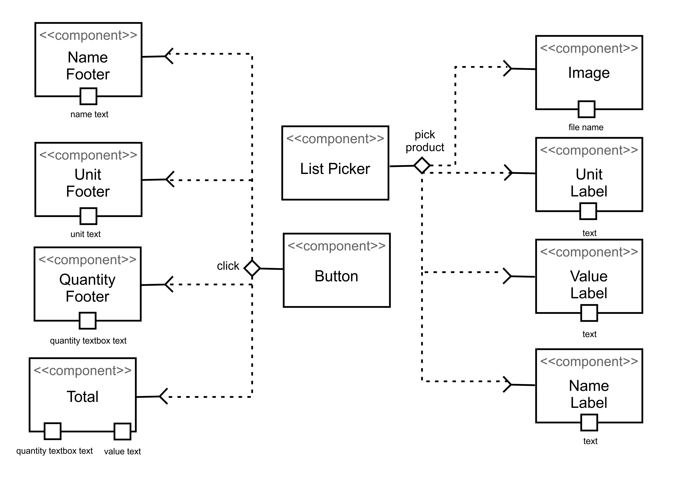

# Aluno
* `Luís Filipe Menten Gomes de Soutello`

# Tarefa 1 - App no MIT App Inventor

> * tela 1 - captura da tela completa de design de interface
> * tela 2 - captura de tela do app com nenhum produto selecionado
> * tela 3 - captura de tela do app com primeiro produto selecionado
> * tela 4 - captura de tela do app com segundo produto selecionado
> * tela 5 - compra de um dos produtos efetivada
> * tela 6 - diagrama de blocos do aplicativo

> [Arquivo App](app/lab4.aia)

# Tarefa 2 - Diagrama de Componentes dirigida a Eventos

> 
