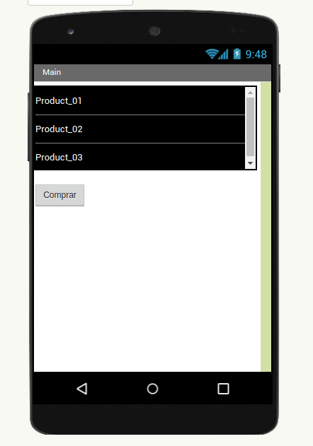
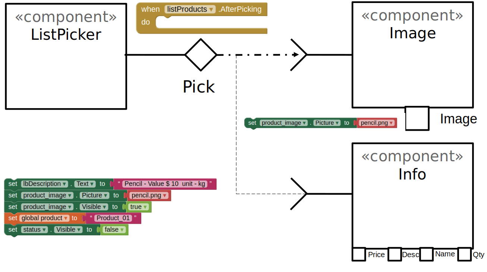

# Apresentação do Lab04 - MVC

Estrutura de pastas:

~~~
├── README.md  <- arquivo apresentando a tarefa
│
├── images     <- arquivos de imagens usadas no documento
│
└── app        <- apps do MIT App Inventor exportados em formato `aia`
~~~

# Aluno
* `Fabiano Louzada Cesario`

# Tarefa 1 - App no MIT App Inventor

> Imagens PNG da captura de seis telas do seu aplicativo:
> * tela 1 - captura da tela completa de design de interface

> 

> * tela 2 - captura de tela do app com nenhum produto selecionado

> 

> * tela 3 - captura de tela do app com primeiro produto selecionado

> 

> * tela 4 - captura de tela do app com segundo produto selecionado

> 

> * tela 5 - compra de um dos produtos efetivada

> 

> * tela 6 - diagrama de blocos do aplicativo

> 

>
> Link para o arquivo do aplicativo exportado a partir do MIT App Inventor em formato `aia`. Ele estará dentro da pasta `app`.
[a link] (https://github.com/louces85/component2learn/tree/entregas-labs-2022/labs/2022/04-mvc/solucoes/louces85/app/Labo04.aia)

# Tarefa 2 - Diagrama de Componentes dirigida a Eventos

> 
