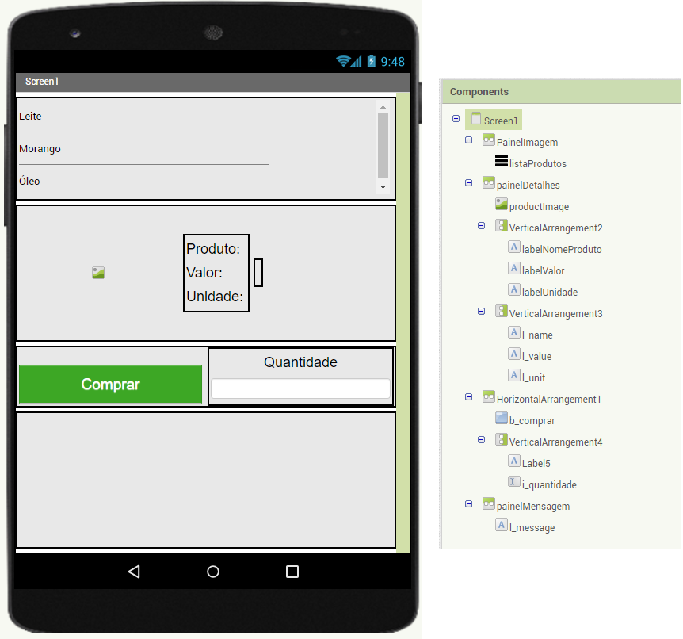
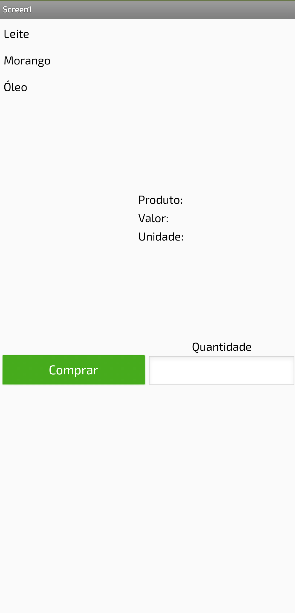
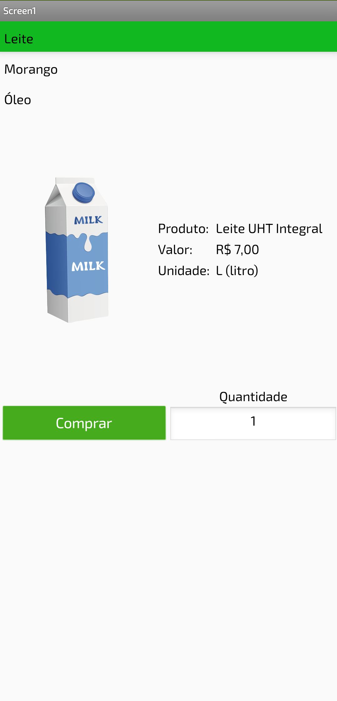
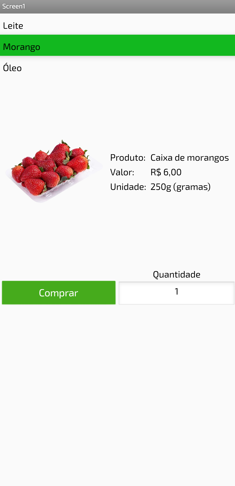
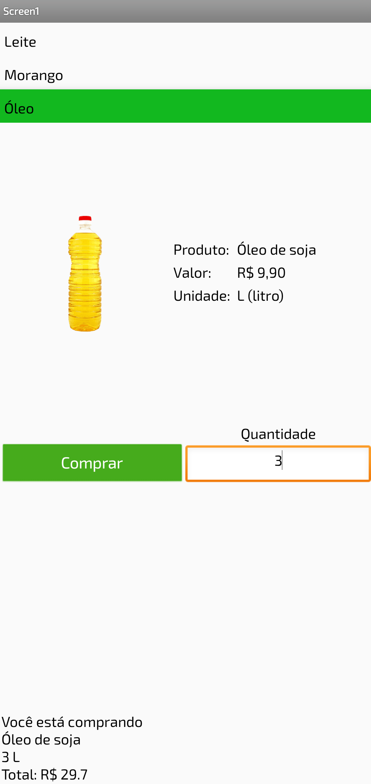
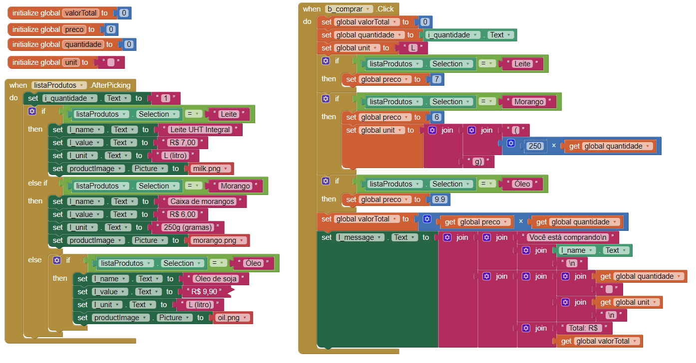
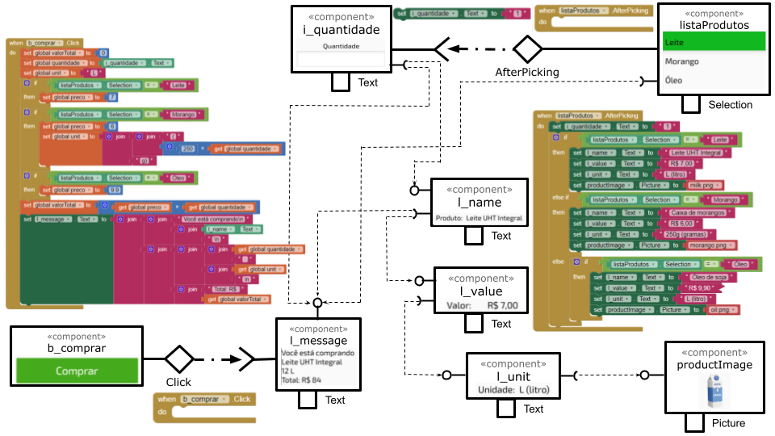

# Modelo para Apresentação do Lab04 - MVC

Estrutura de pastas:

~~~
├── README.md  <- arquivo apresentando a tarefa
│
├── images     <- arquivos de imagens usadas no documento
│
└── app        <- apps do MIT App Inventor exportados em formato `aia`
~~~

# Aluno
* `Raul Mendes de Souza`

# Tarefa 1 - App no MIT App Inventor

> * Tela 1 - Captura da tela completa de design de interface
> 

> * Tela 2 - Captura de tela do app com nenhum produto selecionado
> 

> * Tela 3 - Captura de tela do app com primeiro produto selecionado
> 

> * Tela 4 - Captura de tela do app com segundo produto selecionado
> 

> * Tela 5 - Compra de um dos produtos efetivada
> 

> * Tela 6 - Diagrama de blocos do aplicativo
> 

> 

# Tarefa 2 - Diagrama de Componentes dirigida a Eventos

> 
