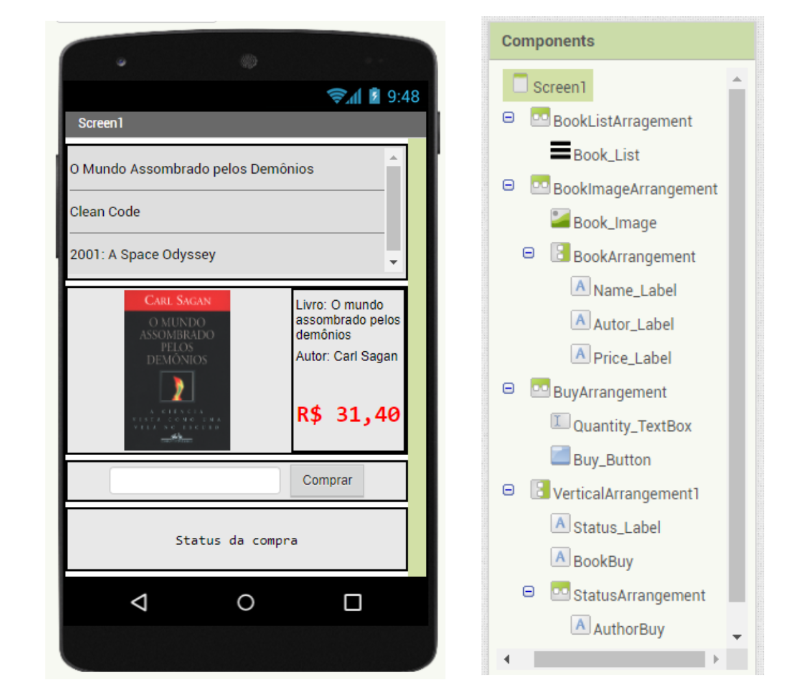
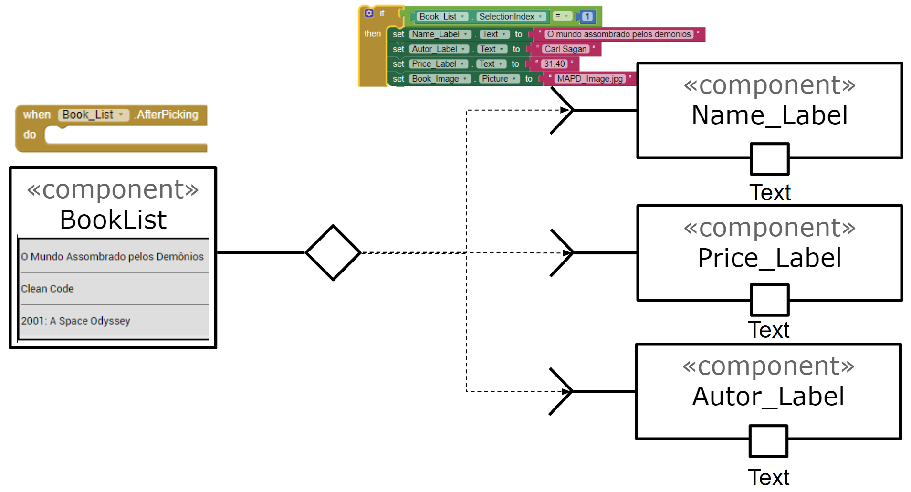
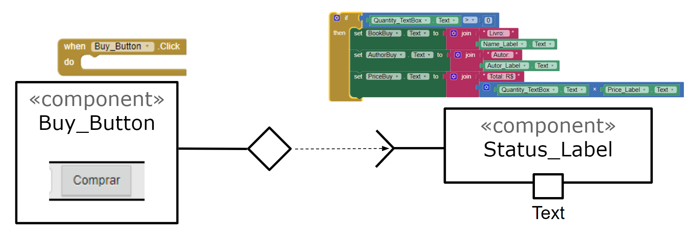

# Modelo para Apresentação do Lab04 - MVC

Estrutura de pastas:

~~~
├── README.md  <- arquivo apresentando a tarefa
│
├── images     <- arquivos de imagens usadas no documento
│
└── app        <- apps do MIT App Inventor exportados em formato `aia`
~~~

# Aluno
* `Thiago Silva de Souza`

# Tarefa 1 - App no MIT App Inventor

>
>
> Link do arquivo do aplicativo exportado a partir do MIT App Inventor em formato `aia`.

# Tarefa 2 - Diagrama de Componentes dirigida a Eventos

> Imagens do diagrama:
>
> 
>
> 
