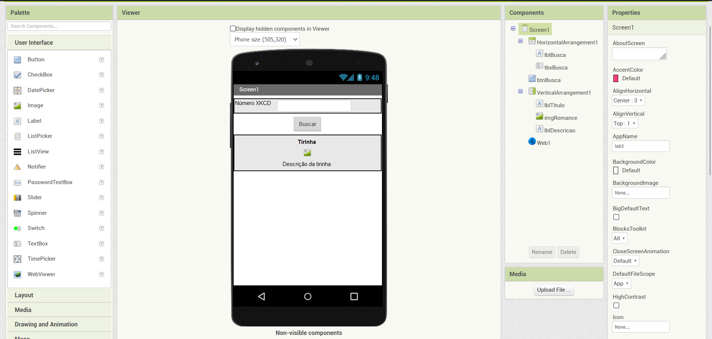
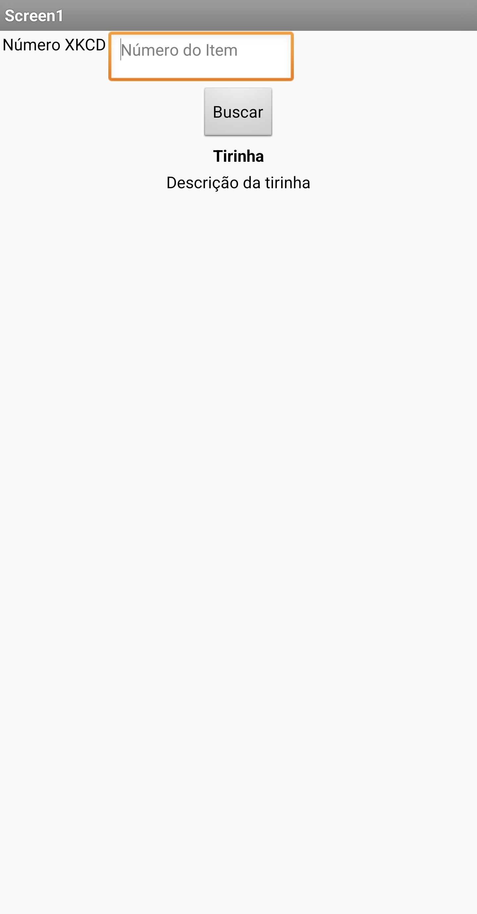
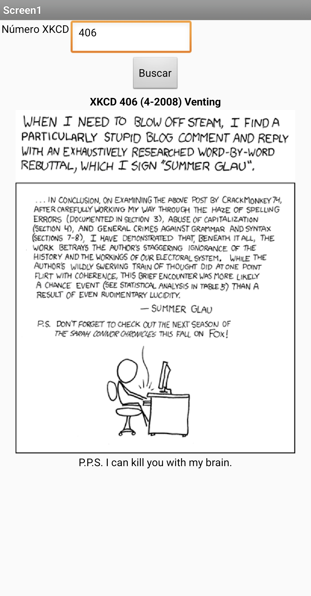
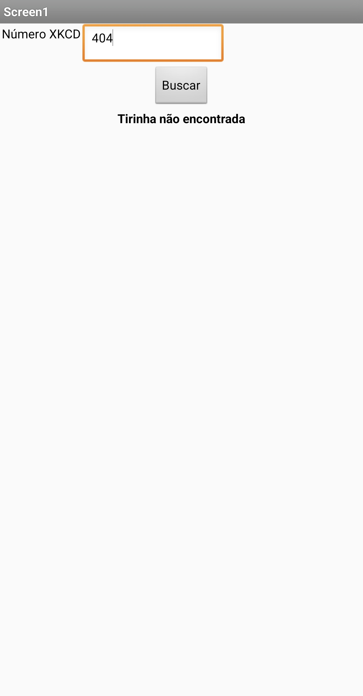
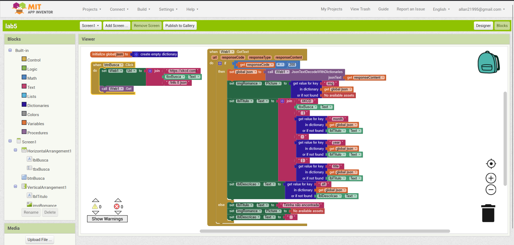

Estrutura de pastas:

~~~
├── README.md  <- arquivo apresentando a tarefa
│
├── images     <- arquivos de imagens usadas no documento
│
└── app        <- apps do MIT App Inventor exportados em formato `aia`
~~~

# Aluno
* `Allan Ferreira Fonseca`

> Imagens PNG do aplicativo:
> * tela 1 - captura da tela completa de design de interface
> 
> * tela 2 - captura de tela do app com nenhuma tirinha selecionada
> 
> * tela 3 - captura de tela do app com uma tirinha retornada com sucesso
> 
> * tela 4 - captura de tela do app com uma tirinha inexistente selecionada
> 
> * tela 5 - diagrama de blocos do aplicativo
> 

> Link do Aplicativo em formato .aia
> [App](app/lab5.aia)